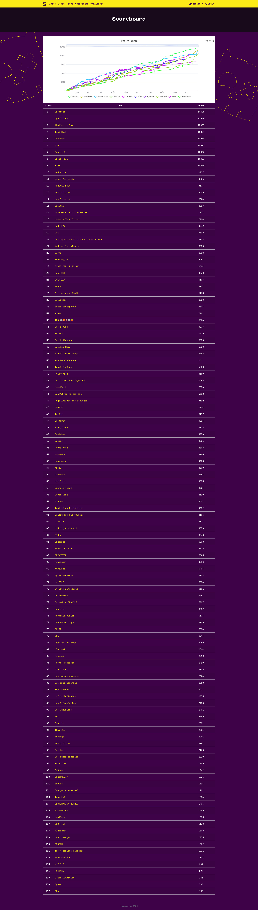

# Breizh CTF 2023

### Pool (par ordre alphabétique)

- Main
    - [\_SaxX\_](https://twitter.com/_SaxX_) (Co-fondateur)
    - [BDI](https://www.bdi.fr/fr/accueil/) (Organisateur)
    - [kaluche_](https://twitter.com/kaluche_) (Co-fondateur + lead pool technique)
- Challs makers
    - [0x_m4k2](https://twitter.com/0x_m4k2)
    - [0xdeadbeef](/)
    - [adam_le_bon](https://twitter.com/adam_le_bon)
    - [aiglematth](/)
    - [b0oml](https://twitter.com/b0oml)
    - [naacbin](https://twitter.com/naacbin) 
    - [hashp4_](https://twitter.com/hashp4_)
    - [shadowwws7](https://twitter.com/shadowwws7)
    - [Teddysbears3](https://twitter.com/Teddysbears3)
    - [zeecka_](https://twitter.com/zeecka_)
- Infra système
    - [Eriln](/)
- Infra réseau
    - [\_\_Sp4rKy\_\_](https://twitter.com/__Sp4rKy__)
- Infra serveurs
    - [Shade](/)

### Challenges

Les différents challenges sont stockés dans le dossier [challenges/](challenges/). Ces derniers sont répartis par catégories (un dossier par catégorie).

### Architecture d'un challenge

Les challenges doivent respecter une architecture comme définie dans le dossier [challenges/_exemple](challenges/_exemple).

#### challenge.yml

Le fichier challenge.yml suit la convention défini par [ctfcli](https://github.com/CTFd/ctfcli/) utilisé pour le déploiement automatique de challenge. 

[Exemple de fichier challenge.yml](https://github.com/CTFd/ctfcli/blob/master/ctfcli/spec/challenge-example.yml).

#### solve.py

Lorsque cela est possible, implémentez un script de résolution du challenge. Ce dernier peut notamment contenir de [assertions](https://www.w3schools.com/python/ref_keyword_assert.asp) pour aider les organisateurs en cas de troubleshot.

Note : après validations croisées des challenges, il est possible de multiplier les scripts, avec par exemple, solve_pseudo.py.

#### Build

Dans la plupart des cas, les challenges pourront tourner dans des conteneurs. Dans ce cas un fichier Dockerfile doit obligatoirement être à la racine du projet. La pipeline est configurée pour automatiquement build les images docker.

Lorsque cela est possible, le dossier Build doit contenir les sources nécessaires à la génération du challenge. Le script de build doit pouvoir faciliter la génération du challenge avec un nouveau Flag.

#### WriteUp

Dossier contenant un Write-Up du challenge au format Markdown. Les captures d'écrans et fichiers peuvent être stocker à même le dossier ou dans des sous-dossiers au bon vouloir de l'auteur.

> Note : après validations croisées des challenges, il est possible de multiplier les WriteUp, avec par exemple, le dossier WriteUp_pseudo.

#### Files

Dossier contenant le(s) fichier(s) fournis dans le challenge. L'ajout du `md5sum` des fichiers dans la description du challenge est recommandé.

> Pensez aussi à rajouter vos fichier dans le `challenge.yml` pour qu'ils soient automatiquement envoyés sur CTFd

#### Docker

Dossier contenant le `Dockerfile` du challenge ainsi que les fichiers du service (voir section Docker).

### Points

Les points attribués aux challenges sont dynamiques (500 pts dégressifs), mais un niveau de difficulté (Très Facile, Facile, Moyen, Difficile, Très Difficile) doit être attribué pour chaque challenge afin d'orienter les joueurs.

## Docker

Afin d'homogénéiser les images Docker, plusieurs modeles d'image sont à votre disposition dans le dossier [docker](docker).
L'objectif du dossier `docker` n'est pas de copier son contenu, mais de l'utiliser comme image de base.

Le dossier contient 3 images de base :
- `tcp` qui est une image alpine avec socat préconfiguré sur le port 1337. Le programme lancé par socat doit se trouver dans `/challenge/challenge` dans le conteneur. Vous trouverez un exemple d'utilisation [dans le dossier _exemple_tcp](challenges/_exemple/_exemple_tcp/Docker/Dockerfile)
- `web` qui est une image alpine avec apache2+php8 d'installé. La racine du serveur web se trouve dans le dossier `/challenge` du conteneur. Vous trouverez un exemple d'utilisation [dans le dossier _exemple_web](challenges/_exemple/_exemple_http/Docker/Dockerfile)
- `python` qui est une simple image avec python3 installé. Le programme par défaut doit se trouver dans le dossier `/challenge/challenge.py` du conteneur

Le port par défaut à utiliser pour les services sont :
- 80 pour HTTP
- 1337 pour TCP

## Links
 - [Discord](https://discord.gg/ckaT65Qsfg)
 - [Twitter](https://twitter.com/BreizhCTF)
 - [Website](https://www.breizhctf.com/)