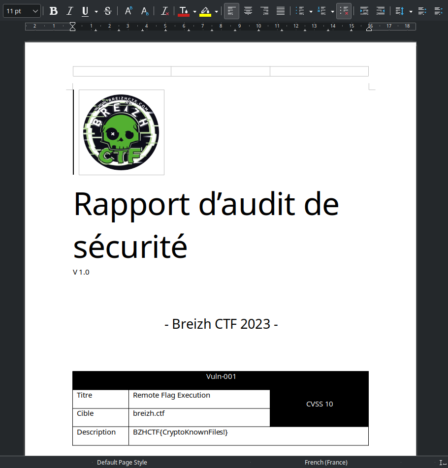

BreizhCTF 2023 - Rapport d'audit
==========================

### Challenge details

| Event                    | Challenge  | Category       | Points | Solves      |
|--------------------------|------------|----------------|--------|-------------|
| BreizhCTF 2023           | Rapport d'audit  | Cryptographie  | ???    | ???         |


L'entreprise Cybeur-salé a transmis au BreizhCTF un rapport d'audit concernant son infrastructure. Suite a un incident chez Cybeur-salé, l'archive a fuité sur le célèbre site Braidzh-Forum. L'ESN affirme cependant que la confidentialité du rapport reste garantie, puisque l'archive est protégée par un mot de passe fort. Dans la continuité de l'incident, vous avez été mandaté par le BreizhCTF pour confirmer de manière impartiale les dires de Cybeur-salé.

Auteur: [Zeecka](https://twitter.com/Zeecka)

- Fichier: [Rapport_Audit_BreizhCTF.zip](../Challenge/Rapport_Audit_BreizhCTF.zip)
- md5sum: c1903432eb7532d82c7f5a3c4e80a04c

### TL;DR

Le challenge proposait une archive ZIP chiffrée avec plusieurs fichiers. Certains de ces fichiers sont disponibles publiquement et permettent une attaque par clair connu.

### Méthodologie

L'archive contenant le rapport d'audit dispose d'un mot de passe et possède une extension ZIP. La commande `zipinfo` et `7z l -slt` nous permet de récupérer des informations sur l'archive, comme l'absence de compression, le nom des fichiers et confirme également le chiffrement `ZipCrypto Store`.

```bash
zipinfo Rapport_Audit_BreizhCTF.zip
zipinfo -v Rapport_Audit_BreizhCTF.zip
7z l -slt Rapport_Audit_BreizhCTF.zip
```
```raw
Archive:  Rapport_Audit_BreizhCTF.zip
Zip file size: 1357917 bytes, number of entries: 3
-rw-r--r--  3.0 unx   430627 BX stor 22-Nov-28 15:09 20211216_OWASP-MSP_OWASP_Top_Ten_2021.pdf
-rw-r--r--  3.0 unx   688733 BX stor 22-Nov-28 15:05 cvss-v31-specification_r1.pdf
-rw-r--r--  3.0 unx   237871 BX stor 22-Nov-28 15:08 Rapport_Audit_BreizhCTF.docx
3 files, 1357231 bytes uncompressed, 1357231 bytes compressed:  0.0%
```
```raw
7-Zip [64] 17.04 : Copyright (c) 1999-2021 Igor Pavlov : 2017-08-28
p7zip Version 17.04 (locale=C,Utf16=off,HugeFiles=on,64 bits,20 CPUs x64)

Scanning the drive for archives:
1 file, 1357917 bytes (1327 KiB)

Listing archive: Rapport_Audit_BreizhCTF.zip

--
Path = Rapport_Audit_BreizhCTF.zip
Type = zip
Physical Size = 1357917

----------
Path = 20211216_OWASP-MSP_OWASP_Top_Ten_2021.pdf
Folder = -
Size = 430627
Packed Size = 430639
Modified = 2022-11-28 15:09:11
Created = 
Accessed = 
Attributes = _ -rw-r--r--
Encrypted = +
Comment = 
CRC = 435B5F61
Method = ZipCrypto Store
Characteristics = UT 0x7875 : Encrypt Descriptor
Host OS = Unix
Version = 10
Volume Index = 0
Offset = 0
...
```

L'utilisation de ZipCrypto est dépréciée, notamment à cause de sa vulnérabilité face aux attaques par "clair connu", en particulier en l'absence de compression. L'outil [bkcrack](https://github.com/kimci86/bkcrack) permet de faciliter l'exploitation de cette vulnérabilité. Ce dernier nécessite la connaissance d'un fichier de l'archive (ou une partie). Les noms des fichiers n'ayant pas été changés, il est possible de récupérer une partie des référentiels comme `cvss-v31-specification_r1.pdf` sur internet:

```bash
wget https://www.first.org/cvss/v3-1/cvss-v31-specification_r1.pdf
```

La réalisation de l'attaque s'effectue ensuite en deux étapes. La première étape consiste à récupérer les clés de chiffrement intermédiaires. Celles-ci nécessitent la comparaison d'une archive contenant le fichier `cvss-v31-specification_r1.pdf` dans le même mode de stockage (sans compression):

```bash
zip -0 origin.zip cvss-v31-specification_r1.pdf
bkcrack -C Rapport_Audit_BreizhCTF.zip -c cvss-v31-specification_r1.pdf -P origin.zip -p cvss-v31-specification_r1.pdf -e
```
```plaintext
bkcrack 1.5.0 - 2022-09-25
[21:15:45] Z reduction using 688726 bytes of known plaintext
0.7 % (4952 / 688726)
[21:15:46] Attack on 166 Z values at index 684443
Keys: 2cec9bbe 8410cf1b 74078a50
100.0 % (166 / 166)
[21:15:46] Keys
2cec9bbe 8410cf1b 74078a50
```

La deuxième étape réside donc dans l'utilisation de ces clés pour récupéré le fichier souhaité, ici notre rapport d'audit [Rapport_Audit_BreizhCTF.docx](Rapport_Audit_BreizhCTF.docx).

```bash
bkcrack -C Rapport_Audit_BreizhCTF.zip -c Rapport_Audit_BreizhCTF.docx -k 2cec9bbe 8410cf1b 74078a50 -d Rapport_Audit_BreizhCTF.docx
```

L'ouverture du fichier docx permet ensuite d'accéder au rapport en clair, et récupérer le Flag



> A titre informatif, le mot de passe utilisé pour la génération de l'archive était `9Sh679pjKawR`

#### Flag

`BZHCTF{CryptoKnownFiles!}`

Auteur: [Zeecka](https://twitter.com/zeecka_)