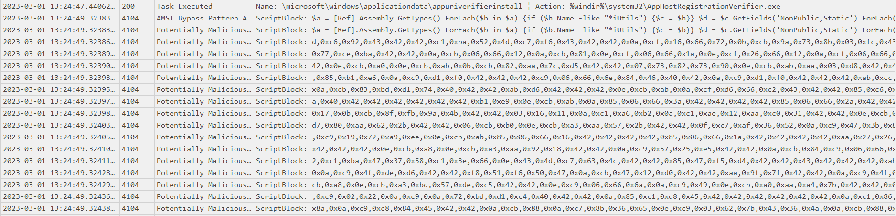
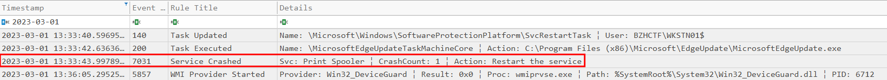
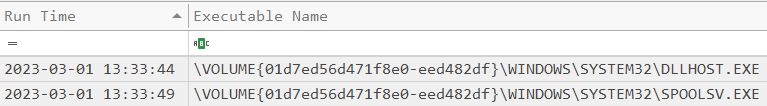
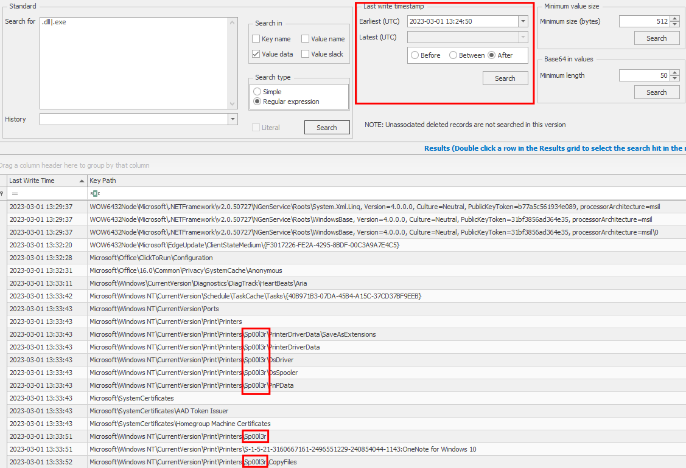
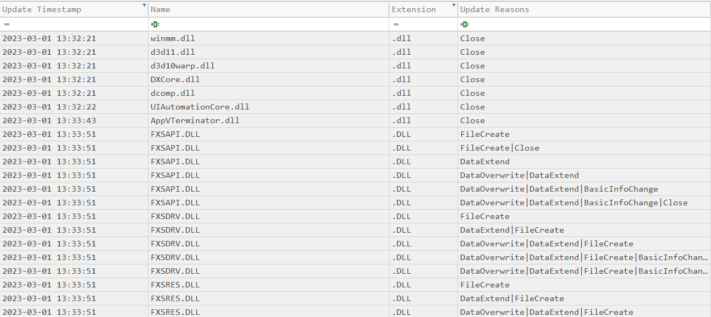
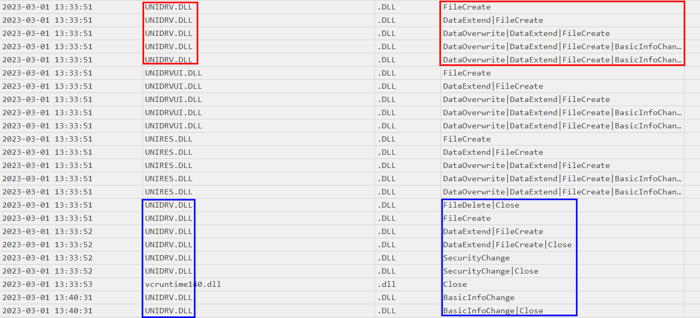
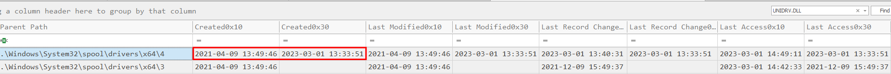
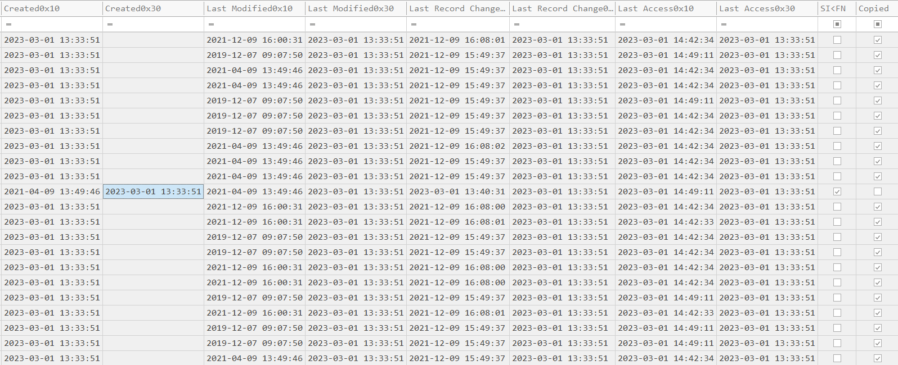
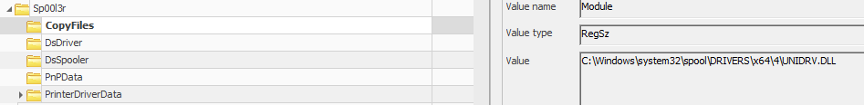
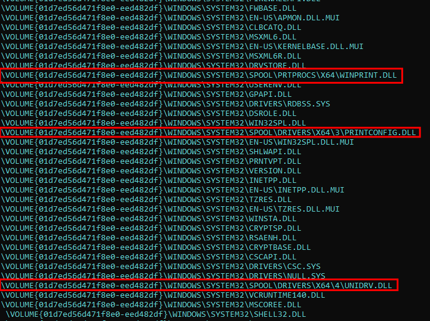

BreizhCTF 2023 - BreizhCrêpes
==========================

### Challenge details

| Event                    | Challenge  | Category       | Points | Solves      |
|--------------------------|------------|----------------|--------|-------------|
| BreizhCTF 2023           | BreizhCrêpes  | Forensique  | ???    | ???         |

Une fois que l'attaquant a accès à l'ordinateur de Gweltaz, il utilise une vulnérabilité d'escalade de privilège pour obtenir des droits supplémentaires.
Le fichier "legit" correspond au stager utilisé pour avoir un accès au PC WKSTN01.

Retrouver le nom du binaire utilisé pour effectuer l'escalade de privilège et l'horodatage du moment où l'élévation de privilège à eu lieu. 
Le format du flag à soumettre est le suivant BZHCTF{file.ext:AAAA-MM-DD HH:MM:SS}

**Indice 1:** Aucun shellcode n'est à reverse pour ce challenge.

**Indice 2:** Pour ce challenge les journaux d'événement, la `$MFT`, le `$J` et les prefetchs sont utiles. Les clés de registre peuvent potentiellement aussi aider.

### TL;DR

La vulnérabilité exploitée ici est la CVE-2022-21999, référencée aussi au titre de CVE-2022–22718 qui est une escalade de privilège à l'aide du service *print spooler*. L'exploitation de cette CVE va laisser plusieurs traces sur le système. Notamment le nom de l'imprimante dans `Microsoft\Windows NT\CurrentVersion\Print\Printers`, mais surtout la présence de la clé `Microsoft\Windows NT\CurrentVersion\Print\Printers\<Printer_name>\CopyFiles` avec une DLL comme valeur. Pour obtenir l'heure d'exécution, il faut comprendre qu'il s'agit de l'heure de chargement de la DLL dans le service de `Print Spooler`.

### Méthodologie

Il est possible de parser les journaux d'événements avec un outil comme [Hayabusa](https://github.com/Yamato-Security/hayabusa). On peut voir dans le csv produit par la commande `hayabusa.exe -d C:\Temp\evidence --RFC-3339 --quiet -U -o C:\Temp\hayabusa.csv` que le stager a été exécuté à 13:24:49 (EventId 4104 dans le journal d'événement PowerShell).

Un peu après, on peut remarquer que le service `Print Spooler` à crash à 13:33:43.

En analysant les prefetchs, on peut voir que le service a redémarré à 13:33:49.

En observant les dernières modifications dans les ruches HKLM (`SOFTWARE` / `SYSTEM`) à partir de 13:24:50 soit après l'accès initial, on observe un nom d'imprimante assez étrange `Sp00l3r`
dans la clé `Microsoft\Windows NT\CurrentVersion\Print\Printers`.

Une autre piste à explorer sont les fichiers `$J` et `$MFT` (parsable avec [MFTECmd](https://github.com/EricZimmerman/MFTECmd)), en effet en filtrant sur les extensions type `dll`, `exe`, `ps1`, etc. et la date, on obtient directement une longue liste de DLL qui sont créées sur le système.

On peut même remarquer que la dll `UNIDRV.DLL` semble être créée, supprimée puis créée de nouveau.

En cherchant dans la `$MFT` cette fois-ci, on peut voir que le timestamp de la création côté système (0x10/`$SI`) est inférieur à celui côté kernel (0x30/`$FN`), ce qui révèle potentiellement du timestomping.

[MFTECmd](https://github.com/EricZimmerman/MFTECmd) va indiquer lorsqu'un fichier a été copié en se basant sur l'[horodatage](http://www.kazamiya.net/en/NTFS_Timestamps) de création, modification, accès et changement de métadonnée. Dans notre cas, en filtrant sur le dossier `.\Windows\System32\spool\drivers\x64\4`, on peut voir que toutes les DLL ont été copiées sauf `UNIDRV.DLL`.

Avec toutes ces informations, on peut donc supposer que l'élévation de privilège, s'est fait au travers du service `Print Spooler`, en recherchant sur Internet, on va tomber sur la [CVE-2020-1030](https://www.accenture.com/us-en/blogs/cyber-defense/discovering-exploiting-shutting-down-dangerous-windows-print-spooler-vulnerability) et la [CVE-2022–21999/CVE-2022-22718](https://research.ifcr.dk/spoolfool-windows-print-spooler-privilege-escalation-cve-2022-22718-bf7752b68d81). On s'aperçoit alors que le répertoire par défaut utilisé pour charger une dll malveillante est justement `\Windows\System32\spool\drivers\x64\4`. De plus, le nom de la dll chargée par le service est stocké dans la clé `Microsoft\Windows NT\CurrentVersion\Print\Printers\Sp00l3r\CopyFiles`, ici, on retrouve `UNIDRV.DLL`.

Par ailleurs, avec [PECmd](https://github.com/EricZimmerman/PECmd/), on peut voir que de toutes les DLL chargées, seulement 3 ne sont pas dans `.\Windows\System32` et uniquement la dernière n'est pas connue.

Tous ces éléments permettent de dire que `UNIDRV.DLL` est la DLL malveillante et l'heure d'exploitation correspond à l'heure d'écriture avec potentiellement quelques secondes en plus le temps que la DLL soit chargée. Le maximum étant `13:33:59`, en effet d'après les prefetchs le service a redémarré à `13:33:49`, or on voit la DLL chargée. Comme les prefetchs sont "actualisés" toutes les 10 secondes, on n'aurait donc pas vu la DLL si elle avait été chargée après `13:33:59`.

# Flag

`BZHCTF{UNIDRV.DLL:2023-03-01 13:33:51}`

> En réalité si vous aviez mis entre 51 et 59 secondes le flag était aussi valide.
