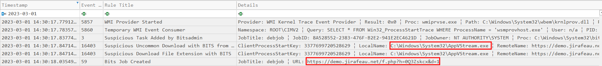
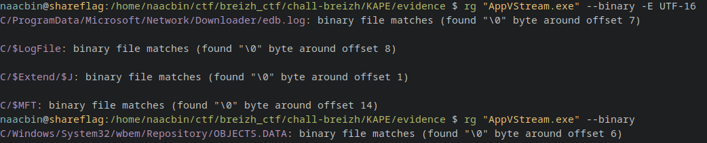
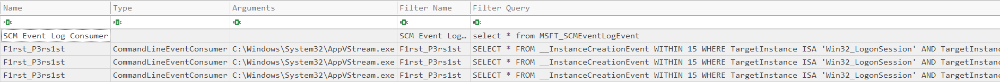
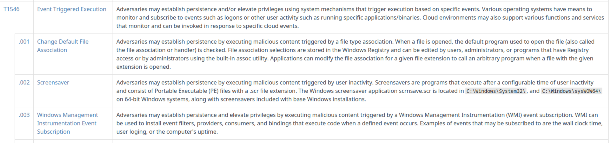

BreizhCTF 2023 - BreizhCrêpes
==========================

### Challenge details

| Event                    | Challenge  | Category       | Points | Solves      |
|--------------------------|------------|----------------|--------|-------------|
| BreizhCTF 2023           | BreizhCrêpes  | Forensique  | ???    | ???         |

Ewen un journaliste à *Reporter Sans Bretagne*, vous indique que les attaquants se sont vantés qu'ils utilisaient une fonctionnalité Windows pour lancer un binaire malveillant au démarrage d'une session sur les réseaux sociaux, permettant de maintenir une persistance sur le système.

Vous devez retrouver un flag au format l33t.
Le format du flag à soumettre est le suivant BZHCTF{l33t}

**Indice :** Fouillez bien tous les fichiers fournis dans le zip.

### TL;DR

Une persistance utilisant WMI est effectué pour ce challenge. Il faut utiliser le fichier `C:\WINDOWS\system32\wbem\Repository\OBJECTS.DATA` qui stocke des informations sur les objets WMI pour retrouver la peristance.

### Méthodologie

Avec le parsage des journaux fait par [Hayabusa](https://github.com/Yamato-Security/hayabusa) précédement, on peut voir que peu de temps après l'escalade de privilège, un fichier a été téléchargé en utilisant BITS. Le fichier téléchargé sur `https://demo.jirafeau.net` est stocké dans `C:\Windows\System32\AppVStream.exe`.

> Il est aussi possible d'utiliser [chainsaw](https://github.com/WithSecureLabs/chainsaw) ou [EvtxECmd](https://github.com/EricZimmerman/evtx) pour parser les événements.

Avec *grep*, on peut voir que le fichier `AppVStream.exe` est présent dans `edb.log` (trace laissé par BITS), `$LogFile`, `$J` et `$MFT` (dû au stockage du fichier sur le disque) en UTF-16.

En revanche pour de l'UTF-8, on peut voir que `AppVStream.exe` est uniquement présent dans le fichier `C:\WINDOWS\system32\wbem\Repository\OBJECTS.DATA`.

Il est possible de parser le `OBJECTS.DATA` avec [wmi-parser](https://github.com/woanware/wmi-parser) (activable également dans les modules de [KAPE](https://www.kroll.com/en/services/cyber-risk/incident-response-litigation-support/kroll-artifact-parser-extractor-kape)).

Après avoir executé `wmi-parser.exe -i .\evidence\C\Windows\System32\wbem\Repository\OBJECTS.DATA -o C:\Temp`, on obtient un csv qui contient le nom de la tâche WMI permettant de lancer le binaire `C:\Windows\System32\AppVStream.exe` à chaque ouverture de session.

Pour retrouver la persistance, on pouvait aussi s'appuyer sur le fait que celle-ci était exécutée au démarrage d'une session utilisateur donc le binaire est lancé suite à un l'exécution d'un événement. En allant rechercher les techniques correspondant dans MITRE et en se renseignant rapidement sur chacune d'elles, on tombe sur "Windows Management Instrumentation Event Subscription". On apprend notamment que le fichier `OBJECTS.DATA` est utile pour de la forensique.

# Flag

`BZHCTF{F1rst_P3rs1st}`
