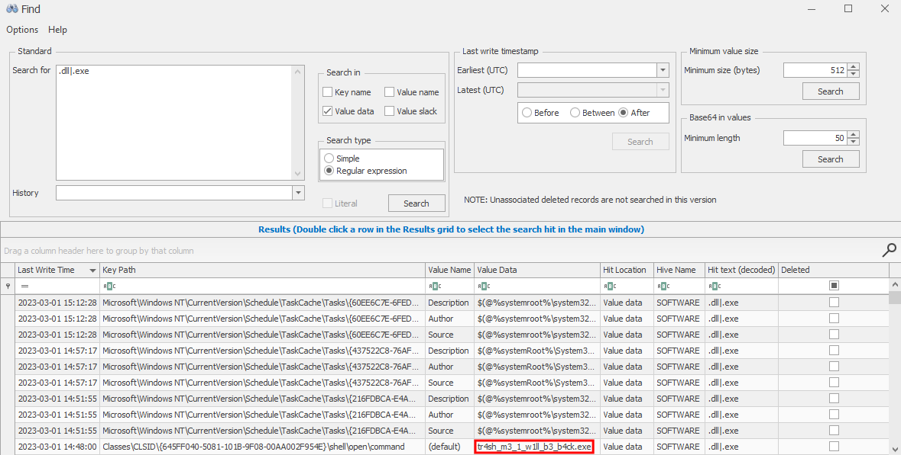
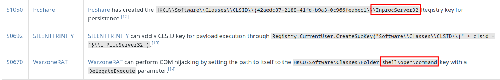
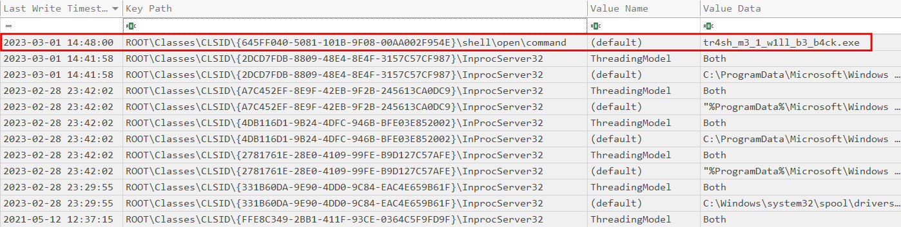

BreizhCTF 2023 - BreizhCrêpes
==========================

### Challenge details

| Event                    | Challenge  | Category       | Points | Solves      |
|--------------------------|------------|----------------|--------|-------------|
| BreizhCTF 2023           | BreizhCrêpes  | Forensique  | ???    | ???         |


Erwann, le responsable de communication, s'est fait ratio sur Twitter, suite à sa récente déclaration comme quoi la situation était revenue COM avant. En effet, 5 minutes après sa déclaration, les mots de passe des employés de l'entreprise ont fui sur Twitter.
Il semble que l'attaquant a gardé un accès au système.

Vous devez retrouver le nom du binaire utilisé pour effectuer la persistance.
Le format du flag à soumettre est le suivant BZHCTF{filename.ext}

**Indice :** Les ruches contiennent la date de dernière modification.

### TL;DR

La persistence utilisé ici, va se déclencher une fois que l'utilisateur ouvrira la corbeille. Pour cela, une clé `shell\open\command` qui va contenir le fichier à exécuter dans le COM object de la corbeille `{645FF040-5081-101B-9F08-00AA002F954E}` sera créée.

### Méthodologie

Une manière efficace de réaliser ce challenge est d'utiliser [Registry Explorer](https://ericzimmerman.github.io/#!index.md) pour ouvrir les ruches fournies. On va chercher les valeurs de clés contenant `.dll` ou `.exe` et trié par date de modification.



Une autre façon de faire est de se renseigner avec la page du [MITRE sur la persistence COM](https://attack.mitre.org/techniques/T1546/015/). Deux clés sont souvent utilisées `InprocServer32` et `shell\open\command`.



On créé un fichier *Batch File* pour [RECmd](https://github.com/EricZimmerman/RECmd) afin d'extraire sous format CSV les valeurs de clé que l'on recherche.

```text
Description: Breizh
Author: naacbin
Version: 1.0
Id: 1aca270c-9969-4c61-ad5e-6fe551dff59d
Keys:
    -
        Description: COM persistence shell command
        HiveType: Software
        Category: Execution
        KeyPath: Classes\CLSID\*\shell\*\command
        Recursive: true
        Comment:
    -
        Description: COM persistence
        HiveType: Software
        Category: Execution
        KeyPath: Classes\CLSID\*\InprocServer32
        Recursive: true
        Comment:
```

Une fois la commande `RECmd.exe -d .\evidence\C\Windows\System32\config --bn .\BatchExamples\breizh.reb --nl --csv C:\Temp` exécutée, on obtient un fichier CSV. Après avoir trié sur la date, on voit directement le flag.



# Flag

`BZHCTF{tr4sh_m3_1_w1ll_b3_b4ck.exe}`
