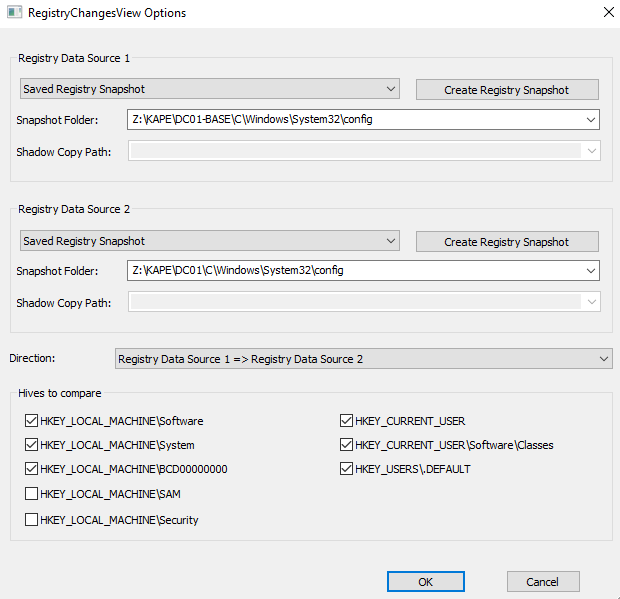
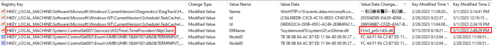

BreizhCTF 2023 - BreizhCrêpes
==========================

### Challenge details

| Event                    | Challenge  | Category       | Points | Solves      |
|--------------------------|------------|----------------|--------|-------------|
| BreizhCTF 2023           | BreizhCrêpes  | Forensique  | ???    | ???         |

Maël l'administrateur du DC vient de retrouver les fichiers de registres d'avant les attaques sur DC01.
Vérifier que l'attaquant n'a pas gardé une autre porte dérobée sur le système.

Vous devez retrouver le nom du binaire utilisé pour effectuer la persistance et l'horodatage de l'écriture dans la clé de registre. Le format du flag à soumettre est le suivant BZHCTF{filename.ext:AAAA-MM-DD HH:MM:SS}

### TL;DR

La persistance utilisé dans ce challenge correspond à la dll reférencée dans la clé `HKEY_LOCAL_MACHINE\SYSTEM\CurrentControlSet\Services\W32Time\TimeProviders\NtpClient` avec pour nom de valeur `DllName`. Le service `W32Time` va charger cette dll au démarrage ce qui va permettre d'avoir une communication avec le C2. En comparant l'état d'un registre initial par rapport à celui fournit, on peut trouver les clés modifiées/ajoutées et ainsi déceler la persistance.

### Méthodologie

Il est possible de comparer des bases de registres entre eux avec [RegistryChangesView](https://www.nirsoft.net/utils/registry_changes_view.html).

Une fois la comparaison faite on peut trier par `Value Data Changed To`, on retrouve alors aisément le nom du binaire et la date d'ajoute de la clé dans la ruche.

# Flag

`BZHCTF{t1m3_pr0v1d3r.dll:2023-03-01 14:49:29}`
