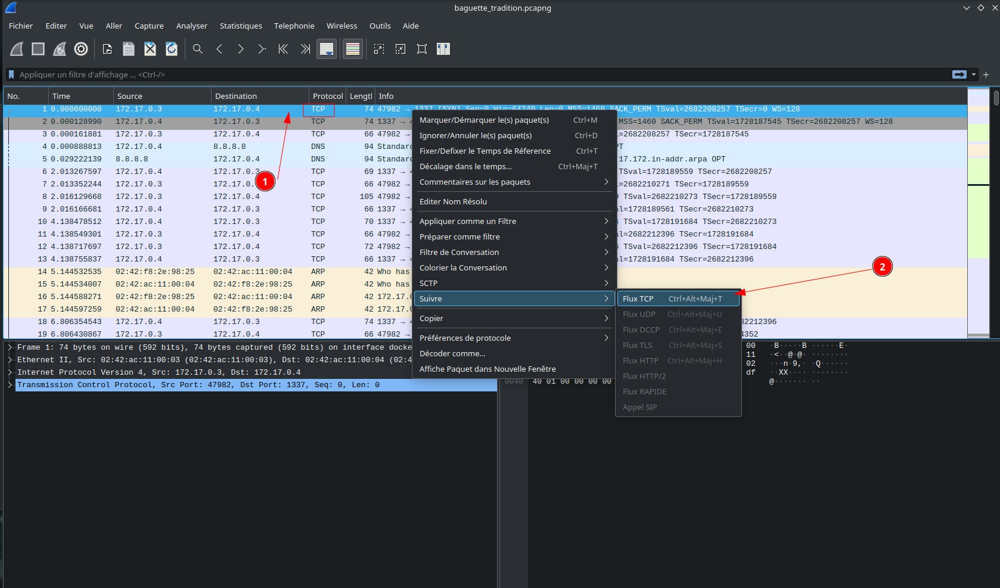
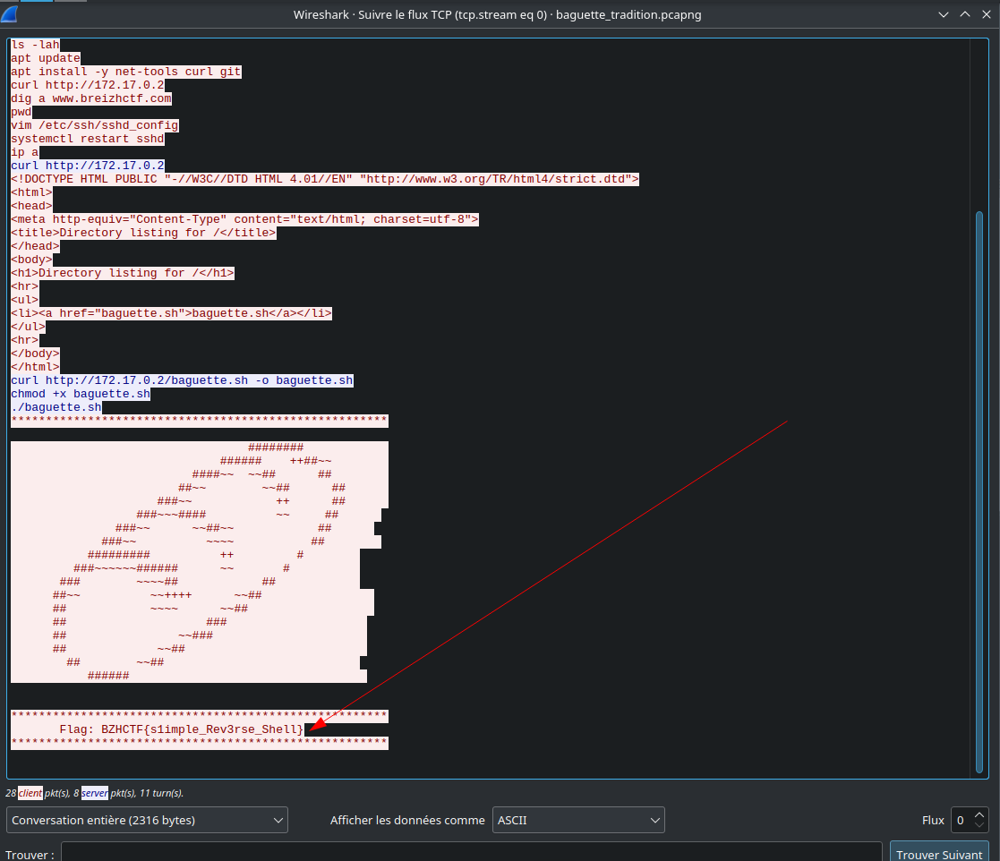

BreizhCTF 2023 - Baguette Tradition
==========================

### Challenge details

| Event                    | Challenge  | Category       | Points | Solves      |
|--------------------------|------------|----------------|--------|-------------|
| BreizhCTF 2023           | Baguette Tradition  | Forensique | ???    | ???         |


### TL;DR

Un capture réseau au format pcapng nous est fournie. Cette dernière peut être ouverte à l'aide de l'outil Wireshark. L'inspection des flux TCP nous permet d'identifier un trafique réseau contenant le flag en clair.

### Méthodologie

Le fichier baguette_tradition.pcapng est une capture réseau au format pcapng (comme en témoigne la commande file).

```bash
$ file baguette_tradition.pcapng 
baguette_tradition.pcapng: pcapng capture file - version 1.0
```

Le format PcapNg est défini sur [le site de l'outil Wireshark](https://wiki.wireshark.org/Development/PcapNg). Il peut être ouvert avec [ce dernier](https://www.wireshark.org/).

Il est alors possible d'analyser les communications, on retrouve ici différents protocoles comme TCP ou HTTP qui ne sont pas chiffrés. L'inspection peut se faire à  l'aide d'un clic droit (1) puis Suivre (2):



Une fois suivi, on peut lire la communication TCP. Il s'agit ici d'une communication effectuée sur un reverse shell avec en bleu les commandes effectuées par l'attaquant et en rouge les réponses renvoyées par la machine compromise.



On récupère le flag à la fin de la communication TCP.

# Flag

`BZHCTF{s1imple_Rev3rse_Shell}`
