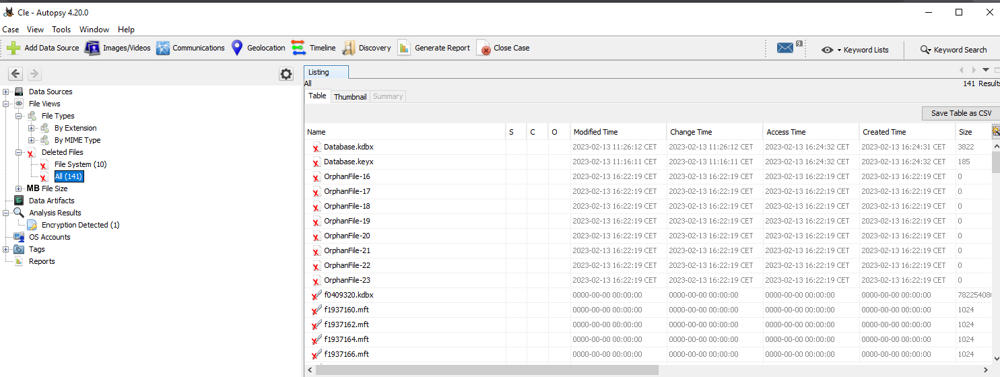
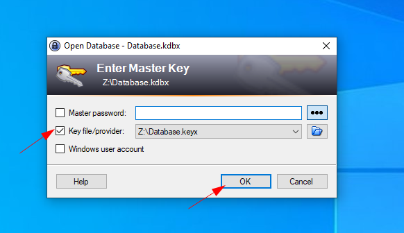
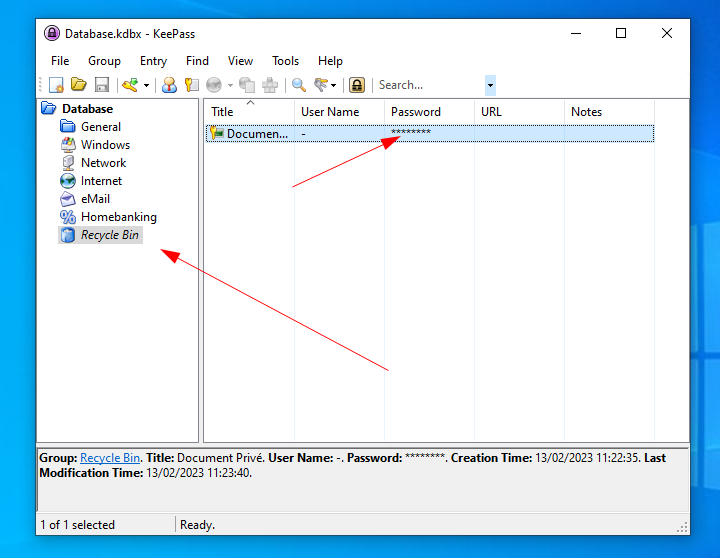
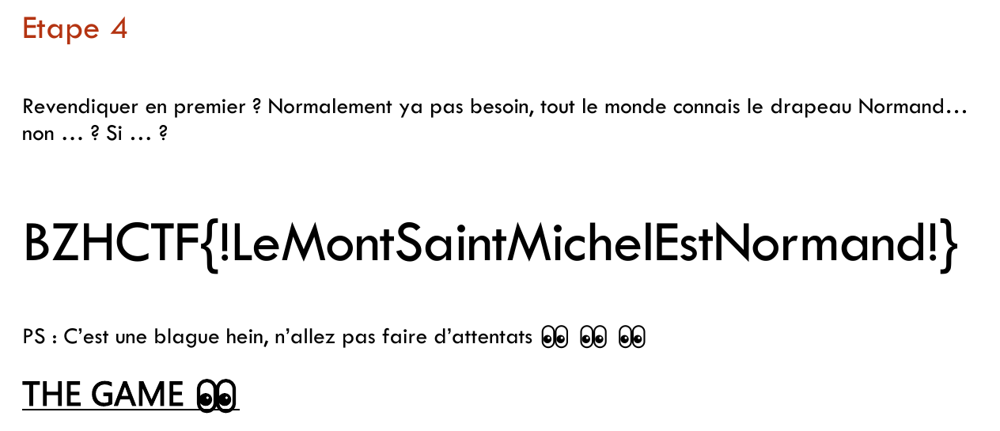

BreizhCTF 2023 - The Lost Key
==========================

### Challenge details

| Event                    | Challenge  | Category       | Points | Solves      |
|--------------------------|------------|----------------|--------|-------------|
| BreizhCTF 2023           | The Lost Key  | Forensique  | ???    | ???         |


La clé USB d'un terroriste normand a été récupérée. Investiguez son support pour l'empêcher de passer à l'acte !

Auteur: [Zeecka](https://twitter.com/Zeecka_)

### TL;DR

Il s'agit d'un dump de clé USB avec un système de fichier NTFS. Ce dernier présente un PDF chiffré ainsi que 2 fichiers supprimés: Un fichier KeePass et sa clé.

L'extraction des différents fichiers, par exemple sous Autopsy, permet l'ouverture du KeePass et la récupération d'un mot de passe fonctionnel pour le PDF, et par extension un accès au flag.

### Méthodologie

On commence par décompresser l'archive:

```bash
tar xvf the_lost_key.tar.gz
```
```
the_lost_key.img
```
```bash
md5sum the_lost_key.img
```
```
3daec81dae1d07d700288a096dcf0bad  the_lost_key.img
```

La commande `file` et `fdisk` permettent de vérifier le type de fichier récupéré.

```bash
file the_lost_key.img
```
```
the_lost_key.img: DOS/MBR boot sector; partition 1 : ID=0x7, start-CHS (0x4,4,1), end-CHS (0x3ff,254,2), startsector 2048, 3909632 sectors
```
```bash
fdisk -l the_lost_key.img
```
```
Disque the_lost_key.img : 1,87 GiB, 2003632128 octets, 3913344 secteurs
Unités : secteur de 1 × 512 = 512 octets
Taille de secteur (logique / physique) : 512 octets / 512 octets
taille d'E/S (minimale / optimale) : 512 octets / 512 octets
Type d'étiquette de disque : dos
Identifiant de disque : 0x7bdf73d0

Périphérique      Amorçage Début     Fin Secteurs Taille Id Type
the_lost_key.img1           2048 3911679  3909632   1,9G  7 HPFS/NTFS/exFAT
```

On peut donc confirmer la présence d'une unique partition de type NTFS.

Nous pouvons ensuite utiliser la suite [The Sleuth Kit](https://www.sleuthkit.org/) et sa GUI [Autopsy](https://www.sleuthkit.org/autopsy/) pour procéder à l'investiguation.

On commence par récupérer un PDF chiffré "PlanTipTopSecret.pdf" (clique droit > export files).


Ensuite, dans la section *fichiers supprimés*, on retrouve 2 fichiers intéressants:



On extrait donc Database.kdbx et Database.keyx.

On procède ensuite à l'ouverture de la base KeePass à l'aide de la clé.



Puis, on recupère le mot de passe du PDF (`9b4W3jl@gQ7z`) dans la corbeille du KeePass:



L'ouverture du PDF à l'aide du mot de passe permet ensuite d'accéder au flag.



#### Flag

`BZHCTF{!LeMontSaintMichelEstNormand!}`

Auteur: [Zeecka](https://twitter.com/zeecka_)