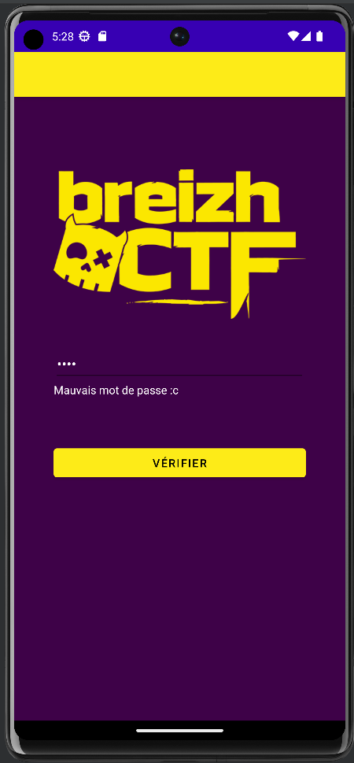
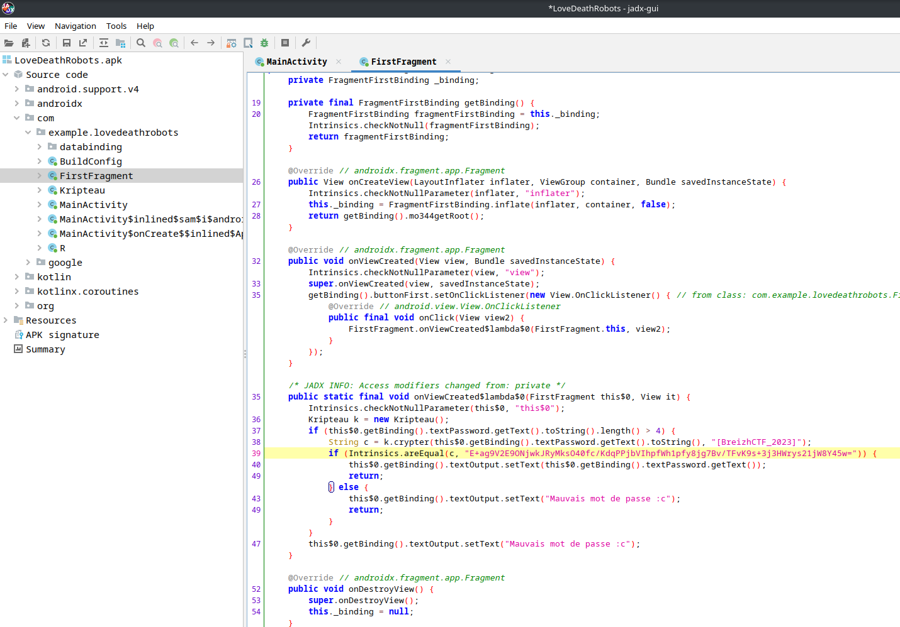

BreizhCTF 2023 - Love, Death & Robots
==========================

### Challenge details

| Event                    | Challenge  | Category       | Points | Solves      |
|--------------------------|------------|----------------|--------|-------------|
| BreizhCTF 2023           | Love, Death & Robots  | Mobile      | ???    | ???         |


« Robot moi ? serieusement ^^ haha on me l avait pas sortie celle la depuis loooongtemps :) demande a mes potes si je suis robot tu vas voir les reponses que tu vas te prendre XD ... je pense que je suis le mec le moins robot de ma bande de 11 meilleurs amis ! »  -- ChatCPT

Désactivez l'android à l'aide du passe administrateur avant qu'il ne devienne incontrôlable.

Auteur: [Zeecka](https://twitter.com/Zeecka_)

### TL;DR

L'application, développée en Kotlin, chiffrait le mot de passe fourni avec un algorythme [TEA Cipher](https://en.wikipedia.org/wiki/Tiny_Encryption_Algorithm) dont les constantes avait légèrement été modifiées. Elle vérifiait ensuite le résultat chiffré avec une chaine contenue dans l'application.

### Méthodologie

Lorsque nous ouvrons l'APK fourni dans une VM Android, sous faisons face à une demande de mot de passe:



Afin de décompiler et naviguer facilement dans l'application, nous l'ouvrons à l'aide de l'application `jadx-gui`.



Nous identifions rapidement 2 classes intéressantes:
- FirstFragment (correspondant à l'activité principale)
- Kripteau (contient les suites cryptographiques)

La première lecture indique que le message fourni par l'utilisateur doit être égale à `E+ag9V2E9ONjwkJRyMksO40fc/KdqPPjbVIhpfWh1pfy8jg7Bv/TFvK9s+3j3HWrys21jW8Y45w=` un fois chiffré à l'aide de `Kripteau.crypter()` et clé `[BreizhCTF_2023]`.

Afin de faciliter la lecture, voici le code source de Krypteau.kt : 

```kotlin
package com.example.lovedeathrobots

import java.lang.Integer.min
import java.util.*

class Kripteau {

    fun crypter(s: String, k: String): String{
        var sb = _str2vec(s)
        var kb = _str2vec(k)
        var o = byteArrayOf()
        for (i in 0..(sb.size-1) step 2) {
            val v = listOf(sb[i], sb[i+1])
            o += _vec2str(_crypter(v, kb))
        }
        return String(Base64.getEncoder().encode(o))
    }
    fun _crypter(v: List<Long>, k: List<Long>): List<Long>{
        val d: Long = (0xBC7F2023).toLong()
        var y: Long = v[0]
        var z: Long = v[1]
        var sum: Long = 0L
        for (x in 32 downTo 1) {
            sum += d
            y = ((y + ((((z shl 4) + k[0]) xor (z + sum)) xor ((z shr 5) + k[1]))) and 0xFFFFFFFF)
            z = ((z + ((((y shl 4) + k[2]) xor (y + sum)) xor ((y shr 5) + k[3]))) and 0xFFFFFFFF)
        }
        return listOf(y, z)
    }
    fun _str2vec(s: String):  List<Long>{
        val charset = Charsets.UTF_8
        var n = s.length
        // Split the string into chunks
        var numchunks = kotlin.math.ceil((n.toDouble() / 4)).toInt()
        var chunks: Array<ByteArray> = arrayOf()
        for (i in 0..(numchunks-1)){
            val sub = s.substring(4 * i, min(4 * (i + 1), n))
            chunks += (sub).toByteArray(charset)
        }
        var v: List<Long> = listOf()
        for (c in chunks){
            var i = 0L
            var s = 0L
            for (l in c){
                s += (l.toLong() shl ((8 * i).toInt()))
                i++
            }
            v += s
        }
        return v
    }
    fun _vec2str(v: List<Long>): ByteArray{
        var o = byteArrayOf()
        for (elt in v){
            for (i in 0..4){
                var b = ((elt shr (8 * i))).toByte()
                if (b != 0.toByte())
                    o += b
            }
        }
        return o
    }
}
```

La lecture de ce dernier permet d'identifier un chiffrement avec des opérandes particulières comme `<< 4` et `>> 5` (`z shl 4` et `y shr 5`).

A partir d'ici 2 possibilités:
- Reconstituer entièrement l'algorythme de déchiffrement ;
- Chercher des références sur internet pour identifier l'algorythme.

En cherchant sur internet, on retrouve une description visuelle du [TEA Cipher](https://en.wikipedia.org/wiki/Tiny_Encryption_Algorithm) :


On y retrouve ainsi les opérations de shift propre à l'algorithme.

En cherchant et testant une [implémentation python de l'algorythme](https://gist.github.com/twheys/4e83567942172f8ba85058fae6bfeef5), on identifie rapidement que le résultat du déchiffrement est différent entre les deux implémentations. En effet, le challenge dispose de constantes différentes (`0x9E3779B9` a été remplacé par `0xBC7F2023`).
En modifiant les constantes de l'algorithme python, on retrouve une implémentation correcte permettant de déchiffrer le message:

```python
# coding: utf-8
"""
Implementation of the Tiny Encryption Algorithm (TEA) for Python
https://en.wikipedia.org/wiki/Tiny_Encryption_Algorithm
Example Usage:
import tea
# The key must be 16 characters
key = '0123456789abcdef'
message = 'Sample message for encryption and decryption.'
cipher = tea.encrypt(message, key)
assert message == tea.decrypt(cipher, key)
"""
import base64
import ctypes
import itertools
import math


def encrypt(plaintext, key):
    """
    Encrypts a message using a 16-character key.
    :param plaintext:
        The message to encode.  *Must* be a utf8 string but can have any length.
    :param key:
        The encryption key used to encode the plaintext message.  *Must* be a utf8 string and 16 characters long.
    :return:
        A base64 utf8 string of the encrypted message.
    """
    if not plaintext:
        return ''

    v = _str2vec(plaintext.encode())
    k = _str2vec(key.encode()[:16])
    bytearray = b''.join(_vec2str(_encipher(chunk, k))
                         for chunk in _chunks(v, 2))

    return base64.b64encode(bytearray).decode()


def decrypt(ciphertext, key):
    """
    Decrypts a message using a 16-character key.
    :param ciphertext:
        The encrypted message to decode as a base64 utf8 string.
    :param key:
        The encryption key used to encode the plaintext message.  *Must* be a utf8 string and 16 characters long.
    :return:
        A utf8 string of the decrypted message.
    """
    if not ciphertext:
        return ''

    k = _str2vec(key.encode()[:16])
    v = _str2vec(base64.b64decode(ciphertext.encode()))

    return b''.join(_vec2str(_decipher(chunk, k))
                    for chunk in _chunks(v, 2)).decode()


def _encipher(v, k):
    """
    TEA encipher algorithm.  Encodes a length-2 vector using a length-4 vector as a length-2 vector.  
    
    Compliment of _decipher.
    :param v:
        A vector representing the information to be enciphered.  *Must* have a length of 2.
    :param k:
        A vector representing the encryption key.  *Must* have a length of 4.
    :return:
        A length-2 vector representing the encrypted information v.
    """
    y, z = [ctypes.c_uint32(x)
            for x in v]
    sum = ctypes.c_uint32(0)
    delta = 0x9E3779B9

    for n in range(32, 0, -1):
        sum.value += delta
        k1 = (z.value << 4)
        k2 = (k1 + k[0]) ^ (z.value + sum.value)
        k3 = ((z.value >> 5) + k[1])
        k4 = (k2 ^ k3)
        y.value += k4
        z.value += (((y.value << 4) + k[2]) ^ (y.value + sum.value)) ^ ((y.value >> 5) + k[3])
    return [y.value, z.value]


def _decipher(v, k):
    """
    TEA decipher algorithm.  Decodes a length-2 vector using a length-4 vector as a length-2 vector.
    
    Compliment of _encipher.
    :param v:
        A vector representing the information to be deciphered.  *Must* have a length of 2.
    :param k:
        A vector representing the encryption key.  *Must* have a length of 4.
    :return:
        The original message.
    """
    y, z = [ctypes.c_uint32(x)
            for x in v]
    delta = 0xBC7F2023
    sum = ctypes.c_uint32(0x8fe40460)  #  sum is (delta << 5) & 0xFFFFFFFF, see https://en.wikipedia.org/wiki/Tiny_Encryption_Algorithm

    for n in range(32, 0, -1):
        z.value -= (y.value << 4) + k[2] ^ y.value + sum.value ^ (y.value >> 5) + k[3]
        y.value -= (z.value << 4) + k[0] ^ z.value + sum.value ^ (z.value >> 5) + k[1]
        sum.value -= delta

    return [y.value, z.value]


def _chunks(iterable, n):
    """
    Iterates through an iterable in chunks of size n.
    :param iterable:
        Any iterable.  Must have a length which is a multiple of n, or the last element will not contain n elements.
    :param n:
        The size of the chunks.
    :return:
        A generator that yields elements in chunks of size n.
    """
    it = iter(iterable)
    while True:
        chunk = tuple(itertools.islice(it, n))
        if not chunk:
            return
        yield chunk


def _str2vec(value, l=4):
    """
    Encodes a binary string as a vector.  The string is split into chunks of length l and each chunk is encoded as 2 
    elements in the return value.
    
    Compliment of _str2vec.
    :param value:
        A binary string to encode.
    :param l:
        An optional length value of chunks.
    :return:
        A vector containing ceil(n / l) elements where n is the length of the value parameter.
    """
    n = len(value)

    # Split the string into chunks
    num_chunks = math.ceil(n / l)
    chunks = [value[l * i:l * (i + 1)]
              for i in range(num_chunks)]
    d = [sum([character << 8 * j
                 for j, character in enumerate(chunk)])
            for chunk in chunks]
    return d


def _vec2str(vector, l=4):
    """
    Decodes a vector to a binary string.  The string is composed by chunks of size l for every two elements in the 
    vector.
    
    Compliment of _str2vec.
        
    :param vector:

        An even-length vector.
    :param l:
        The length of the chunks to compose the returned string.  This should match the value for l used by _str2vec.
        If the value used is smaller, than characters will be lost.
    :return:
    """
    return bytes((element >> 8 * i) & 0xff
                 for element in vector
                 for i in range(l)).replace(b'\x00', b'')


key = '[BreizhCTF_2023]'
cipher = "E+ag9V2E9ONjwkJRyMksO40fc/KdqPPjbVIhpfWh1pfy8jg7Bv/TFvK9s+3j3HWrys21jW8Y45w="
print(decrypt(cipher, key))
```
```
Bravo, le flag est BZHCTF{WouldYouLikeACupOfTeaCipher?}.
```

#### Flag

`BZHCTF{WouldYouLikeACupOfTeaCipher?}`

Auteur: [Zeecka](https://twitter.com/zeecka_)