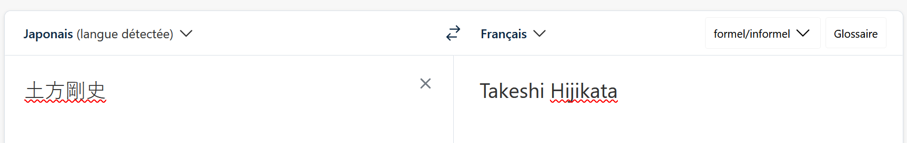
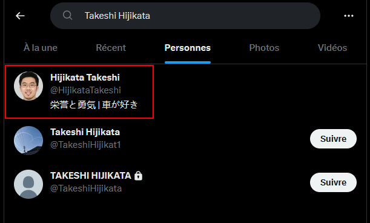
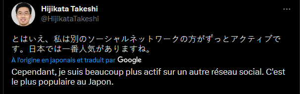
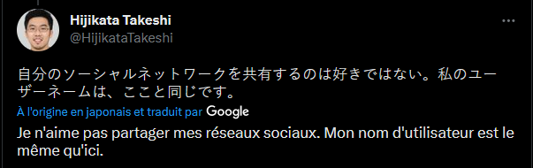
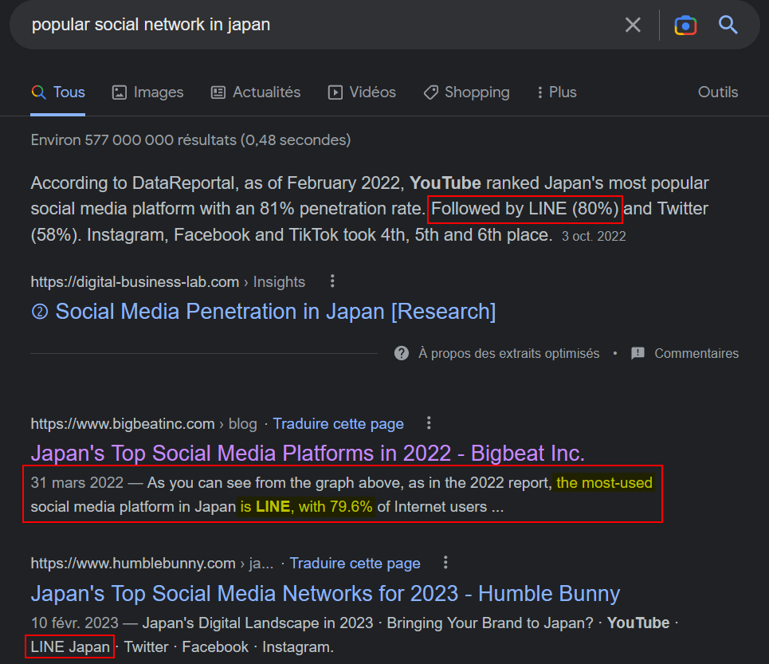
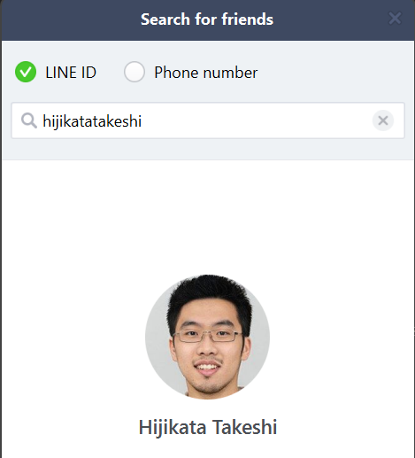
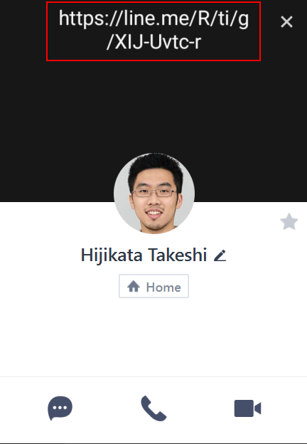
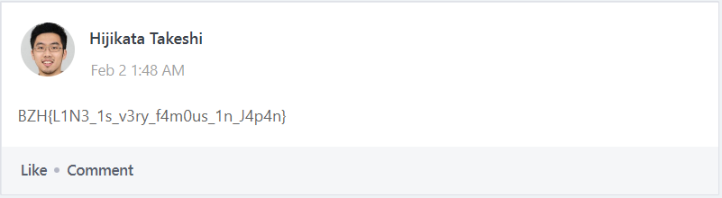

BreizhCTF 2023 - Yakuza (1/5) - Nihon he yōkoso
================================

## Détails du challenge

| Event          | Serie  |       Challenge     | Category | Points | Solves |
|----------------|--------|---------------------|----------|--------|--------|
| BreizhCTF 2023 | Yakuza |Nihon he yōkoso (1/5)| OSINT    | ???    | ???    |

## TL;DR
1. Traduction de la signature en rōmaji : `土方剛史` => *Takeshi Hijikata*
2. Recherche du nom sur Twitter -> Compte [@HijikataTakeshi](https://twitter.com/HijikataTakeshi/)
3. Dans un tweet, la cible parle d'un groupe dans lequel il serait plus actif. Il se trouverait sur un réseau social très populaire au Japon
4. Recherche des réseaux sociaux japonais populaire => **LINE** est le n°1
5. Recherche d'utilisateur sur LINE avec le même nom d'utilisateur que celui sur Twitter (marche aussi avec son prénom + nom) => On trouve son compte
6. En bannière, il y a une URL permettant de rejoindre un groupe LINE
7. En le rejoignant, présence du flag dans la partie "Notes" du groupe. 

## Objectif
L'objectif de ce premier challenge est de faire le lien entre la signature du message et une vraie personne. De ce fait, il faut trouver des traces de la cible sur Internet.  

## Méthodologie
Pour ce faire, il faut commencer par partir de cette fameuse signature : `土方剛史`. À moins d'avoir le JLPT et de comprendre directement sa signification, il faut commencer par la traduire. Pour ce faire, nous pouvons utiliser **DeepL**.

Nous nous retrouvons donc avec un prénom et un nom : `Takeshi Hijikata.` En faisant une recherche de celui-ci sur Twitter, nous pouvons trouver son compte. 

Après investigation sur son compte, deux tweet se trouvent être particulièrement intéressants :

La cible nous dit d'elle même qu'il se trouve être plus actif sur un autre réseau social. Celui-ci serait le plus populaire au Japon. Après une recherche internet plutôt basique, on tombe rapidement sur `LINE`

En cherchant le nom d'utilisateur sur LINE, on tombe sur son compte :

Nous remarquons qu'en bannière de son compte se trouve un lien. Celui-ci permet de rejoindre son groupe LINE. Il faut noter qu'afin de rejoindre un groupe, il faut disposer de l'application mobile.  

Une fois sur le groupe, nous nous dirigeons dans les notes dans lesquelles plusieurs informations s'y trouvent, dont notre flag qui marque la fin de ce premier challenge.

## Flag

`BZHCTF{L1N3_1s_v3ry_f4m0us_1n_J4p4n}`

