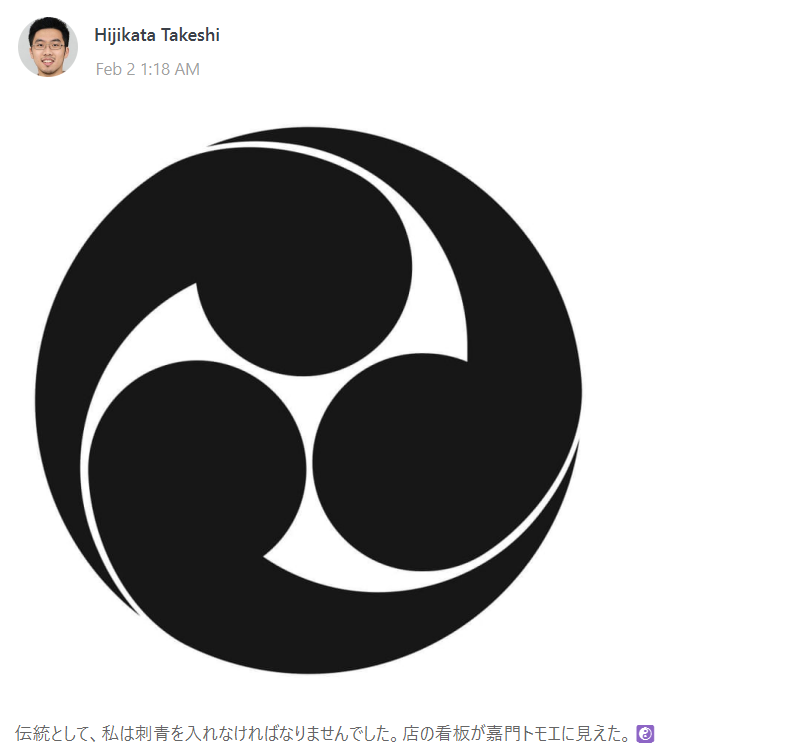
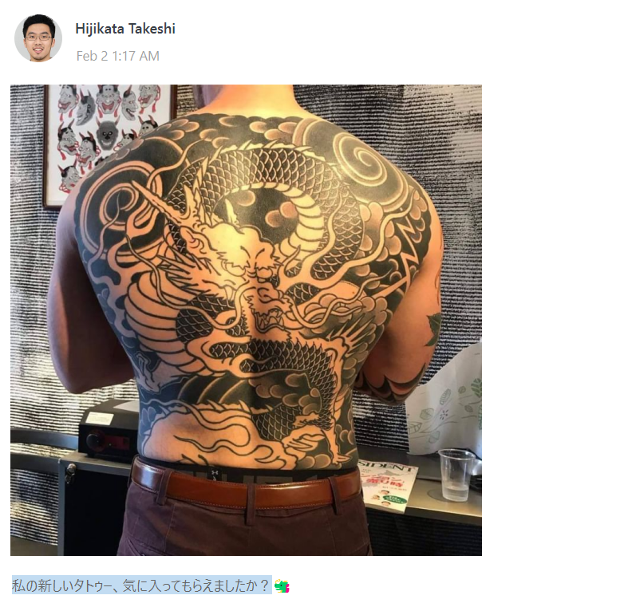
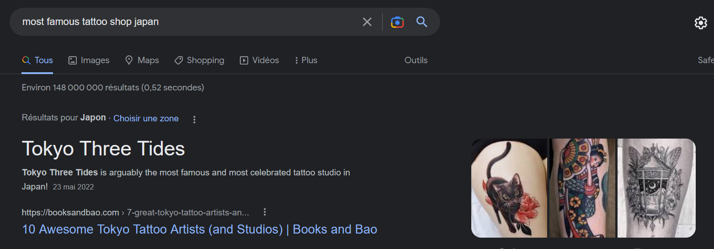
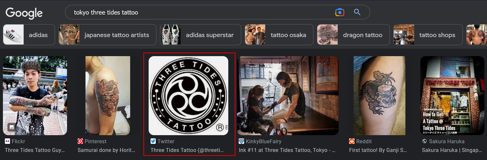
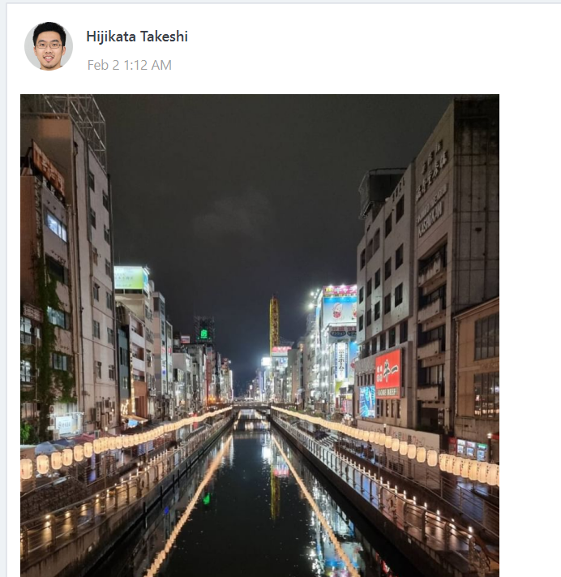
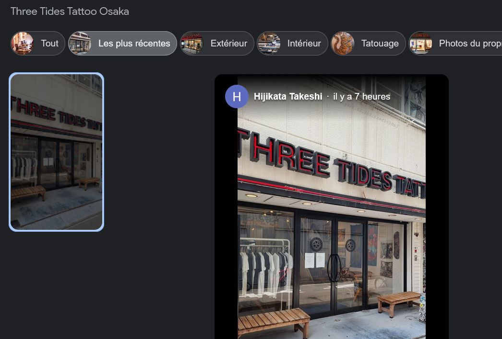
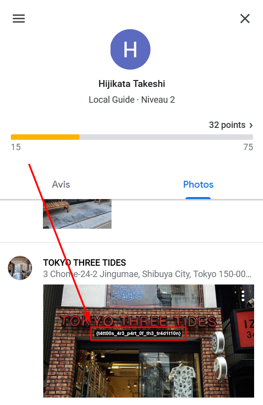

BreizhCTF 2023 - Yakuza (2/5) - Tebori
================================

## Détails du challenge

| Event          |  Serie  | Challenge     | Category | Points | Solves |
|----------------|---------|---------------|----------|--------|--------|
| BreizhCTF 2023 | Yakuza  | Tebori (2/5)  | OSINT    | ???    | ???    |

## TL;DR
1. Note sur un magasin de tatouage + photo d'un `Kamon Tomoe`
2. Recherche "most famous tattoo shop in japan" => Tokyo Three Tides Tattoo
3. Le logo du magasin est un `Kamon Tomoe` => confirmation du magasin
4. Il y en a 2 au Japon (Osaka et Tokyo). Grâce aux photos sur le groupe LINE, on sait qu'il se trouve à Osaka. 
5. Filtrer par commentaire le plus récent pour voir que Hijakata a posté une photo.
6.1 Sur téléphone : pivoter sur son profil pour obtenir le flag dans sa biographie
6.2 Sur PC : pivoter sur son profil => Hijakata a posté une autre photo contenant le flag

## Objectif
L'objectif de ce second challenge est maintenant de faire le lien entre la cible et le groupe de Yakuza. Il faut obtenir une preuve de son appartenance. 

## Méthodologie

Comme le souligne l'énoncé de ce deuxième challenge, il y a la présence de deux message sur le groupe LINE à propos d'un salon de tatouage et du tatouage en lui-même. Dans ceux-ci, notre cible dit qu'elle aurait fait un tatouage comme le veut la tradition dans un magasin ayant pour enseigne un *"Kamon Tomoe"*. 

Le tatouage en question :

Il faut donc commencer par rechercher les magasins de tatouages au Japon. Pour ce faire, une piste intéressante est de commencer par les magasins les plus connus. 

On tombe assez rapidement, voire immédiatement, sur "Tokyo Three Tides". En effectuant des recherches sur cette enseigne, on tombe sur le logo du magasin : 

Le logo se trouve être une sorte de *Kamon Tomoe*, nous indiquant que l'on est sur la bonne piste. En considérant que la cible s'y est fait tatouée, il a potentiellement laissé un avis ou une photo. Il reste à déterminer lequel des deux magasins à Tokyo ou Osaka est le bon. Avec une légère corrélation d'information et un peu de GEOINT sur les photos présentes sur LINE ou Twitter, on peut en déduire qu'il se trouve très souvent à Osaka. EN voici un exemple :

Regardons les avis de [Tokyo Three Tides Osaka](https://www.google.com/search?client=firefox-b-d&q=tokyo+three+tides+osaka#lrd=0x6000e70e351eebd3:0x5cfbe83df2d33f5b,1,,,,). En triant par photo les plus récente, on tombe sur un commentaire de Hijikata Takeshi.

Cela permet de pivoter et d'accéder à son profil. Deux cas de figure :

- Si l'on est sur téléphone, la biographie de l'utilisateur s'affiche et contient le flag :

- Si l'on est sur PC, la biographie ne s'affiche pas. Or on remarque que Hijikata a également publié une seconde photo contenant le flag :

## Flag
`BZHCTF{t4tt00s_4r3_p4rt_0f_th3_tr4d1t10n}`
