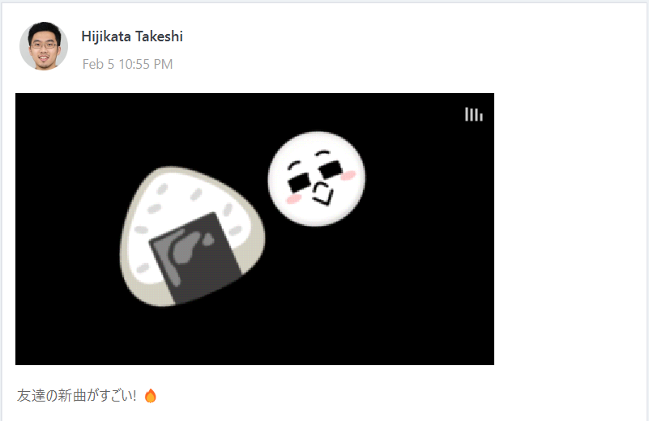
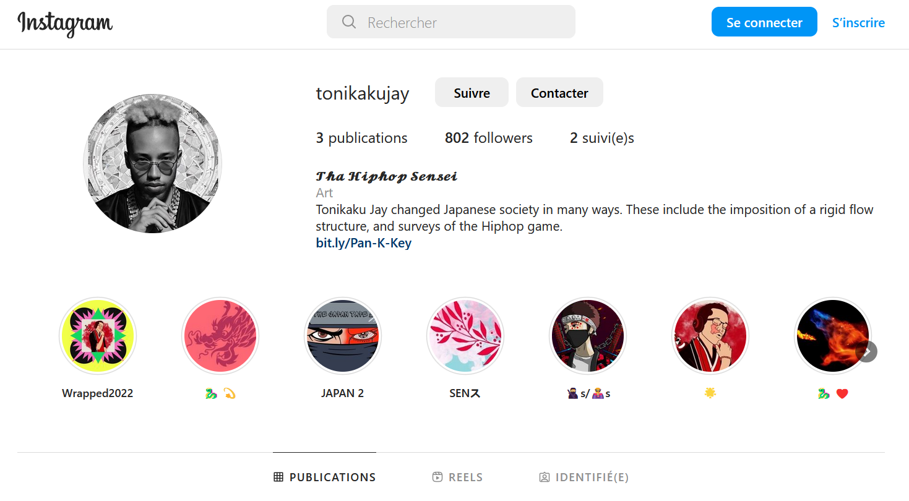
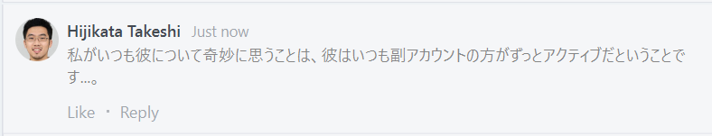
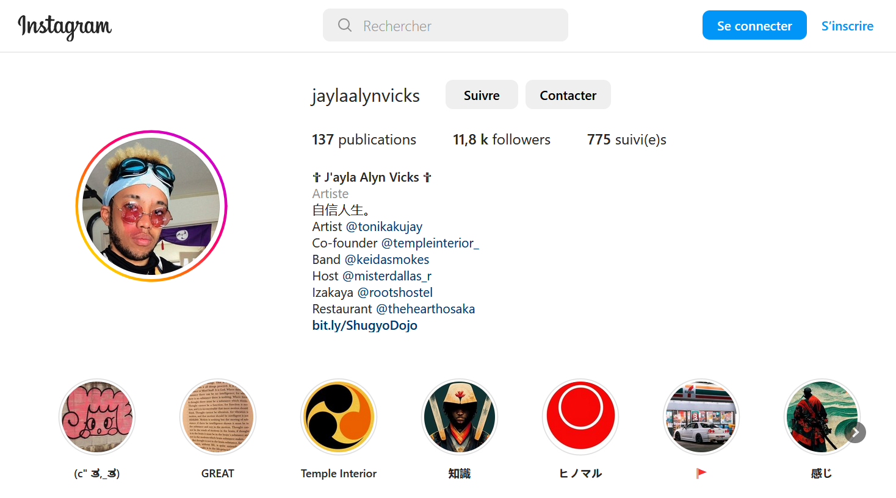

BreizhCTF 2023 - Yakuza (3/5) - Onigiri
================================

## Détails du challenge

| Event          |  Serie  | Challenge     | Category | Points | Solves |
|----------------|---------|---------------|----------|--------|--------|
| BreizhCTF 2023 | Yakuza  | Onigiri (3/5) | OSINT    | ???    | ???    |

## TL;DR
1. Utiliser Shazam (ou autre) pour reconnaitre la chanson et l'artiste => *Onigiri* par *Tonikaku Jay*
2. L'artiste possède un Instagram ([@tonikakujay](https://www.instagram.com/tonikakujay/)) sur lequel il ne semble pas très actif. En regardant ses followers, on remarque son compte personnel ([@jaylaalynvicks](https://www.instagram.com/jaylaalynvicks/))
3. Pivot sur son second compte Instagram sur lequel il est TRES actif.
4. En story, il parle de son ami, aussi connu sous le nom de *Hijikata Takeshi* qui se trouve être notre cible => présence d'un flag en dernière story.
5. [BACKUP] Une autre manière est de parcourir ses storys à la une. Celle ayant pour nom "🚩" contient également le flag.   

## Objectif
L'objectif de ce troisième challenge est de retrouver l'individu. Dans cette traque en 3 étapes, il faut tout d'abord s'attarder sur l'entourage de la cible afin de voir s'il apparaît sur les posts ou storys de potentiels amis à lui. En l'occurence oui, dans la story d'un bon ami rappeur à lui... 

## Méthodologie

Sur le groupe LINE, on remarque que la cible a posté une vidéo :

Elle contient un enregistrement avec un téléphone d'une chanson visiblement américano-japonaise. Deux émoticones sont sur la vidéo, dont un représentant un **onigiri** (petit indice). De plus, il semblerait d'après la description et les commentaires que ce soit la musique d'un bon ami à lui. 

En utilisant Shazam pour retrouver la musique, on tombe sur *"Onigiri"* de l'artiste *Tonikaku Jay*. C'est donc cette personne qui ferait parti de l'entourage de notre cible. 

Avec de très simples recherches, on tombe rapidement sur les réseaux sociaux du rappeur, dont son instagram. 

Cependant, il n'y est pas très actif. Il l'est certainement plus sur son compte personnel, comme l'indique notre cible sur le groupe LINE. 

*"Ce que je trouve toujours étrange chez lui, c'est qu'il est toujours beaucoup plus actif sur son compte secondaire..."*

En cherchant dans ses followers et en filtrant avec "*Jay*" (déduction à partir de Tonikaku Jay signifiant "*anyway, Jay*"), on tombe sur le compte *@jaylaalynvicks* qui se trouve être son compte principal. 

On remarque que le compte possède une story. Dans l'une d'elle, il parle effectivement de son ami et nous donne le flag permettant de valider cette troisième étape du challenge.

## Flag
`BZHCTF{g0_l1st3n_t0_t0n1k4ku_j4y!}`