BreizhCTF 2023 - Yakuza (4/5) - IS THAT A SUPRA ???
================================

## Détails du challenge

| Event          |  Serie  |          Challenge         | Category | Points | Solves |
|----------------|---------|----------------------------|----------|--------|--------|
| BreizhCTF 2023 | Yakuza  | IS THAT A SUPRA ??? (4/5)  | OSINT    | ???    | ???    |

## TL;DR
1. GEOINT pour trouver sa destination : `Couvent des Jacobins à Rennes` depuis `la gare de Rennes`. 
2. Grâce au screenshot de son fond d'écran, on note qu'il a l'application `Blablacar`
3. Plusieurs posts indiquent sa date de retour et le fait que ce soit un aller-retour avec **le même conducteur**. 
4. Sur l'application Blablacar : recherche d'un trajet le `samedi 18 mars` (fin du BreizhCTF) à 08h00 du *Couvent* à *la gare de Rennes*
5. Ewen poste le trajet => un avis => profil d'Hijikata => avis => flag

## Objectif
L'objectif de ce quatrième challenge reste le même : localiser notre cible. Cette fois-ci, il est possible de la localiser de manière plus précise et de connaître sa destination finale. 

## Méthodologie

Ce challenge difficile se décompose en deux parties : d'une part avec un travail de **GEOINT**. D'autre part avec un travail de **SOCMINT**. 

===

### 1. Partie GEOINT

Pour cette première partie, on commence par analyser le poste de Hijikata contenant une photo qui s'apparente être la devanture d'un édifice religieux. On remarque également la présence d'une bannière sur le mur. 

La description est la suivante (traduction approximative) :

`Savez-vous où se trouve la petite photo de la destination ? L'événement est juste à côté`

Il lance le challenge de retrouver le lieu à ses amis, sachant que l'événement auquel il se rend se trouve juste à côté. 

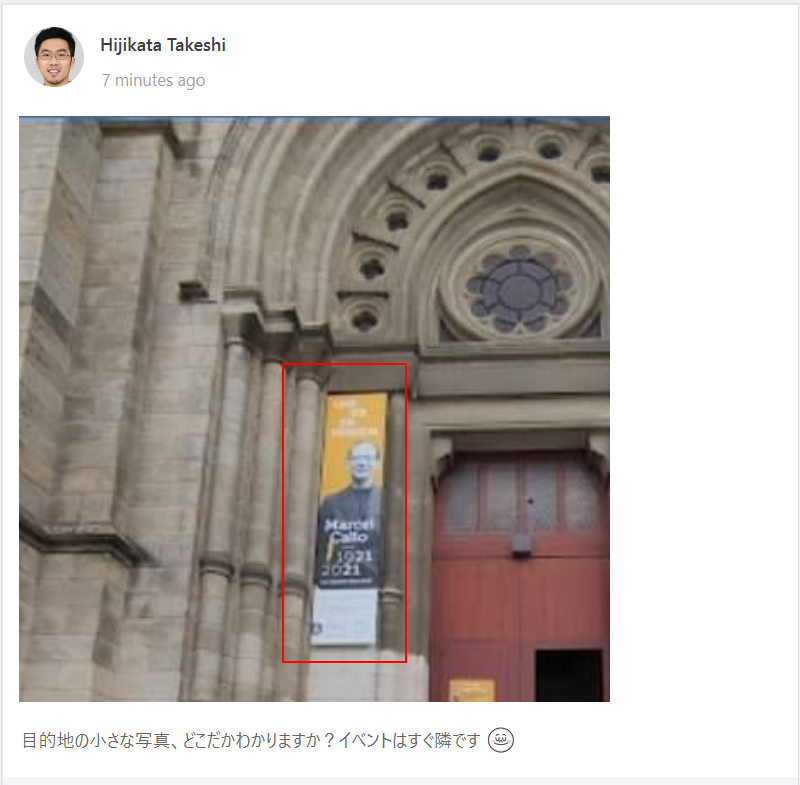

En analysant la photo malgré sa qualité, on peut facilement extraire le texte suivant : 

`Marcel Callo 1921 2021`

En faisant une recherche Google du texte, les premiers résultats indiquent que l'événement se passe à Rennes et serait en lien avec le diocèse de cette ville.

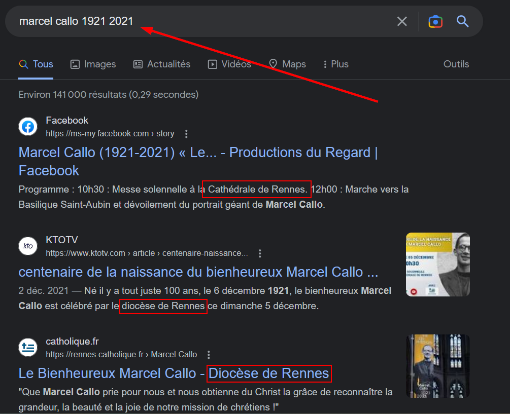

Lorsque l'on s'intéresse de plus près à cet événement, on remarque qu'il a eu lieu en majorité à la `basilique Saint-Aubin`

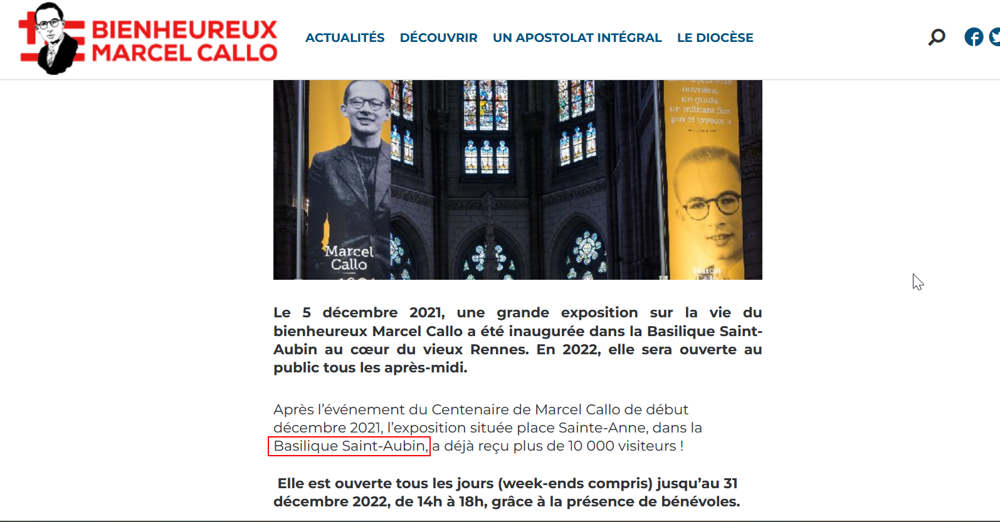

La suite logique est donc de rechercher cette basilique sur Google Maps afin de savoir à quoi elle ressemble pour affirmer ou infirmer si la photo y correspond. 

Avec le bon placement sur Street View, on remarque tout de suite la devanture identique. La bannière y est même toujours accrochée. On a donc la confirmation que l'événement se situe à côté de cette basilique au niveau de `la place Saint-Anne`.

Si le rapprochement n'a pas encore été fait avec le lieu dans lequel vous êtes actuellement (wink wink), une recherche intéressante peut être 

`place saint anne événements rennes`

Les résultats nous remontent rapidement le `Couvent des Jacobins` de Rennes.

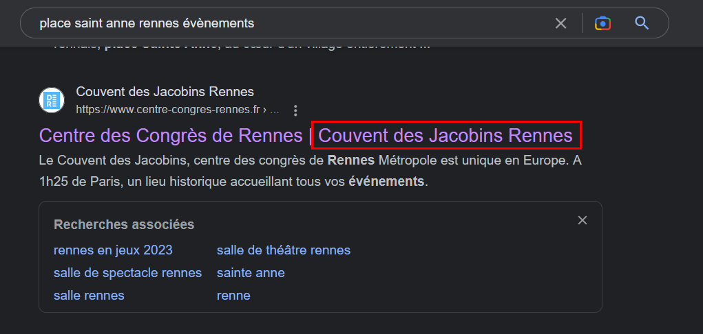

Comme dernière vérification, on peut mesurer la distance entre les deux points pour aperçevoir qu'ils se situent bien juste à côté l'un de l'autre.  

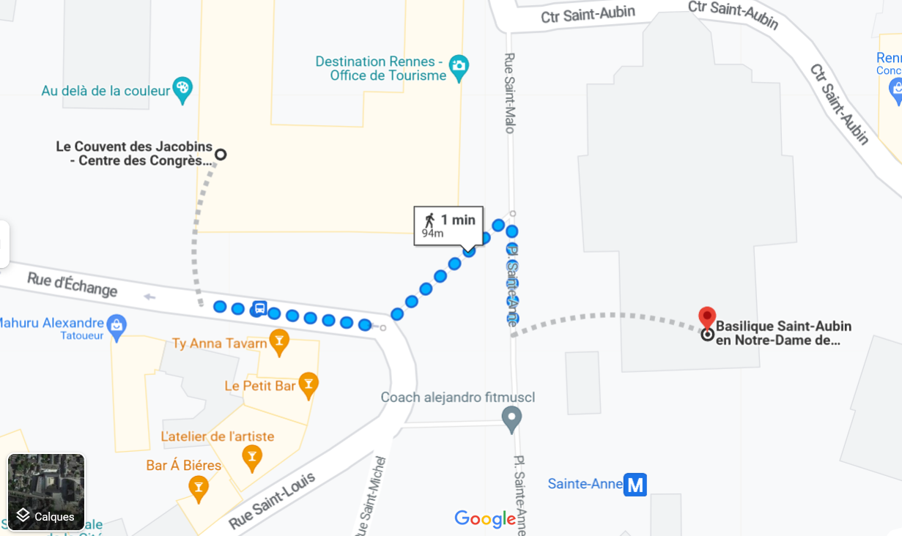

Cela conclut donc la partie GEOINT. La cible se rend au `Couvent des Jacobins` et sera présente au `BreizhCTF`. 

===

### 2. Partie SOCMINT

Maintenant que l'on sait où la cible se rend, nous allons pouvoir utiliser cette information. 

Ici, l'information intéressante est le post dans lequel il parle de sa nouvelle voiture. Il y montre son fond d'écran et nous avons un aperçu de certaines applications qu'il utilise. Parmi celles-ci, on remarque Blablacar. C'est une application pour du covoiturage en Europe. 

`Vous aimez mon fond d'écran ? J'ai acheté une nouvelle voiture`

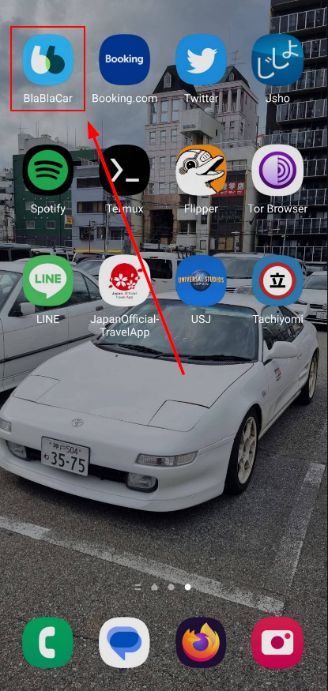

De plus, deux autres posts nous indiquent des informations supplémentaires quant à ses déplacements. D'une part, un dans lequel il dit qu'il a hâte de voir comment *ils conduisent* (sous-entendu les étrangers) mais aussi qu'il va faire un aller-retour du lieu de l'événement à la gare. 

`En tant qu'amateur de voitures, j'ai hâte de voir comment ils roulent. Mais le voyage sera court... Ce sera un aller-retour du lieu à la gare`

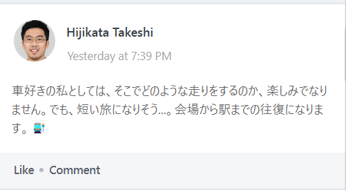

D'autre part, il mentionne dans le second qu'il rentrera à la fin de l'événement le samedi matin. 

`En fait, je rentrerai chez moi dès que l'événement sera terminé. Ce sera samedi matin.`

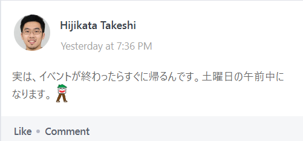

Par ailleurs en commentaire, il dit que ce sera avec le même conducteur. 

`Avec le même conducteur`

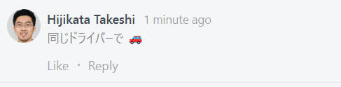

Grâce à l'ensemble de nos informations, on peut à présent effectuer une recherche sur `Blablacar`. L'essentiel est d'effectuer la recherche sur le trajet retour puisque le trajet aller n'est plus disponible. La recherche en question :

- Depuis : `Le Couvent des Jacobins - Centre des Congrès de Rennes Métropole, Rennes`
- Vers : `Gare de Rennes, Rennes`
- Date : `Samedi 18 mars` (fin du BreizhCTF)

On tombe sur le trajet d'un certain `Ewen`. 

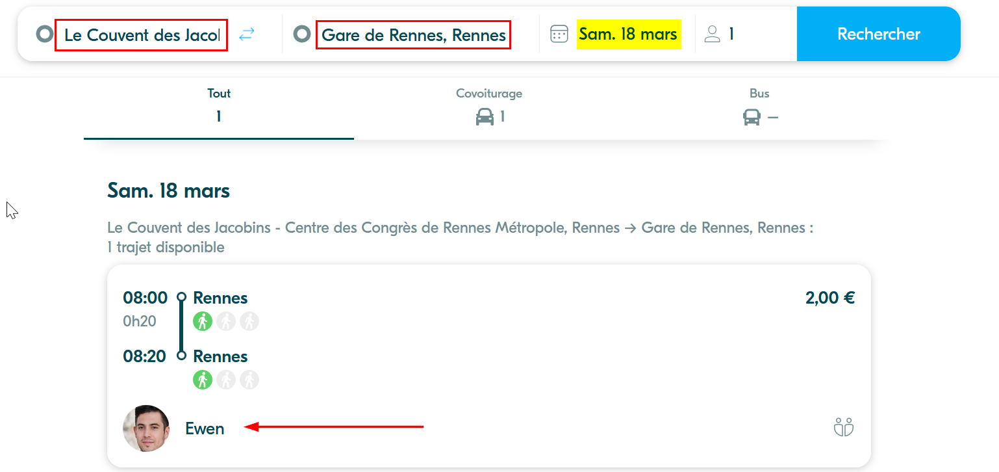

Sur le trajet en question, on peut obtenir des informations sur le conducteur. On remarque qu'il a un avis. 

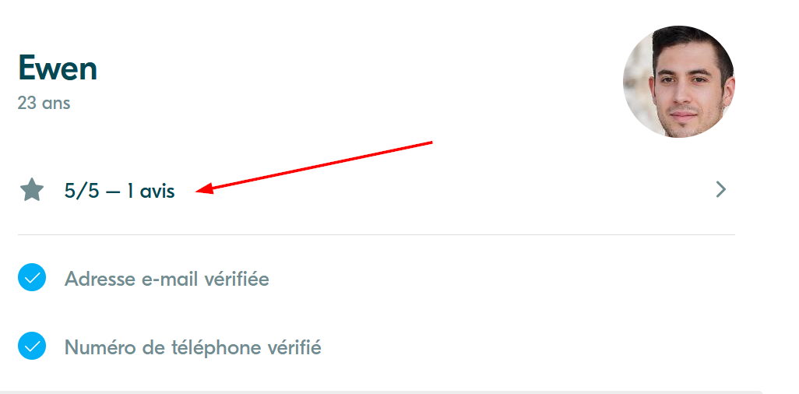

Cet avis a été laissé par Hijikata. C'est un point de pivot pour se diriger sur son compte Blablacar. 

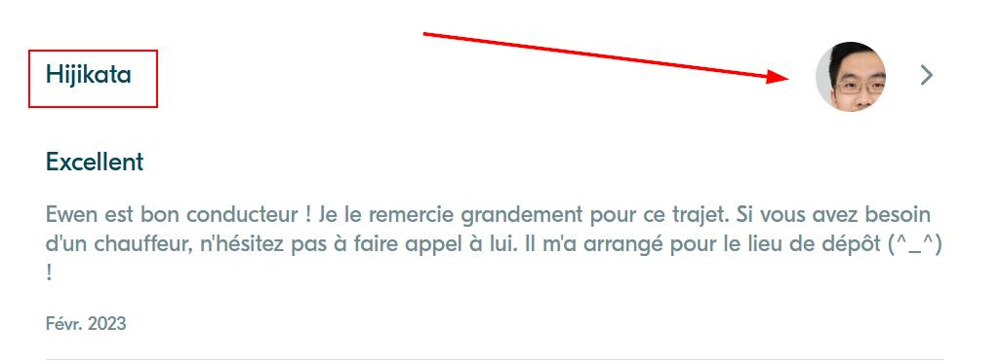

En répétant la même procédure et en se rendant sur les avis que possède Hijikata, on trouve finalement le flag. 

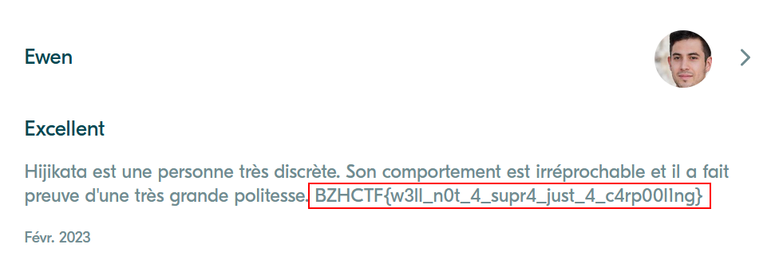

## Flag
`BZHCTF{w3ll_n0t_4_supr4_just_4_c4rp00l1ng}`