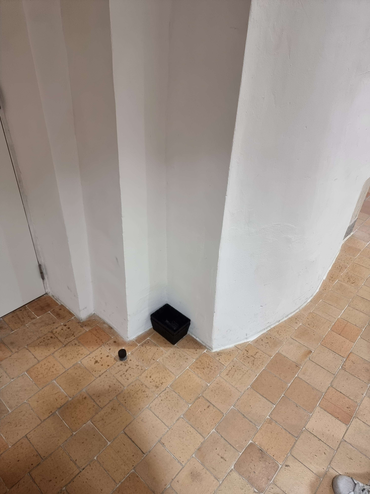
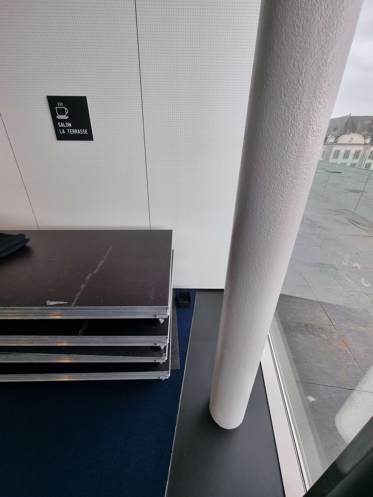
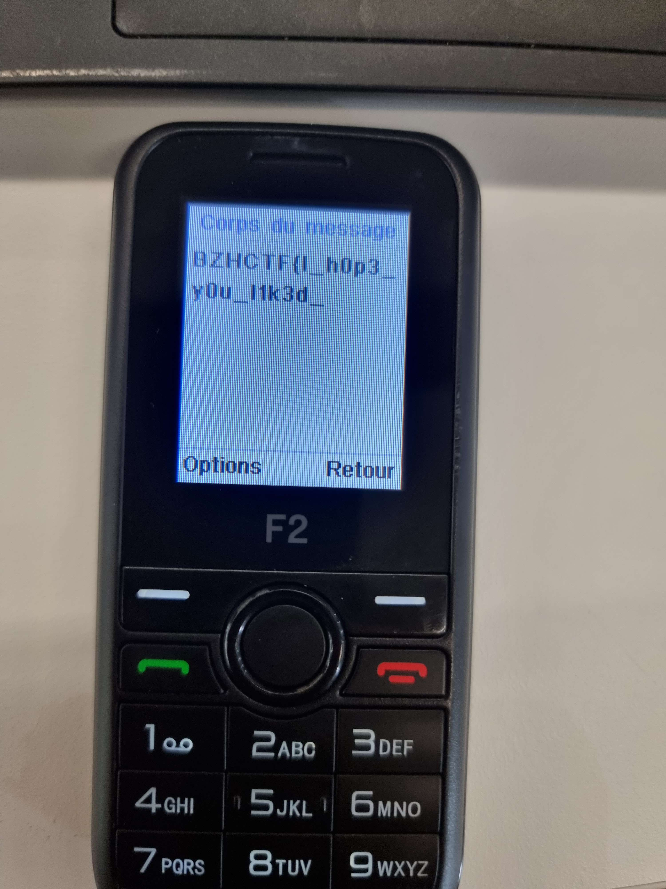
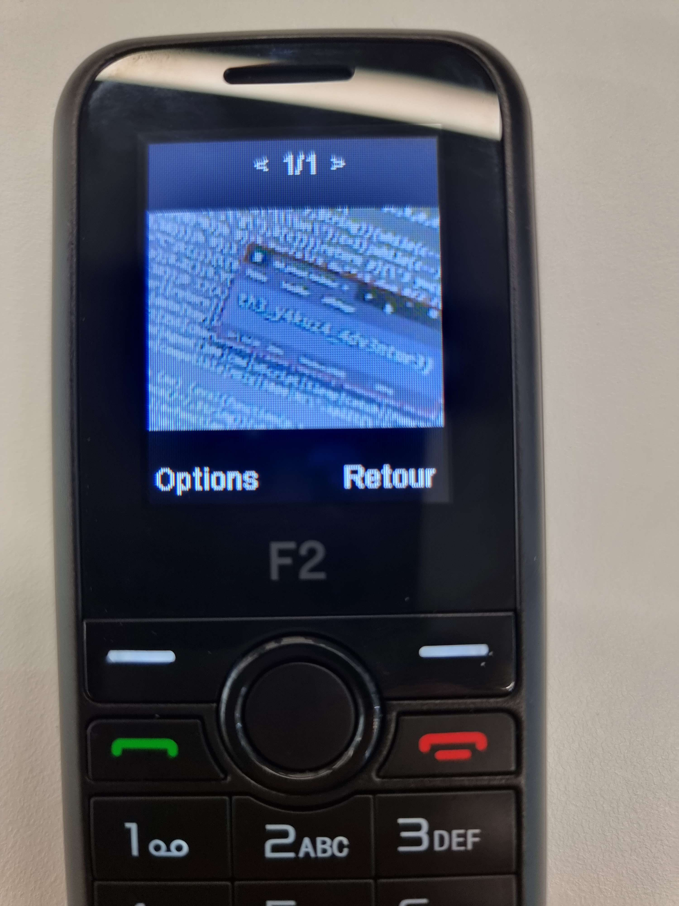

BreizhCTF 2023 - Yakuza (5/5) - Détective Conan
================================

## Détails du challenge

| Event          |  Serie  |        Challenge       | Category | Points | Solves |
|----------------|---------|------------------------|----------|--------|--------|
| BreizhCTF 2023 | Yakuza  | Détective Conan (5/5)  | OSINT    | ???    | ???    |

## TL;DR
1. Trouver l'emplacement des deux corbeilles 
2. Dans chacune des corbeilles, il y a un téléphone.
3. Sur le téléphone n°1 => boîte de récéption => conversation contenant la première partie du flag
4. Sur le téléphone n°2 => fichiers => photo contenant la seconde partie du flag

## Objectif
L'objectif de ce dernier challenge est de retrouver les téléphones appartenant à l'attaquant. 

## Méthodologie

La première étape consiste à trouver l'emplacement des deux corbeilles. Pour ce faire, aucune technique particulière. Il faut se déplacer et chercher dans le Couvent des Jacobins.

Voici l'emplacement des deux corbeilles :

**Etage 0** : 

**Etage 2** : 

Chacune d'entre elles contient un téléphone. 

En se balandant sur le téléphone n°1 on retrouve plusieurs preuves, notamment une conversation vers un certain "GCC". Cette première conversation contient la première partie du flag. 

`BZHCTF{I_h0p3_y0u_l1k3d_`

En fouillant sur le téléphone n°2, on retrouve dans les fichiers du téléphone une photo contenant la seconde partie du flag.

`th3_y4kuz4_4dv3ntur3}`

Ce dernier challenge clôt la série "*Yakuza*". J'aimerai beaucoup avoir vos retours sur cette série de challenge, qu'il soit positif ou négatif. Donc n'hésitez pas à me contacter sur Discord ou Twitter. (:

## Flag
`BZHCTF{I_h0p3_y0u_l1k3d_th3_y4kuz4_4dv3ntur3}`
