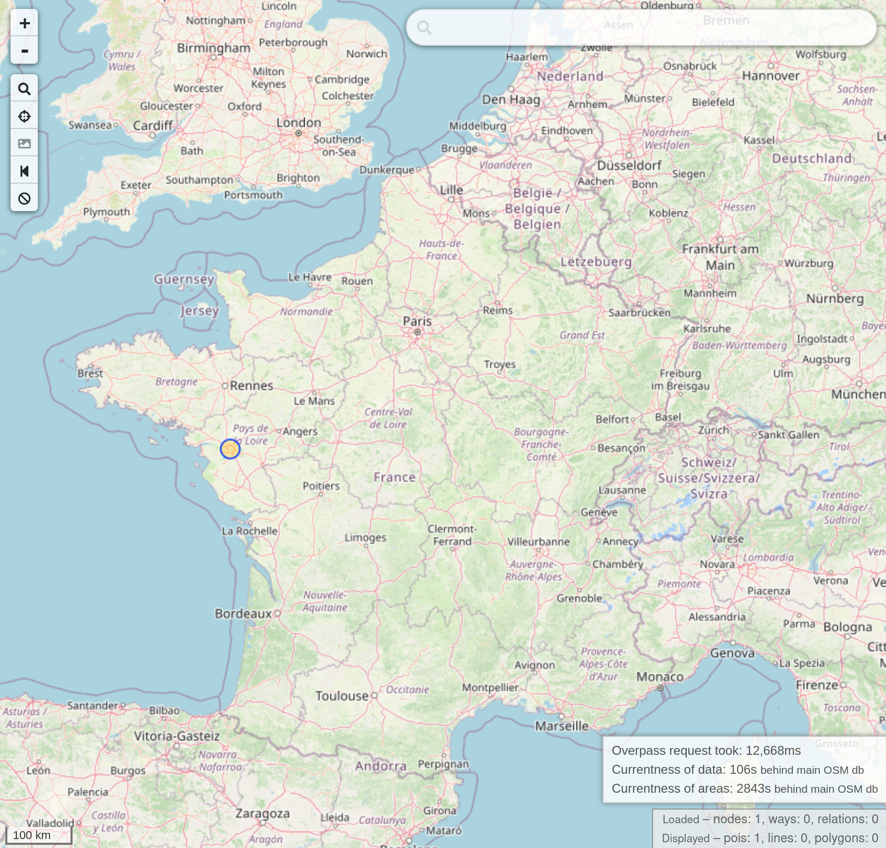

BreizhCTF 2023 - Bar ou Turbot ?
================================

## Détails du challenge

| Event          | Challenge       | Category | Points | Solves |
|----------------|-----------------|----------|--------|--------|
| BreizhCTF 2023 | Bar ou Turbot ? | OSINT    | ???    | ???    |

```
Un soir d'hiver, quelque part en France,
Un homme erre, ivre et seul,
Il cherche un bar où il a bu,
Mais le nom lui fait cruellement défaut.

Il se rappelle d'un Starbucks,
Où il a pris un café plus tôt dans la soirée,
Avant de s'engager dans une rue piétonne,
Où gît son destin sous son coeur.

Il avance pendant environ cent mètres,
Avant que ses yeux ne trouvent un magasin de bandes dessinées fermé,
Mais juste à côté, il aperçoit le bar où il avait passé la nuit.

Il se remémore les rires des clients et les verres de bière vides,
Mais son esprit s'obstine à ne pas lui rappeler le nom du bar,
Il poursuit sa recherche avec espoir,
Emportant avec lui sa mémoire troublée.
```

Le flag est le nom du bar en minuscule et sans espace. Par exemple pour le bar `La Boussole` le flag serait `BZHCTF{laboussole}`.

## TL;DR

Le poème décrit l'itinéraire d'un homme ivre jusqu'à un bar, l'objectif est de retrouver le nom de ce bar. Le bar peut être retrouvé à l'aide d'Overpass Turbo, en utilisant les informations données dans le poème.

## Méthodologie

### Objectif

L'objectif du challenge est de retrouver le nom d'un bar. Du poème peuvent être extrait certains éléments qui nous permettront de retrouver ce bar :

> Un soir d'hiver, quelque part en France,  
> Il se rappelle d'un Starbucks,  
> Avant de s'engager dans une rue piétonne,  
> Il avance pendant environ cent mètres,  
> Avant que ses yeux ne trouvent un magasin de bandes dessinées fermé,  
> Mais juste à côté, il aperçoit le bar où il avait passé la nuit.

On cherche donc en France un bar, qui se trouve à côté d'un magasin de bandes dessinées. Ce magasin de BD se suitant dans une rue piétonne, dans laquelle il y a également un Starbucks à une centaine de mètres.

### Overpass Turbo

On peut utiliser [Overpass Turbo](https://overpass-turbo.eu/) pour résoudre ce challenge.

Overpass Turbo est un outil en ligne qui permet de requêter la base de données Open Street Map via l'[API Overpass](https://wiki.openstreetmap.org/wiki/Overpass_API) et manière plus simple qu'en passant par l'API. Overpass Turbo permet de visualiser les résultats des requêtes sur une carte interactives, et de les exporter facilement sous différent formats (GeoJSON et autres).

Pour une introduction à Overpass Turbo, je vous invite à lire les articles de NixIntel sur le sujet ([Partie 1](https://nixintel.info/osint-tools/getting-started-with-overpass-turbo-part-1/), [Partie 2](https://nixintel.info/osint-tools/getting-started-with-overpass-turbo-part-2/)).

### Construction de la requête

On va construire la requête Overpass Turbo étape par étape, en suivant le poème.

On commence par chercher tous les Starbucks en France.

```
area[name="France"];

node[brand=Starbucks](area)->.starbucks;
```

On cherche ensuite les rues piétonnes (*pedestrian*) à proximité des Starbucks, pour cela on utilise un rayon assez court (20 mètres) afin de ne sélectionner que les rues adjacentes aux starbucks.

```
way(around.starbucks:20)[highway=pedestrian]->.pedestrian;
```

On cherche ensuite les magasins de BD (*comic*) présents le long des rues piétonnes sélectionnées, en utilisant encore une fois un rayon de 20 mètres.

```
node(around.pedestrian:20)[books=comic]->.comic;
```

Et dernier filtre, on ne garde que les bars présents à côté des magasins de BD.

```
node(around.comic:20)[amenity=bar]->.bar;
```

Tout mis bout à bout, on obtient la requête suivante :

```
area[name="France"];

node[brand=Starbucks](area)->.starbucks;
way(around.starbucks:20)[highway=pedestrian]->.pedestrian;
node(around.pedestrian:20)[books=comic]->.comic;
node(around.comic:20)[amenity=bar]->.bar;

(.bar;);

out;
```



On trouve un seul bar correspondant à toutes ces critères, son nom est **Espit Chupitos**.

On aurait également pu simplifier la requête en faisant abstraction de la rue piétonne. En cherchant un bar, à côté d'un magasin de BD, ce dernier se situant dans un rayon de plus ou moins 100 mètres d'un Starbucks :

```
area[name="France"];

node[brand=Starbucks](area)->.starbucks;
node(around.starbucks:120)[books=comic]->.comic;
node(around.comic:20)[amenity=bar]->.bar;

(.bar;);

out;
```

## Flag

`BZHCTF{espitchupitos}`
