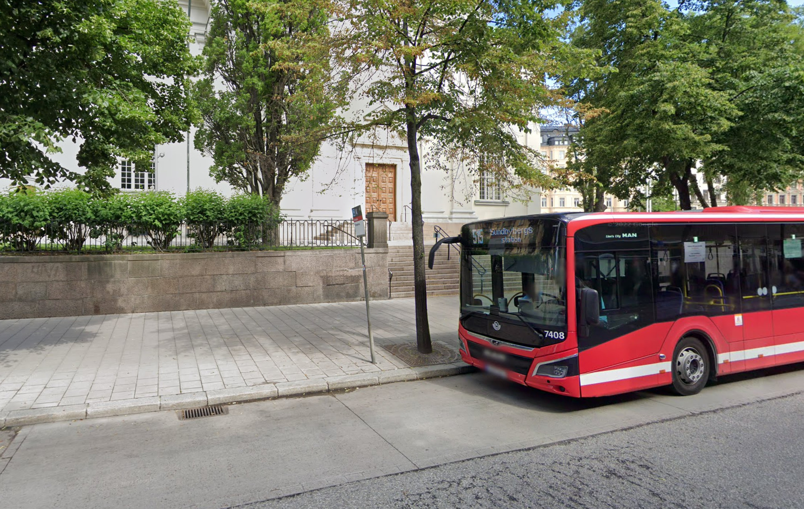
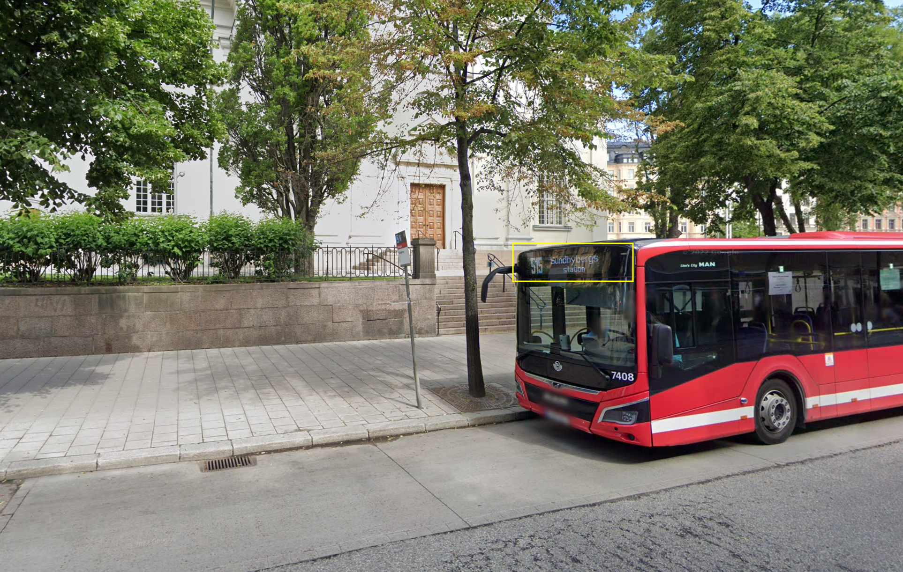
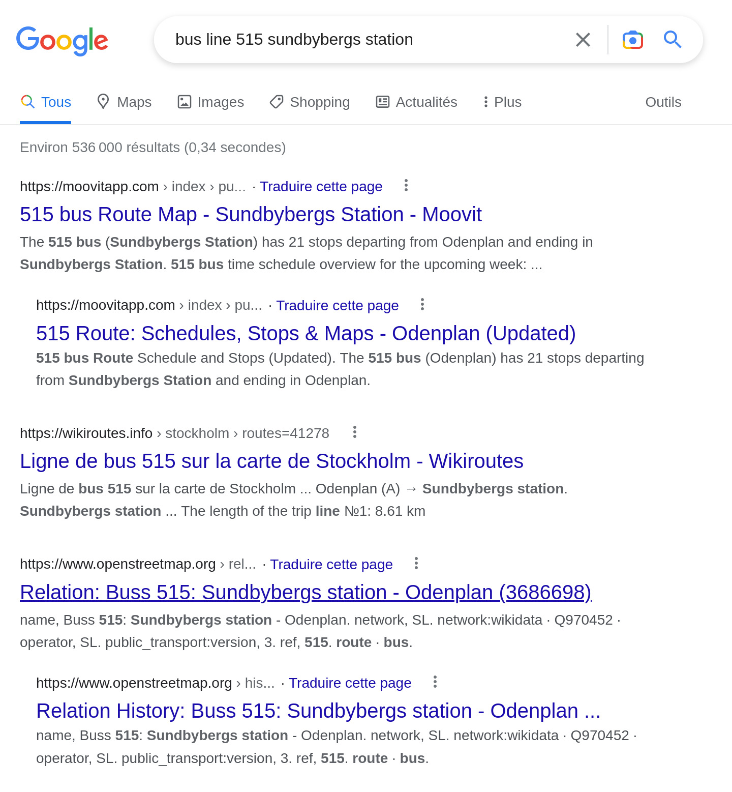
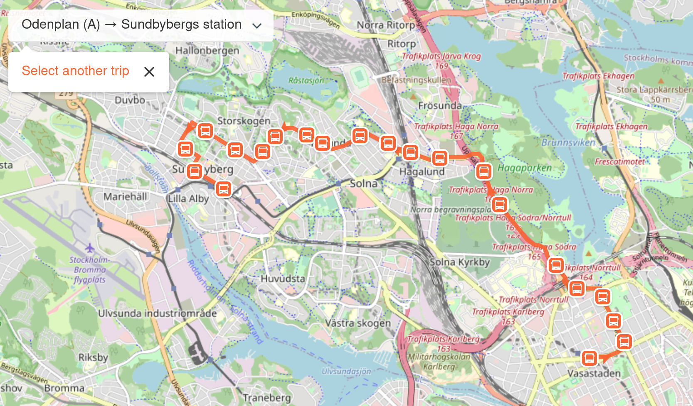
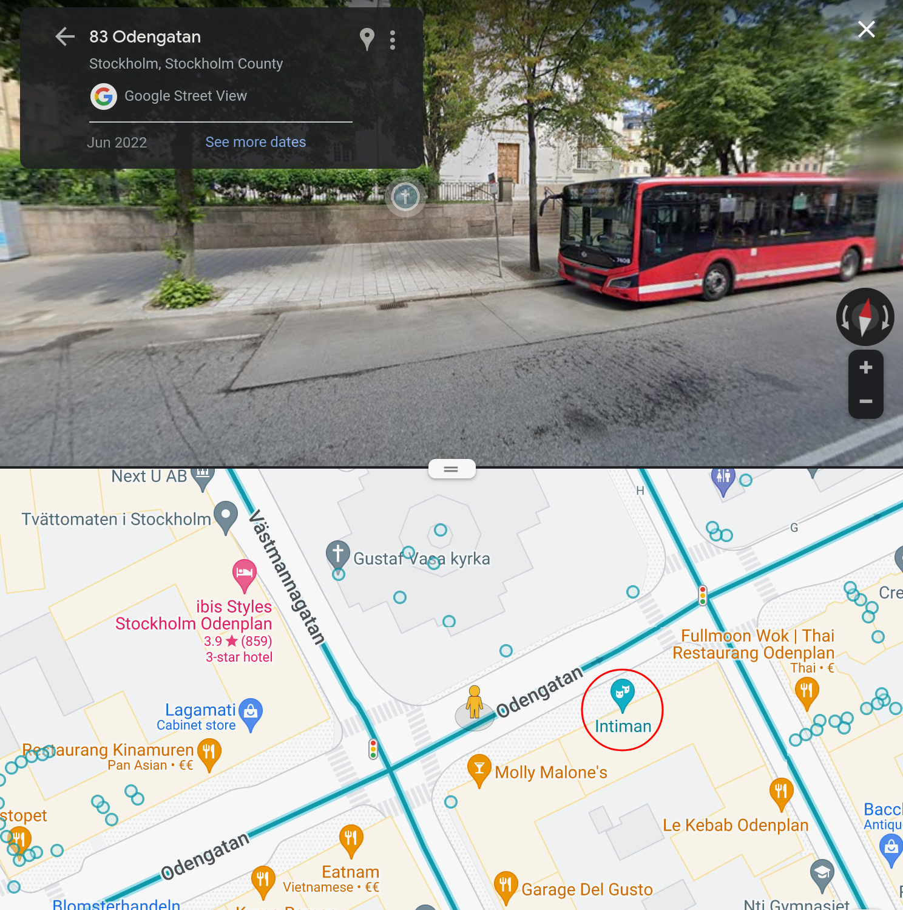

BreizhCTF 2023 - GeoBus
=======================

## Détails du challenge

| Event          | Challenge       | Category | Points | Solves |
|----------------|-----------------|----------|--------|--------|
| BreizhCTF 2023 | GeoBus          | OSINT    | ???    | ???    |

Quel est le nom du théâtre le plus proche?

Le flag est le nom du théâtre en minuscule. Par exemple pour le théâtre `Euphoria` le flag serait `BZHCTF{euphoria}`.

## TL;DR

La destination du bus ainsi que le numéro de ligne sont inscrits au devant du bus. Ces informations nous permettent de retrouver assez facilement la ligne ; il reste ensuite à suivre la ligne pour trouver où à été prise la photo.

## Méthodologie

En regardant le bus d'un peu plus près, on remarque que la destination du bus ainsi que le numéro de ligne y sont inscrits.

* Numéro de ligne: 515
* Destination: Sundbybergs station

Une recherche sur un moteur de recherche permet de retrouver l'itinéraire du bus.

Il ne reste plus qu'à suivre cet itinéraire jusqu'à trouver l'endroit où la photo a été prise. La photo a été prise près de l'arrêt Odenplan, premier arrêt de la ligne.

Le théâtre le plus proche est à quelques dizaines de mètre, il s'agit du théâtre **Intiman**.

## Flag

`BZHCTF{intiman}`
