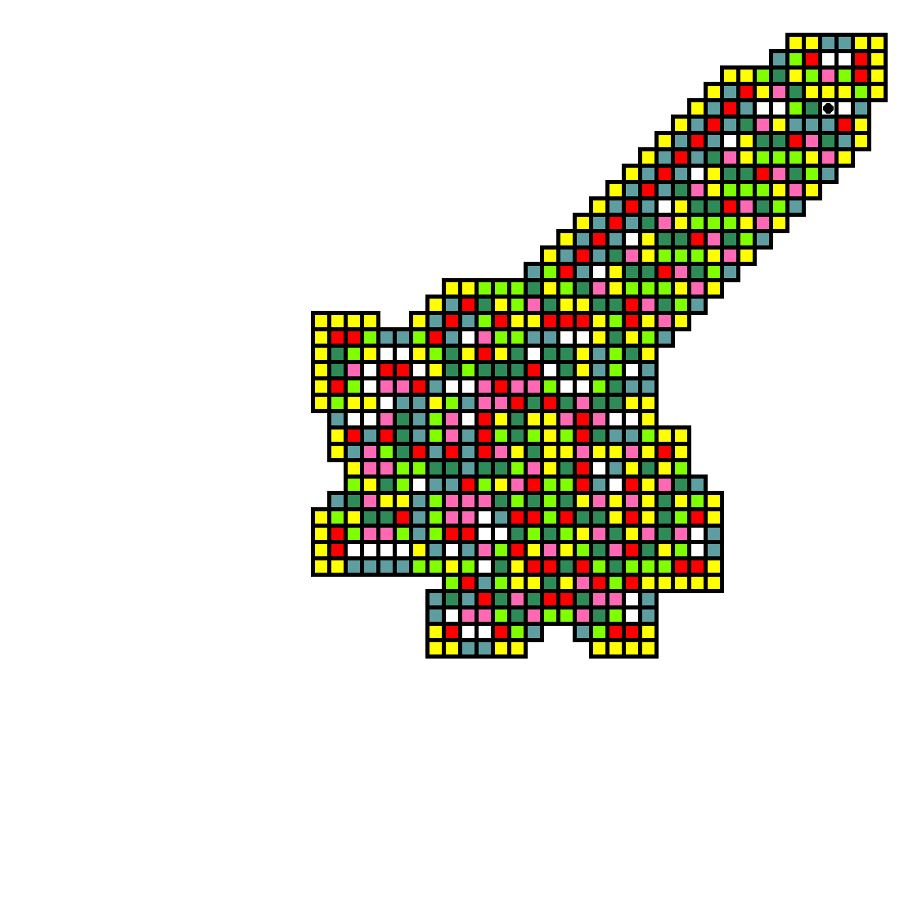

BreizhCTF 2023 - 1001 pattes
==========================

### Challenge details

| Event                    | Challenge  | Category       | Points | Solves      |
|--------------------------|------------|----------------|--------|-------------|
| BreizhCTF 2023           | 1001 pattes | Programmation  | ???    | ???         |


Les fourmis sont des artistes dont l'inspiration n'est encore que trop peu connu.

https://www.youtube.com/watch?v=1X-gtr4pEBU (à regarder pour comprendre le challenge)

Auteur: [Zeecka](https://twitter.com/Zeecka_)

- Fichier: [Examples.zip](../Challenge/Examples.zip)
- md5sum: 74984c1c14a69cff6d5d76985919a55c
- Fichier: [challenge.png](../Challenge/challenge.png)
- md5sum: aa4e2b232bced0d882967d35570afc14

### TL;DR

Le challenge nécessite la réimplementation d'un automate appelé "Langton's Ant" (ou fourmis de Langtons). Un bruteforce est ensuite à effectuer sur un nombre de paramètre limités pour aboutir à l'image recherchée. Une fois l'image identifiée, le flag peut être dérivé des différents paramètres d'entrée.

### Méthodologie

Le challenge nécessite la réimplementation d'un automate appelé ["Langton's Ant"](https://fr.wikipedia.org/wiki/Fourmi_de_Langton) (ou fourmis de Langtons). Une description visuelle et pertinente de l'automate est [disponible sur youtube](https://www.youtube.com/watch?v=1X-gtr4pEBU).

La solution attendue est l'empreinte d'une configuration JSON dont les paramètre sont les suivants (extrait du fichier config1.json):

```json
{
    "colors": {
        "cadetblue": "L",
        "hotpink": "R",
        "seagreen": "L",
        "white": "R"
    },
    "sizes": {
        "cell": 15,
        "border": 5,
        "grid": 30
    },
    "steps": 200
}
```

Ici, nous disposons de 3 clés principales:
- colors (permettant d'indiquer les direction à suivre pour l'automate)
- sizes (définissant les propriétés graphiques du rendu)
- steps (nombre d'itération de l'automate)

Dans un premier temps, il est important de réimplémenter un algorithme permettant de générer les fichiers d'exemples à partir de ces configurations:


*Exemple 1*


*Exemple 2*

Dans ces fichiers et leurs configuration, on retrouve bien les propriétés de la clés "sizes" (à savoir, la taille des cellules, taille des bordures et nombre de cases).

Le point noir indique la position finale de la fourmis.

Les différentes informations déductible des différents exemples et des notes additionelles du challenge permettent d'aboutir à un script fonctionnel dont voici une proposition d'implémentation:

#### Implémentation de l'exemple

```python
#! /usr/bin/env python3
# -*- coding: utf-8 -*-
# pylint: disable=invalid-name, line-too-long

"""
    Langton's Ant program
"""

import sys
import json
from PIL import Image, ImageDraw

sys.setrecursionlimit(10000)


class Ant:
    """ Langton's Ant. """

    def __init__(self, config, position=None):
        self.img = Image.new("RGBA", (WINDOW_WIDTH, WINDOW_HEIGHT))
        self.steps = 0
        self.config = config
        self.colors = list(self.config.keys())
        self.grid = [[None for i in range(GRID_WIDTH)]
                     for j in range(GRID_HEIGHT)]
        self.position = position
        if position is None:
            self.position = (GRID_WIDTH // 2, GRID_HEIGHT //
                             2)  # Middle of the screen
        self.prev_position = self.position
        self.orientation = "T"
        self.update()

    def update(self):
        """ Move ant and change color. """
        if self.steps < MAX_STEPS:
            self.steps += 1
            x, y = self.position
            if self.grid[y][x] is None:  # White by default
                self.grid[y][x] = "white"
            for i, color in enumerate(self.colors):
                if self.grid[y][x] == color:
                    new_color = self.colors[(i+1) % len(self.colors)]
                    self.grid[y][x] = new_color  # Update color
                    self.move(self.config[new_color])  # Move ant
                    break
            try:
                self.update()
            except IndexError:
                self.save()
        else:
            self.save()

    def move(self, turn):
        """ Move ant. Turn can be L or R """
        self.prev_position = self.position
        x, y = self.position
        if self.orientation == "T":
            if turn == "L":
                x, o = x-1, "L"
            else:
                x, o = x+1, "R"
        elif self.orientation == "L":
            if turn == "L":
                y, o = y+1, "B"
            else:
                y, o = y-1, "T"
        elif self.orientation == "B":
            if turn == "L":
                x, o = x+1, "R"
            else:
                x, o = x-1, "L"
        else:  # R
            if turn == "L":
                y, o = y-1, "T"
            else:
                y, o = y+1, "B"

        self.position = (x, y)
        self.orientation = o

    def save(self):
        """ Save ant drawing as image. """
        # Draw squares
        img = ImageDraw.Draw(self.img)
        for y in range(GRID_HEIGHT):
            for x in range(GRID_WIDTH):
                color = self.grid[y][x]
                if color is None:
                    continue
                img.rectangle([
                    (x * CELL_SIZE, y * CELL_SIZE),
                    (x * CELL_SIZE + CELL_SIZE + CELL_BORDER - 1, y * CELL_SIZE + CELL_SIZE + CELL_BORDER - 1)],
                    outline="black", fill=color, width=CELL_BORDER
                )
        # Draw ant
        x, y = self.prev_position
        ant_size = ANT_SIZE - 1
        padding = (CELL_SIZE + CELL_BORDER - ant_size)//2
        img.ellipse([
            (x * CELL_SIZE + padding, y * CELL_SIZE + padding),
            (x * CELL_SIZE + ant_size + padding, y * CELL_SIZE + ant_size + padding)],
            fill="black"
        )
        filename = "exemple1.png"
        self.img.save(filename)


if __name__ == "__main__":
    # Load config
    with open('config1.json', encoding='utf-8') as json_file:
        data = json.load(json_file)
        CONFIG = data["colors"]
        MAX_STEPS = data["steps"]
        SIZES = data["sizes"]
        CELL_INSIDE = SIZES["cell"]
        CELL_BORDER = SIZES["border"]
        GRID_WIDTH = SIZES["grid"]

    CELL_SIZE = CELL_INSIDE + CELL_BORDER
    ANT_SIZE = CELL_INSIDE - 2
    GRID_HEIGHT = GRID_WIDTH  # Square image
    WINDOW_WIDTH = CELL_SIZE * GRID_WIDTH + CELL_BORDER
    WINDOW_HEIGHT = CELL_SIZE * GRID_HEIGHT + CELL_BORDER

    Ant(CONFIG)
```

Une fois l'implémentation des exemples réalisée, la solution du challenge consiste à retrouver les paramètres d'une configuration initiale pour une image donnée.

#### Implémentation de la solution


*Image du challenge*

A partir de l'image de challenge, nous pouvons récupérer les variables liées à la taille de la grille.
Le nombre de couleur est également un facteur important à récupérer depuis le fichier de challenge.
Nous savons également que le nombre d'itérations est inférieur à 10000.

Nous disposons donc d'un fichier de configuration partiel:

```json
{
    "colors": {
        "cadetblue": "?",
        "chartreuse": "?",
        "hotpink": "?",
        "red": "?",
        "seagreen": "?",
        "white": "?",
        "yellow": "?"
    },
    "sizes": {
        "cell": 15,
        "border": 5,
        "grid": 55
    },
    "steps": 10000  // maximum
}
```

La solution consiste donc à générer l'ensemble des solutions de rotation de couleurs possibles avec des itérations pouvant aller jusqu'à 10000 maximum.

Afin d'améliorer notre attaque par force brute, il est intéressant de noter:
- Lorsqu'une case (transparente sur l'image du challenge) vient à être colorée, la configuration de couleur (ainsi que les itérations suivantes) peuvent être exclues. **Il n'est donc pas nécessaire de les calculer**.
- Lorsque la position finale de la fourmis ne correspond pas entre le challenge et l'image générée, cette dernière peut être exclus. Ainsi, **la vérification d'image peut se baser dans un premier temps sur la position finale de la fourmis**.
- Lorsque qu'un cycle est détecté (état de la grille, position et orientation de la fourmis similaires), le calcul des prochaines itérations peut être exclus. Cette implémentation est cependant compliquée et couteuse, et n'est donc pas nécessaire.

Afin d'effectuer notre attaque par force brute sur les différents paramètres, nous réutilisons notre script initial,  auquel nous ajoutons les vérifications précédemment mentionnées, ainsi qu'un produit des différentes combinaisons de couleurs avec une boucle for. Une vérification de la solution est effectuée à chaque itération:

```python
# Test each combination of L/R up to `MAX_STEPS` steps.
N = 2**len(CONFIG)
for j in range(N):
    print(f"{j}/{N}")
    bin_j = bin(j)[2:].zfill(len(CONFIG))  # binary notation tricks
    conf = bin_j.replace("0", "L").replace("1", "R")
    CONFIG = {
        "cadetblue": conf[0],
        "chartreuse": conf[1],
        "hotpink": conf[2],
        "red": conf[3],
        "seagreen": conf[4],
        "white": conf[5],
        "yellow": conf[6]
    }

    # Start drawing
    try:
        Ant(CONFIG)
    except Exception() as e:
        print(e)
        continue
```
*Boucle sur l'ensemble des combinaisons de couleurs*

```python
def update(self):
    """ Move ant and change color. """
    # We need to quit as soon as possible to reduce computing
    # Compute current shape
    current_shape = [[k is not None for k in row] for row in self.grid]
    # Check if current shape is already bigger (if so, quit)
    for row in range(len(SHAPE)):
        for p in range(len(SHAPE[0])):
            if current_shape[row][p] is not None and SHAPE[row][p] is None:
                return

    # Check if shape is the same
    if current_shape == SHAPE:
        if self.grid == MATRIX:
            print("[+] Found valid solution !")
            print(f"[i] Steps number: {self.steps}")
            print(f"[i] Valid configuration: {self.config}")
            self.save()

    if self.steps < MAX_STEPS:
```
*Modification de la fonction update pour vérifier la solution*

L'implémentation de la solution finale est la suivante:

```python
#! /usr/bin/env python3
# -*- coding: utf-8 -*-
# pylint: disable=invalid-name, line-too-long, consider-using-enumerate

"""
    Langton's Ant program
"""

import sys
import json
from PIL import Image, ImageDraw

sys.setrecursionlimit(15000)


class Ant:
    """ Langton's Ant. """

    def __init__(self, config, position=None):
        self.img = Image.new("RGBA", (WINDOW_WIDTH, WINDOW_HEIGHT))
        self.steps = 0
        self.status = []
        self.config = config
        self.colors = list(self.config.keys())
        self.grid = [[None for i in range(GRID_WIDTH)]
                     for j in range(GRID_HEIGHT)]
        self.position = position
        if position is None:
            self.position = (GRID_WIDTH // 2, GRID_HEIGHT //
                             2)  # Middle of the screen
        self.prev_position = self.position
        self.orientation = "T"
        self.update()

    def update(self):
        """ Move ant and change color. """
        # We need to quit as soon as possible to reduce computing
        # Compute current shape
        current_shape = [[k is not None for k in row] for row in self.grid]
        # Check if current shape is already bigger (if so, quit)
        for row in range(len(SHAPE)):
            for p in range(len(SHAPE[0])):
                if current_shape[row][p] is not None and SHAPE[row][p] is None:
                    return

        # Check if shape is the same
        if current_shape == SHAPE:
            if self.grid == MATRIX:
                print("[+] Found valid solution !")
                print(f"[i] Steps number: {self.steps}")
                print(f"[i] Valid configuration: {self.config}")
                self.save()

        if self.steps < MAX_STEPS:
            self.steps += 1
            x, y = self.position
            if self.grid[y][x] is None:  # White by default
                self.grid[y][x] = "white"
            for i, color in enumerate(self.colors):
                if self.grid[y][x] == color:
                    new_color = self.colors[(i+1) % len(self.colors)]
                    self.grid[y][x] = new_color  # Update color
                    self.move(self.config[new_color])  # Move ant
                    break
            try:
                self.update()
            except IndexError:
                return

    def move(self, turn):
        """ Move ant. Turn can be L or R """
        self.prev_position = self.position
        x, y = self.position
        if self.orientation == "T":
            if turn == "L":
                x, o = x-1, "L"
            else:
                x, o = x+1, "R"
        elif self.orientation == "L":
            if turn == "L":
                y, o = y+1, "B"
            else:
                y, o = y-1, "T"
        elif self.orientation == "B":
            if turn == "L":
                x, o = x+1, "R"
            else:
                x, o = x-1, "L"
        else:  # R
            if turn == "L":
                y, o = y-1, "T"
            else:
                y, o = y+1, "B"

        self.position = (x, y)
        self.orientation = o

    def save(self):
        """ Save ant drawing as image. """
        # Draw squares
        img = ImageDraw.Draw(self.img)
        for y in range(GRID_HEIGHT):
            for x in range(GRID_WIDTH):
                color = self.grid[y][x]
                if color is None:
                    continue
                img.rectangle([
                    (x * CELL_SIZE, y * CELL_SIZE),
                    (x * CELL_SIZE + CELL_SIZE + CELL_BORDER - 1, y * CELL_SIZE + CELL_SIZE + CELL_BORDER - 1)],
                    outline="black", fill=color, width=CELL_BORDER
                )
        # Draw ant
        x, y = self.prev_position
        ant_size = ANT_SIZE - 1
        padding = (CELL_SIZE + CELL_BORDER - ant_size)//2
        img.ellipse([
            (x * CELL_SIZE + padding, y * CELL_SIZE + padding),
            (x * CELL_SIZE + ant_size + padding, y * CELL_SIZE + ant_size + padding)],
            fill="black"
        )
        filename = f"imgs/challenge_{self.steps}_{''.join(self.config.values())}.png"
        self.img.save(filename)

def get_challenge(filename):
    """ Return shape and matrix for a given ant art. """
    challenge = Image.open(filename)
    rgba_matrix_1d = []
    for my in range(CELL_BORDER + 1, WINDOW_HEIGHT, CELL_SIZE):
        for mx in range(CELL_BORDER + 1, WINDOW_WIDTH, CELL_SIZE):
            rgba_matrix_1d.append(challenge.getpixel((mx, my)))
    colors_map = {
        (95, 158, 160, 255): "cadetblue",
        (127, 255, 0, 255): "chartreuse",
        (255, 105, 180, 255): "hotpink",
        (255, 0, 0, 255): "red",
        (46, 139, 87, 255): "seagreen",
        (255, 255, 255, 255): "white",
        (0, 0, 0, 0): None,
        (255, 255, 0, 255): "yellow"
    }
    rgba_matrix = []
    for i in range(0, len(rgba_matrix_1d), GRID_WIDTH):
        rgba_matrix.append(rgba_matrix_1d[i: i+GRID_WIDTH])

    matrix = [[colors_map[k] for k in row] for row in rgba_matrix]
    shape = [[k is not None for k in row] for row in matrix]

    return shape, matrix

if __name__ == "__main__":
    # Load partial config with known variables such as sizes and colors number
    with open('partial_config.json', encoding='utf-8') as json_file:
        data = json.load(json_file)
        CONFIG = data["colors"]
        MAX_STEPS = data["steps"]
        SIZES = data["sizes"]
        CELL_INSIDE = SIZES["cell"]
        CELL_BORDER = SIZES["border"]
        GRID_WIDTH = SIZES["grid"]

    CELL_SIZE = CELL_INSIDE + CELL_BORDER
    ANT_SIZE = CELL_INSIDE - 2
    GRID_HEIGHT = GRID_WIDTH  # Square image
    WINDOW_WIDTH = CELL_SIZE * GRID_WIDTH + CELL_BORDER
    WINDOW_HEIGHT = CELL_SIZE * GRID_HEIGHT + CELL_BORDER

    # Convert image to matrix of colors & shape
    SHAPE, MATRIX = get_challenge("challenge.png")

    # Test each combination of L/R up to `MAX_STEPS` steps.
    N = 2**len(CONFIG)
    for j in range(N):
        print(f"{j}/{N}")
        bin_j = bin(j)[2:].zfill(len(CONFIG))  # binary notation tricks
        conf = bin_j.replace("0", "L").replace("1", "R")
        CONFIG = {
            "cadetblue": conf[0],
            "chartreuse": conf[1],
            "hotpink": conf[2],
            "red": conf[3],
            "seagreen": conf[4],
            "white": conf[5],
            "yellow": conf[6]
        }

        # Start drawing
        try:
            Ant(CONFIG)
        except Exception() as e:
            print(e)
            continue
```

Le résultat du script nous apporte la sortie suivante:
```
0/128
1/128
2/128
3/128
...
98/128
99/128
[+] Found valid solution !
[i] Steps number: 7103
[i] Valid configuration: {'cadetblue': 'R', 'chartreuse': 'R', 'hotpink': 'L', 'red': 'L', 'seagreen': 'L', 'white': 'R', 'yellow': 'R'}
100/128
101/128
```

Le fichier de solution est par ailleur généré par notre script et sauvegardé sous le nom `challenge_7103_RRLLLRR.png`.

En adaptant le fichier de configuration, on retrouve le fichier de configuration initial suivant:

```json
{
    "colors": {
        "cadetblue": "R",
        "chartreuse": "R",
        "hotpink": "L",
        "red": "L",
        "seagreen": "L",
        "white": "R",
        "yellow": "R"
    },
    "sizes": {
        "cell": 15,
        "border": 5,
        "grid": 55
    },
    "steps": 7103
}
```

En respectant sa mise en forme et en calculant sa somme de controle, on retrouve le flag:

```bash
echo "BZHCTF{$(md5sum solution.json | awk '{print $1}')}"
BZHCTF{aaa2ed309b4ce6caf181f3923e80b136}
```

#### Flag

`BZHCTF{aaa2ed309b4ce6caf181f3923e80b136}`

Auteur: [Zeecka](https://twitter.com/zeecka_)