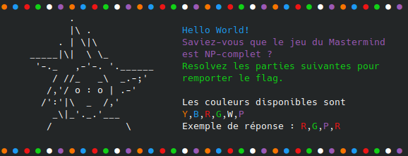
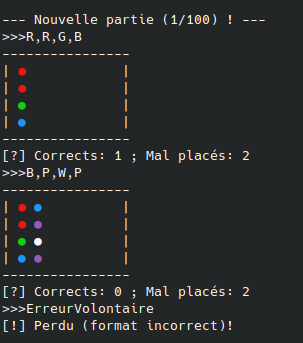

BreizhCTF 2023 - Mastermind
===========================

### Challenge details

| Event                    | Challenge  | Category      | Points | Solves      |
|--------------------------|------------|---------------|--------|-------------|
| BreizhCTF 2023           | Mastermind | Programmation | ???    | ???         |


Hello World !
Saviez-vous que le jeu du Mastermind est NP-complet ?
Résolvez les parties pour remporter le flag.

Auteur: [Zeecka](https://twitter.com/Zeecka_)

### TL;DR

Pour résoudre le challenge, il faut implémenter un solveur du jeu Mastermind, un algorithme optimisé proposé par Donald Knuth est disponible sur [Wikipédia](https://en.wikipedia.org/wiki/Mastermind_(board_game)#Worst_case:_Five-guess_algorithm). Plusieurs implémentations sont également disponibles sur Github. Des solveurs externes sont également disponibles.

### Méthodologie

L'énonce du challenge est explicite, une connexion TCP à l'aide de netcat nous permet d'avoir un énoncé plus complet:

```bash
nc <ip> <port>
```


Quelques tests manuels permettent de confirmer le fonctionnement du jeu. Le nombre de coups limités (6) rendent la partie particulièrement difficile à résoude.



La recherche sur internet d'un algorithme performant nous mène à une solution fonctionnant en 5 coups au maximum ([Five guess algorithm](https://en.wikipedia.org/wiki/Mastermind_(board_game)#Worst_case:_Five-guess_algorithm)).

Le principe de cet algorithme repose sur l'élimination des combinaisons probables au fur et a mesure de la progression de la partie. Cette élimination est accompagnée par un choix stratégique des coups basé sur un algorithme de type [MinMax](https://fr.wikipedia.org/wiki/Algorithme_minimax) visant à choisir le mouvement le plus avantageux parmis la pire combinaison envisageable: 

1. Créer un `set` "S" des 1296 codes possibles {YYYY, YYYB, ... PPPW, PPPP}.
2. Commencer avec un essai initial YYBB. (L'auteur de l'algorithme propose des exemples montrant que l'algorithme utilisant des nombres différents de "deux paires"; tel que YYYY, YYYW, YYWR, ou YWRG; ne fonctionne pas en 5 tentatives pour l'ensemble des combinaisons possible.)
3. Jouer l'essai pour avoir le nombre de couleurs correctes et mal placées.
4. Si le jeu indique 4 couleurs correctes, la partie est gagnée et l'algorithme s'arrète.
5. Sinon, retirer de "S" tous les candidats qui ne donneraient pas la même réponse. L'idée est ici de vérifier si le nombre de couleurs correctes et mal placées correspond entre les candidats et la combinaison secrète du jeu. On place donc initiallement chaque candidat dans l'hypothèse qu'il serait la combinaison secrête. *Note: La vérification du candidat implique de re-coder une fonction calculant le nombre de couleurs correctes et mal placées pour un notre essai par rapport au candidat.*
6. Le prochain essai se base sur l'algorithme MinMax. Les réponses à un essai sont définies par les combinaisons `(nombre correcte, nombre mal placés)`, un essai a plusieurs combinaisons probables.
Le score de chaque combinaison est défini par le nombre de candidats (de codes dans "S") encore possible après avoir pris connaissance de la réponse (et donc après invalidation des candidats). Le calcul des candidats probables est de nécessaire pour chaque combinaison de chaque essai.
Le score retenu pour un essai est le moins favorable de l'ensemble des combinaisons de réponses (donc avec le plus de candidats encore en jeu). En effet, on part du principe que la combinaison du serveur est la moins aventageuse, et donc celle qui nous renvoit le plus de candidat.
On cherche ensuite à minimiser les candidats en selectionnant l'essai le plus favorable, offrant le moins de candidats possible. Une règle importante consiste a privilégier un essai dejà présent dans "S" (un candidat donc) lorsque c'est possible.
7. Répéter depuis l'étape 3.

Sans plus attentdre, voici l'algorithme implémenté en Python3 avec la bibliothèque pwntool:

```python
#!/usr/bin/env python3
# -*- coding:utf-8 -*-
#
# Solution basée sur l'algorithme proposé par Donald Knuth
# https://en.wikipedia.org/wiki/Mastermind_(board_game)#Worst_case:_Five-guess_algorithm

from pwn import *
from itertools import product

HOST = "127.0.0.1"
PORT = 3000
r = remote(HOST, PORT)  # Connexion au serveur
colors = ['Y', 'B', 'R', 'G', 'W', 'P']


def send(c):
    r.sendline((c).encode())


def reponse(essai):
    """ Requète le serveur en jouant un coup. """
    send(','.join(essai))
    print(f">>>{','.join(essai)}")
    board = r.recvuntil(b"-\n").decode()
    board += r.recvuntil(b"-\n").decode().strip()
    print(board)
    score = r.recv().decode()
    if "[+]" in score:
        print(score)
        return (4, 0)
    correct = int(score.split(" ")[2][0])
    mal_place = int(score.split(" ")[6][0])
    print(f"Correctes = {correct}, Mal placés = {mal_place}")
    return (correct, mal_place)


def partie():
    """ Déroulement d'une partie. """
    gagne = False
    essai = "YYBB"  # Notre premier coup est 1122

    # Creation des 1296 possibilités
    possible = [''.join(p) for p in product('YBRGWP', repeat=4)]
    candidats = [''.join(p) for p in product('YBRGWP', repeat=4)]

    intro = r.recv().decode().strip(">>>")
    print(intro)
    while not gagne:
        # On retire notre essai
        possible.remove(essai)
        if essai in candidats:
            candidats.remove(essai)
        # On joue notre essai pour récupéré les Corrects / Mal placés
        rep_code = reponse(essai)

        if rep_code[0] == 4:
            gagne = True
            break

        # Maj des candidats
        candidats = maj_candidats(candidats, essai, rep_code)
        # Calcul le prochain coup
        essai = minimax(possible, candidats)


def calculer_reponse(code, secret):
    """ Calcule la réponse que pourrait renvoyer le serveur
    pour un code et un secret donné. """
    nb_correct = 0
    nb_wrongplace = 0
    for i in range(4):
        if code[i] == secret[i]:
            nb_correct += 1
        elif code[i] in secret:
            nb_wrongplace += 1
    return (nb_correct, nb_wrongplace)


def maj_candidats(candidats, essai, rep_code):
    """ Mise à jours des candidats potentiels.

    Pour chaque candidat, on compare notre essai avec le candidat,
    comme si celui-ci était le code secret.
    Si la réponse est différente, alors le candidat est élimité,
    car la réponse attendue ne correspond pas à la réponse recue.
    A l'inverse si le réponses coincident, alors on garde le candidat.

    """
    nouveau_candidats = []
    for c in candidats:
        if calculer_reponse(essai, c) == rep_code:
            nouveau_candidats.append(c)
    return nouveau_candidats

def minimax(possible, candidats):
    """ 
    On parcours l'ensemble des coups jouables et on regarde
    le nombre maximum de possibilités retirées pour chaque coup
    et chaque réponse possible du serveur (0, 1), (1, 1)...
    Parmis ces réponses possibles, on retiendra la réponse la moins
    avantageuse (avec le nombre de candidats éliminés le plus bas).
    Enfin parmis les candidats minimum éliminés pour chaque coup,
    on choisi le coup le plus avantageux.

    https://fr.wikipedia.org/wiki/Algorithme_minimax
    """
    couts = {}
    rp = [  # Réponses possibles du serveur
        (0, 0), (0, 1), (0, 2), (0, 3), (0, 4),
        (1, 0), (1, 1), (1, 2), (1, 3),
        (2, 0), (2, 1), (2, 2),
        (3, 0), (3, 1), (4, 0)]
    for p in possible:  # Pour chaque coup jouable
        couts[p] = []
        for r in rp:  # On calcule pour chaque réponse du serveur...
            total = 0
            for c in candidats:  # ...si un candidat peut être enlevé
                if calculer_reponse(p, c) != r:  # TODO FIX
                    total += 1
            couts[p].append(total)  # On enregistre le nombre de candidat
        couts[p] = min(couts[p])  # On garde la réponse la moins avantageuse
    max_cout = max(couts.values())
    # On recup la liste des coups les plus avantageux
    coups_max = [k for k,v in couts.items() if v == max_cout]
    # On retourne le coup le plus avantageux (candidat en priorité)
    for c in coups_max:
        if c in candidats:
            return c
    return c


if __name__ == "__main__":
    for i in range(100):
        partie()
```

#### Flag

`BZHCTF{Th4G4M3___3:D}`

Auteur: [Zeecka](https://twitter.com/zeecka_)