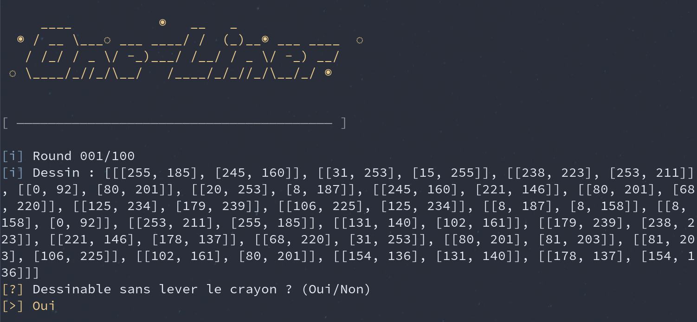

BreizhCTF 2023 - One-Liner
==========================

### Challenge details

| Event          | Challenge | Category      | Points | Solves |
| -------------- | --------- | ------------- | ------ | ------ |
| BreizhCTF 2023 | One-Liner | Programmation | ???    | ???    |



Le dessin qui vous est donné peut-il être dessiné d'un seul trait sans lever le crayon ?
Vous devez répondre correctement à la question 100 fois de suite afin de valider le challenge.

Un dessin est représenté par une liste de segments. Chaque segment est donné sous la forme `[[x1, y1], [x2, y2]]` où `x1`, `x2`, `y1` et `y2` sont des nombres entiers compris entre 0 et 255.

Un dessin peut être dessiné en un seul trait s'il admet un chemin passant par chacun des segments, et passant une seule fois par segment.

Exemple de dessin dessinable en un seul trait: `[[[0, 0], [0, 255]], [[0, 255], [255, 255]], [[255, 255], [255, 0]], [[255, 0], [0, 0]]]`  
Exemple de dessin non dessinable en un seul trait: `[[[127, 127], [0, 0]], [[127, 127], [0, 255]], [[127, 127], [255, 255]], [[127, 127], [255, 0]]]`

`nc <ip> <port>`

### TL;DR

On peut représenter le dessin sous forme d'un graphe. Le dessin est alors dessinable en un seul trait si le graphe possède un [parcours eulérien](https://fr.wikipedia.org/wiki/Graphe_eul%C3%A9rien).

### Méthodologie

Il nous est demandé de déterminer si un dessin est dessinable en un seul traît, en passant par tous les segments et une seule fois par segment.

Afin de résoudre ce challenge, on peut se rapporter à la théorie des graphes et plus précisément à la notion de parcours eulérien.

> *En théorie des graphes, un parcours eulérien ou chemin eulérien, ou encore chaine eulérienne d'un graphe non orienté est un chemin qui passe par toutes les arêtes, une fois par arête.*  
> **Source:** Wikipedia

Si l'on est capable de représenter le dessin sous forme de graphe, alors on peut vérifier si ce graphe possède un parcours eulérien. Si un parcours eulérien existe, alors le dessin peut être dessiné en un seul trait sans passer deux fois par le même segment.

Voici une solution en python utilisant `networkx` :

```python
#!/usr/bin/env python3

import json

import networkx as nx
from pwn import *


def is_oneline_drawable(segments):
    graph = nx.Graph()
    graph.add_edges_from([
        [tuple(s[0]), tuple(s[1])]
        for s in segments
    ])
    return nx.has_eulerian_path(graph)


def solve():
    r = remote('challenge.ctf.bzh', 30024)

    for _ in range(100):
        raw = r.recvuntil('[>] ').decode()
        draw = json.loads(
            raw.split('\n')[-3].split(': ')[1]
        )
        if is_oneline_drawable(draw):
            r.sendline('Oui')
        else:
            r.sendline('Non')

    print(r.recvall().decode())


if __name__ == '__main__':
    solve()
```

### Flag

`BZHCTF{000_Le0nhard_Eul3r_111}`
