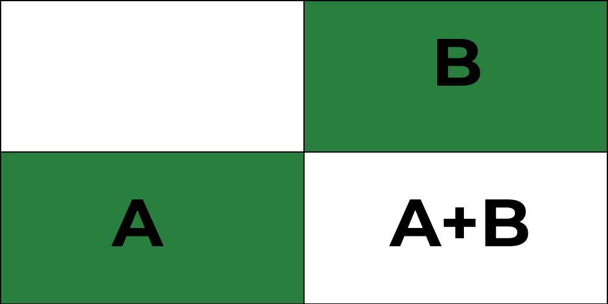
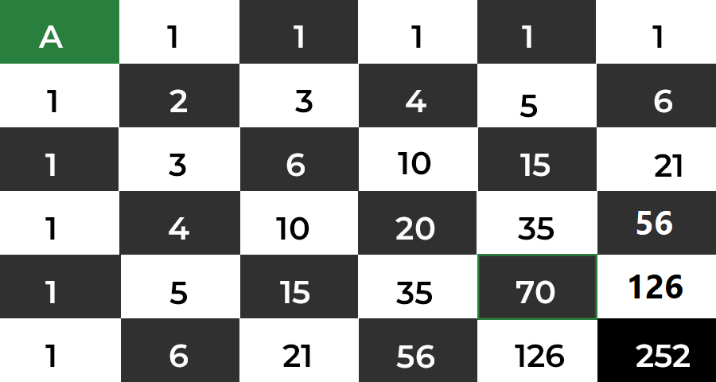

BreizhCTF 2023 - Smoll Grid
==========================

### Challenge details

| Event                    | Challenge  | Category       | Points | Solves      |
|--------------------------|------------|----------------|--------|-------------|
| BreizhCTF 2023           | Smoll Grid | Programmation  | ???    | ???         |

Vous commencez dans le coin supérieur gauche d'une grille 6 × 6 et votre objectif est de vous déplacer vers le coin inférieur droit. Vous ne pouvez vous déplacer que dans deux directions : vers la droite ou vers le bas. Les mouvements en diagonale et en arrière sont interdits.

Combien y a-t-il de façons différentes d'aller du début à la fin ? (3 exemples de chemins sont proposés dans le fichier associé).

Le Flag est sous la forme `BZHCTF{N}` où `N` est un entier positif non nul.

Auteur: Zeecka

### TL;DR

Une approche combinatoire ou utilisant le triangle de Pascal permet de trouver le résultat 252.

### Méthodologie

Un article détaillé de [Geeks for Geeks](https://www.geeksforgeeks.org/puzzle-6x6-grid-how-many-ways/) expose le problème.

L'approche du triangle de Pascal est la suivante :

Si on connaît le nombre de chemins possibles pour atteindre la case de gauche et une case du haut d'une case donnée, alors, le nombre de chemins pour arriver à la case donnée, sera la somme des deux.

Comme le montre la figure, nous pouvons atteindre la case de gauche de `A` manières différentes et atteindre les blocs supérieurs de `B` manières différentes, donc la réponse totale de notre nouvelle case sera `A+B`. La répétition de ce principe permet de réaliser le schéma suivant :

Le nombre de possibilités est donc de 252.

# Flag

`BZHCTF{252}`