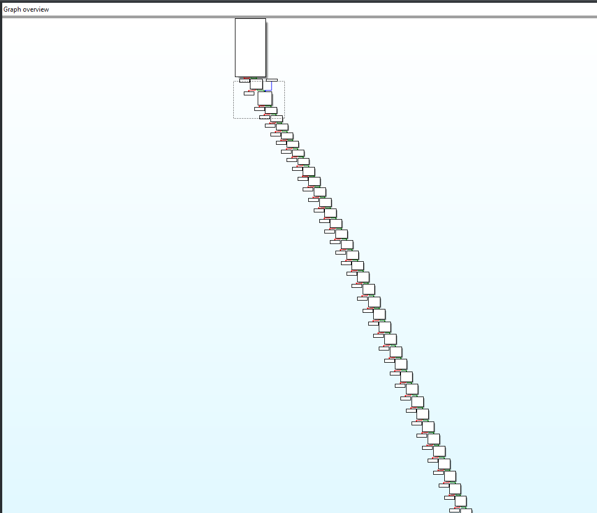
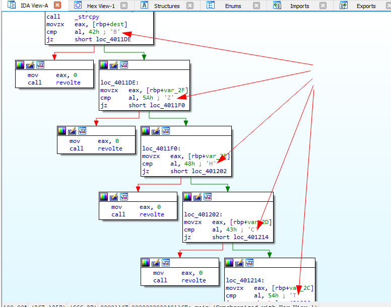

BreizhCTF 2023 - Bretons en colère
==========================

### Challenge details

| Event                    | Challenge  | Category       | Points | Solves      |
|--------------------------|------------|----------------|--------|-------------|
| BreizhCTF 2023           | Bretons en colère  | Reverse      | ???    | ???         |


    
On va tout cramer faudra pas se demander d'où ça vient !


### TL;DR

Le binaire fournis vérifie une succession de conditions sur le premier paramètre fourni. La validation de ces contraites à l'aide du"un solver comme Angr nous permet de récupérer le flag.

### Méthodologie

L'ouverture du binaire avec IDA nous permet d'identifier un graph de controle relativement simple et linéaire :



Une lecture plus avancée du début du graphe nous permet d'identifier le début du flag ainsi que sa taille (39) :



L'utilisation d'hexrays nous permet d'avoir une lecture simplifiée et explicite de l'ensemble des conditions : 

```c
  if ( argc != 2 )
    revolte(argc, argv, envp);
  v3 = argv[1];  // flag à passer en argument
  if ( strlen(v3) != 39 )  // taille du flag
    revolte(v3, argv, v4);
  v5 = argv[1];
  strcpy(dest, v5);
  if ( dest[0] != 66 ) // B
    revolte(dest, v5, v6);
  if ( dest[1] != 90 )  // Z
    revolte(dest, v5, v6);
  if ( dest[2] != 72 ) // H ...
    revolte(dest, v5, v6);
  if ( dest[3] != 67 )
    revolte(dest, v5, v6);
  if ( dest[4] != 84 )
    revolte(dest, v5, v6);
  if ( dest[5] != 70 )
    revolte(dest, v5, v6);
  if ( dest[6] != 123 )
    revolte(dest, v5, v6);
  if ( v60 != 125 )
    revolte(dest, v5, v6);
  if ( (v29 ^ v30) != 97 )
    revolte(dest, v5, v29);
  if ( (v30 ^ v31) != 101 )
    revolte(dest, v5, v30);
  if ( (v31 ^ v32) != 101 )
    revolte(dest, v5, v31);
  if ( (v32 ^ v33) != 65 )
    revolte(dest, v5, v32);
  if ( (v33 ^ v34) != 71 )
    revolte(dest, v5, v33);
  if ( (v34 ^ v35) != 80 )
    revolte(dest, v5, v34);
  if ( (v35 ^ v36) != 55 )
    revolte(dest, v5, v35);
  if ( (v36 ^ v37) != 13 )
    revolte(dest, v5, v36);
  if ( (v37 ^ v38) != 51 )
    revolte(dest, v5, v37);
  if ( (v38 ^ v39) != 93 )
    revolte(dest, v5, v38);
  v7 = (unsigned int)(char)v39;
  if ( (_DWORD)v7 + v40 != 104 )
    revolte(dest, v5, v7);
  v8 = (unsigned int)v40;
  if ( (_DWORD)v8 + v41 != 110 )
    revolte(dest, v5, v8);
  v9 = (unsigned int)v41;
  if ( (_DWORD)v9 + v42 != 163 )
    revolte(dest, v5, v9);
  v10 = (unsigned int)v42;
  if ( (_DWORD)v10 + v43 != 209 )
    revolte(dest, v5, v10);
  v11 = (unsigned int)v43;
  if ( (_DWORD)v11 + v44 != 196 )
    revolte(dest, v5, v11);
  v12 = (unsigned int)v44;
  if ( (_DWORD)v12 + v45 != 194 )
    revolte(dest, v5, v12);
  v13 = (unsigned int)v45;
  if ( (_DWORD)v13 * v46 != 10296 )
    revolte(dest, v5, v13);
  v14 = (unsigned int)v46;
  if ( (_DWORD)v14 * v47 != 5304 )
    revolte(dest, v5, v14);
  v15 = (unsigned int)v47;
  if ( (_DWORD)v15 * v48 != 3519 )
    revolte(dest, v5, v15);
  v16 = (unsigned int)v48;
  if ( (_DWORD)v16 * v49 != 3657 )
    revolte(dest, v5, v16);
  v17 = (unsigned int)v49;
  if ( (_DWORD)v17 * v50 != 5353 )
    revolte(dest, v5, v17);
  v18 = (unsigned int)v50;
  if ( (_DWORD)v18 * v51 != 11514 )
    revolte(dest, v5, v18);
  v19 = (unsigned int)v51;
  if ( (_DWORD)v19 * v52 != 10830 )
    revolte(dest, v5, v19);
  v20 = (unsigned int)v52;
  if ( (_DWORD)v20 * v53 != 11115 )
    revolte(dest, v5, v20);
  v21 = (unsigned int)v54;
  if ( v53 - (_DWORD)v21 != 13 )
    revolte(dest, v5, v21);
  v22 = (unsigned int)v54;
  if ( v55 - (_DWORD)v22 != 13 )
    revolte(dest, v5, v22);
  v23 = (unsigned int)v56;
  if ( v55 - (_DWORD)v23 != 72 )
    revolte(dest, v5, v23);
  v24 = (unsigned int)v56;
  if ( v57 - (_DWORD)v24 != 72 )
    revolte(dest, v5, v24);
  v25 = (unsigned int)v58;
  if ( v57 - (_DWORD)v25 != 13 )
    revolte(dest, v5, v25);
  v26 = (unsigned int)v58;
  if ( v59 - (_DWORD)v26 != 13 )
    revolte(dest, v5, v26);
  puts(asc_402020);
```

Compte tenu du nombre de conditions à satisfaire et de leur diversité, nous allons utiliser le framework [Angr](https://github.com/angr/angr) et son solveur de contraintes [claripy](https://github.com/angr/claripy).

Ici, l'instruction que l'on cherche à atteindre contient la chaine de caractère "flag". L'instrumentation du framework pour challenge peut se traduire comme ceci :

```python
import angr, claripy
proj = angr.Project("breton", auto_load_libs=False)  # Initialisation du projet
key_bytes = [claripy.BVS("byte_%d" % i, 8) for i in range(39)]  # 39 vecteur de 8 bits pour les 39 chars
key_bytes_AST = claripy.Concat(*key_bytes)  # unification des vecteurs en une chaine
state = proj.factory.entry_state(args=["breton", key_bytes_AST])  # le paramètre testé (AST) se trouve etre argv[1]
sim_mgr = proj.factory.simulation_manager(state)  # On lance la simulation avec nos vecteurs
sim_mgr.explore(find=lambda s: b"flag" in s.posix.dumps(1))  # On cherche un chemin affichant "flag"
s = sim_mgr.found[0]  # Solution n° 1
flag = s.solver.eval(key_bytes_AST, cast_to = bytes)  # On remonte le flag depuis le graph de solution
print(flag)
```
```
WARNING  | 2023-02-21 20:53:23,028 | angr.storage.memory_mixins.default_filler_mixin | The program is accessing memory with an unspecified value. This could indicate unwanted behavior.
WARNING  | 2023-02-21 20:53:23,028 | angr.storage.memory_mixins.default_filler_mixin | angr will cope with this by generating an unconstrained symbolic variable and continuing. You can resolve this by:
WARNING  | 2023-02-21 20:53:23,028 | angr.storage.memory_mixins.default_filler_mixin | 1) setting a value to the initial state
WARNING  | 2023-02-21 20:53:23,028 | angr.storage.memory_mixins.default_filler_mixin | 2) adding the state option ZERO_FILL_UNCONSTRAINED_{MEMORY,REGISTERS}, to make unknown regions hold null
WARNING  | 2023-02-21 20:53:23,028 | angr.storage.memory_mixins.default_filler_mixin | 3) adding the state option SYMBOL_FILL_UNCONSTRAINED_{MEMORY,REGISTERS}, to suppress these messages.
WARNING  | 2023-02-21 20:53:23,028 | angr.storage.memory_mixins.default_filler_mixin | Filling memory at 0x7ffffffffff0000 with 53 unconstrained bytes referenced from 0x500018 (strlen+0x0 in extern-address space (0x18))
WARNING  | 2023-02-21 20:53:23,579 | angr.storage.memory_mixins.default_filler_mixin | Filling memory at 0x7fffffffffeff10 with 40 unconstrained bytes referenced from 0x500008 (strcpy+0x0 in extern-address space (0x8))
b'BZHCTF{R3V3r5eR_l177le_ch3E5er_uhu-uhu}'
```

# Flag

`BZHCTF{R3V3r5eR_l177le_ch3E5er_uhu-uhu}`