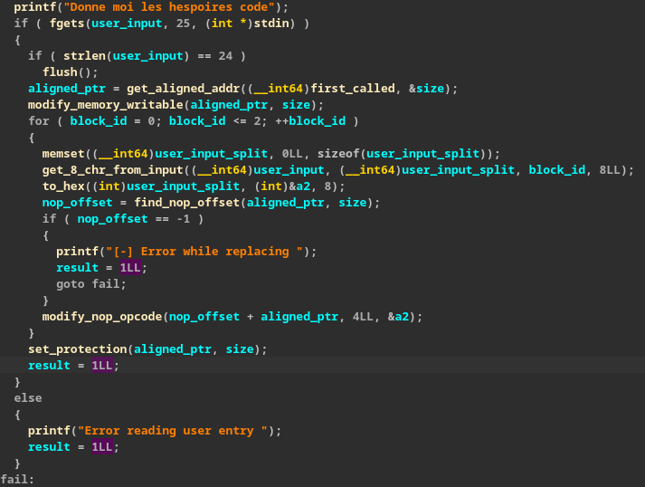
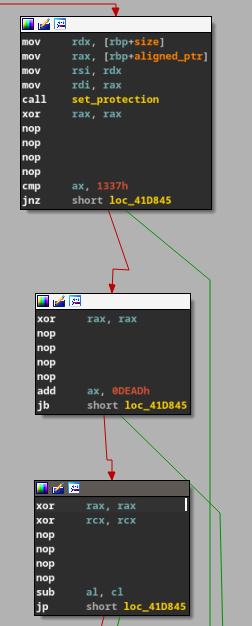
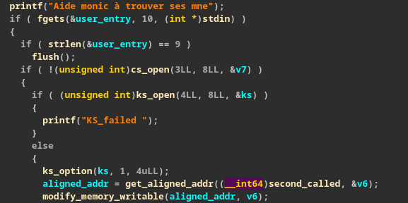
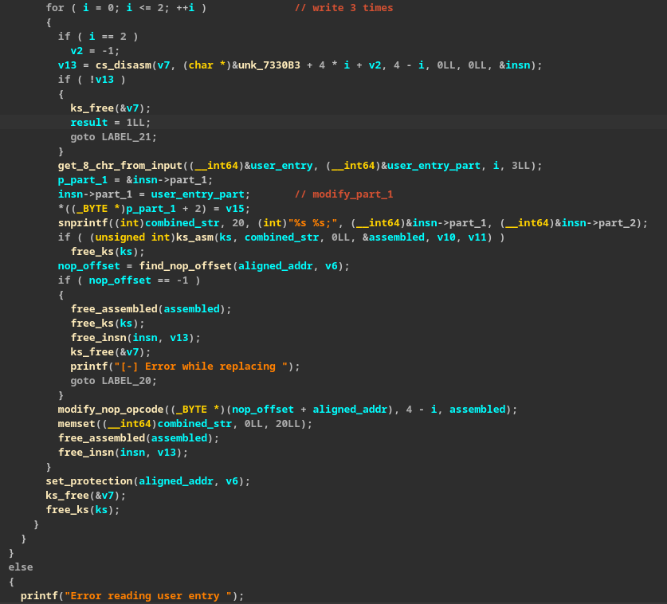
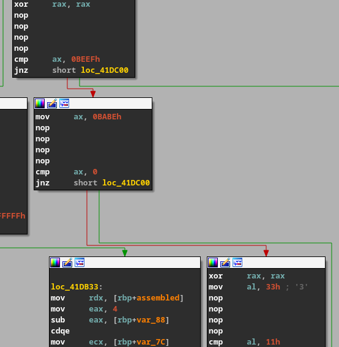
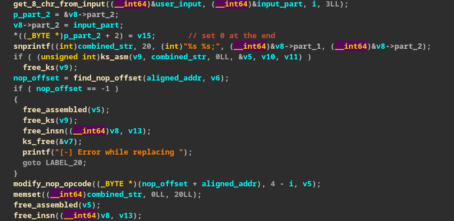

BreizhCTF 2023 - T'es cap ou t'es stone 
==========================

### Challenge details

| Event                    | Challenge  | Category       | Points | Solves      |
|--------------------------|------------|----------------|--------|-------------|
| BreizhCTF 2023           | T'es cap ou t'es stone | Reverse        | ???    | ???         |


Es-tu cap de m'aider dans mes différentes tâches ?
J'espère que tu n'es pas stone j'ai besoin de toi, c'est très important !
Si tu arrives à m'aider pour toutes mes tâches je te récompenserai comme il se doit !

### TL;DR

Le binaire contient 3 étapes. Pour la première il faut passer une string hexadécimal afin 
qu'elle puisse être interprétée en 3 séries d'opcodes pour être directement exécutée. Il ne faut 
pas que ça crash et il faut que ça respecte une comparaison. 
Les deux prochaines étapes sont similaires sauf qu'une demande des mnemonics et des opérandes (registres).
Si le binaire ne crash pas et passe toutes les étapes alors je flag est affiché.

### Méthodologie

#### Premières informations 

On va récupérer les premières informations : 

```bash
$ file cap_ou_stone 
cap_ou_stone: ELF 64-bit LSB executable, x86-64, version 1 (SYSV), statically linked, BuildID[sha1]=c69cccee94529404cf80c4346853a1f153247b76, for GNU/Linux 4.4.0, stripped
```

C'est un binaire ELF 64 bits compilé statiquement et strippé.

On va lancer le binaire une première fois afin de voir ce que ce binaire attend : 
```bash
$ ./cap_ou_stone
Donne moi les hespoires code
dddd
zsh: segmentation fault (core dumped)  ./cap_ou_stone
```

Ok chelou ça segfault, il va falloir investiguer pourquoi ça plante ! 

On va quand même faire un petit `strings` afin de collecter des informations simple à récupérer.

```
$ strings -n 12 cap_ou_stone 
...
Protection couldn't be applied
Donne moi les hespoires code
Error reading user entry
[-] Error while replacing
 trouver ses mne
Donne moi les registres des comptes
GG, la premi
rification est valid
GG, La seconde v
rification est valid
GG, la troisi
rification est valid
Bravo vous avez r
ussi voici le flag : %s
Bravo, vous pouvez r
ration sur le serveur pour r
rer le flag !
...
```

On a pas mal de strings intérestantes, cela nous servira par la suite.

#### Compréhension 

Il temps de l'ouvrir dans ida ! 

Ici on va présenter le pseudo code directement renomé car une première passe sur le code 
a été réalisée. 


Après renommage le pseudo code du main est plutôt claire. En effet ici on peut voir que 3 fonctions 
vont être appelées les unes après si les autres si ces dernières n'échoues pas. 
Après la réussite de ces fonctions il va être affiché le flag si le fichier `flag.txt` originel
est présent sinon il faudra accéder au binaire sur le serveur pour récupérer le flag. 

Allons voir comment faire en sorte de réussir ces fonctions. La première fonction ressemble : 



On voit la string déjà répérée précédemment, ensuite le binaire récupére l'entrée standard. 
si la taille fait 24 caractères l'entrée standard est _flush_.
Ensuite il est récupéré l'addresse de la fonction `first_called` alignée au page mémoire. 
Ceci dans l'objectif de changer les permissions de la page mémoire d'une certaines taille. 
Ici la mémoire aura les permissions `READ, WRITE, EXEC`, il va sûrement il y avoir de la 
modification dynamique du binaire. Une boucle va itérée 3 fois. 
L'entrée utilisateur est traitée, au début de boucle. Cette dernière va être splitée en plusieurs 
part de 8 caractères. Après cette chaîne est transformé en hexadécimal. Il est cherché 
les offsets correspondant à `\x90\x90\x90\x90` une série de 4 **nop**. Enfin il est remplacé 
depuis l'offset **nop**, les **nop** présent par l'hexadécimal issue de l'entrée utilisateur. 

S'il on regarde où ces **nop** peuvent être présents on remarque ceci : 




On comprend que notre entrée va être exécutée, enfin notre chaîne hexadécimal va être exécutée.
Les `opcodes` que l'on va fournir doivent valider certaines conditions. 
La résolution ce cette fonction aura lieux dans la partie Résolution. 


Passons à la fonction n°2.  



Ici on retrouve la même chose que la fonction précédente mais avec des valeurs différentes. 
Une partie complexe, il faut comprendre que les libraries **keystone** et **capstone** sont utilisées.
Les fonctions présentes ici sont des fonctions d'instanciation de structures liées à ces libraries. 

Ensuite encore une fois on retrouve la même fonction de récupération d'addresse alignée. 



On peut voir qu'il y a encore une fois la recherche et modification de **nop** il faut donc 
que l'on comprenne par quoi vont ils être remplacés. 
Il va être désassemblé une suite d'ocpode d'une certaine taille la première sera : 
```
0:  66 2d ef be             sub    ax,0xbeef
```
Son equivalent assembleur est écrit à droite. 
S'il on regarde la première partie de nop : 


Ok, il y a un rapport entre les deux on a d'un côté 0xbeef et de l'autre 0xbeef. On a 
besoin de continuer l'exécution de la fonction donc on va devoir se poser la question 
de comment l'entrée utilisateur peut faire en sorte de validée cette comparaison. 

Par la suite en continuant la compréhension du corps de la fonction et en lisant la doc 
de capstone. On comprend qu'il va être modifié le `mnemonic` de l'instructions asssembleur 
présentée plus haut. 

Cette instruction va donc pouvoir être modifiée par notre entrée utilisateur. Il sera vu 
dans la partie résolution chaque partie d'assembleur et comment résoudre le "casse tête".


Pour la dernière fonction appelée on retrouve encore une fois les même patterns que précédemment.
Toutes les fonctions sont quasiemment toutes déjà renomées.



Ici il ne sera pas modifié le `mnemonic` mais l'`op_str` avec l'entrée utilisateur. Plus 
particulièrement le registre de l'instruction.
Dans la partie résoltion il sera étudié comment réussir les petits casse tête.


#### Résolution 

Comme expliqué précédemment, on va donc devoir résoudre quelque "casse tête assembleur" en 
gardant en tête les spécificité des étapes. 

La première il faut données 1 chaîne hexadécimal de la forme "000000000000000000000000" cette
dernière sera coupée en plusieurs parties de taille 8.


Les premiers casses tête ont la forme suivante : 
```
0:  48 31 c0                xor    rax,rax
3:  90                      nop
4:  90                      nop
5:  90                      nop
6:  90                      nop
7:  66 3d 37 13             cmp    ax,0x1337
b:  75 22                   jne    0x2f
d:  48 31 c0                xor    rax,rax
10: 90                      nop
11: 90                      nop
12: 90                      nop
13: 90                      nop
14: 66 05 ad de             add    ax,0xdead
18: 72 15                   jb     0x2f
1a: 48 31 c0                xor    rax,rax
1d: 48 31 c9                xor    rcx,rcx
20: 90                      nop
21: 90                      nop
22: 90                      nop
23: 90                      nop
24: 28 c8                   sub    al,cl
26: 7a 07                   jp     0x2f 
```
Dans la première **ax** doit être égale à 0x1337 pour cela on peut faire un : 
```
66B83713 => mov ax, 0x1337
```

Cela prend une taille acceptée et remplie bien la condition. 

Ensuite il faut que le `carry flag` ne soit pas défini pour cela l'addition ne doit pas 
_overflow_ (pas le terme exacte). Pour cela on peut entrer : 
```
66B80100 => mov ax, 0x1
```
On va mettre 1 dans **ax** pour cela n'_overflow_ pas après l'addition.

Enfin on va devoir faire en sorte que **al** et **cl** soit paire et impair afin de rendre 
indéfini le _parity flag_ pour cela on peut : 
```
B020B110 => mov al, 0x21; mov cl, 0x10
```

Cela nous donne comme entrée valide pour la première étape : `66B8371366B80100B020B110`

La deuxième partie, qui a besoin de mnemonics sera elle sous la forme "movmovmov" cette dernière
sera découpée en parties de taille 3. 

```
0:  48 31 c0                xor    rax,rax
3:  90                      nop
4:  90                      nop
5:  90                      nop
6:  90                      nop
7:  66 3d ef be             cmp    ax,0xbeef
b:  75 23                   jne    0x30
d:  66 b8 be ba             mov    ax,0xbabe
11: 90                      nop
12: 90                      nop
13: 90                      nop
14: 90                      nop
15: 66 83 f8 00             cmp    ax,0x0
19: 75 15                   jne    0x30
1b: 48 31 c0                xor    rax,rax
1e: b0 33                   mov    al,0x33
20: 90                      nop
21: 90                      nop
22: 90                      nop
23: 90                      nop
24: 3c 11                   cmp    al,0x11
26: 75 08                   jne    0x30 
```

Ici comme vu précédemment on aura comme première instruction : 
```
0:  66 2d ef be             sub    ax,0xbeef
```

il faut ici que l'on modifie le `mnemonic` **sub**, pour que **ax** soit égale à **0xBEEF**.  
Pour cela on peut utiliser le `mnemonic` **mov**.

Ensuite il faut que ax soit égale à **0**, nous avons en instruction : 
```
0:  66 01 c0                add    ax,ax 
```
Il est possible de remplacer **add** par **xor** pour faire en sorte que **ax** soit égale à **0**.

Enfin on a comme instruction : 
```
b0 11                   mov    al,0x11
```
Ici il faut que **al** soit égale à **0x11**, **al** est égale à **0x33** avant. On peut donc 
faire un **and** pour avoir **al** égale à **0x11**


Cela nous donne pour valider la deuxième entrée : `movxorand`


Enfin la dernière partie elle attendra des nom regitres elle sera sous la forme "xorxorxor" cette 
dernière sera découpée en parties de taille 3.

```
0:  48 31 db                xor    rbx,rbx
3:  48 c7 c3 08 00 00 00    mov    rbx,0x8
a:  90                      nop
b:  90                      nop
c:  90                      nop
d:  90                      nop
e:  48 83 fb 02             cmp    rbx,0x2
12: 75 2c                   jne    0x40
14: 4d 31 d2                xor    r10,r10
17: 49 c7 c2 05 00 00 00    mov    r10,0x5
1e: 90                      nop
1f: 90                      nop
20: 90                      nop
21: 90                      nop
22: 49 83 fa fb             cmp    r10,0xfffffffffffffffb
26: 75 18                   jne    0x40
28: 31 c9                   xor    ecx,ecx
2a: b9 fc ff ff ff          mov    ecx,0xfffffffc
2f: 90                      nop
30: 90                      nop
31: 90                      nop
32: 90                      nop
33: 83 f9 03                cmp    ecx,0x3
36: 75 08                   jne    0x40 
```

Pour la première instruction on a : 
```
0:  49 c1 eb 02             shr    r11,0x2 ; PREMIER 
4:  48 f7 d8                neg    rax     ; DEUXIEME
7:  f7 d6                   not    esi     ; FINAL
```

Pour la première il faut que **rbx** soit égale à deux cependant on fait un **shr** de **r11** et 
non de **rbx**. Il faut donc donner en entrée **rbx** afin que ce soit **rbx** => 8 qui soit 
divisier 2 fois par 2. 

Ensuite il faut que **r10** soit égale à -5 on voit que c'est **rax** quit est négationné. 
On a donc juste à mettre **r10** en entrée. 

Enfin on doit faire en sorte que **ecx** soit égale à 3. On remarque encore une fois que ce n'est 
pas le bon registre qui est passé en argument il suffit donc cette fois de passer le bon registre 
**ecx**. 

Cela nous donne la troisième entrée suivante : `rbxr10ecx`

S'il on exécute cela sur l'infra on récupère le flag : `BZHCTF{Po1nt_F4iBl3_tr0p_fOrt_s3lf_M0d1fiC4tion_t0o_fuNnY}`


