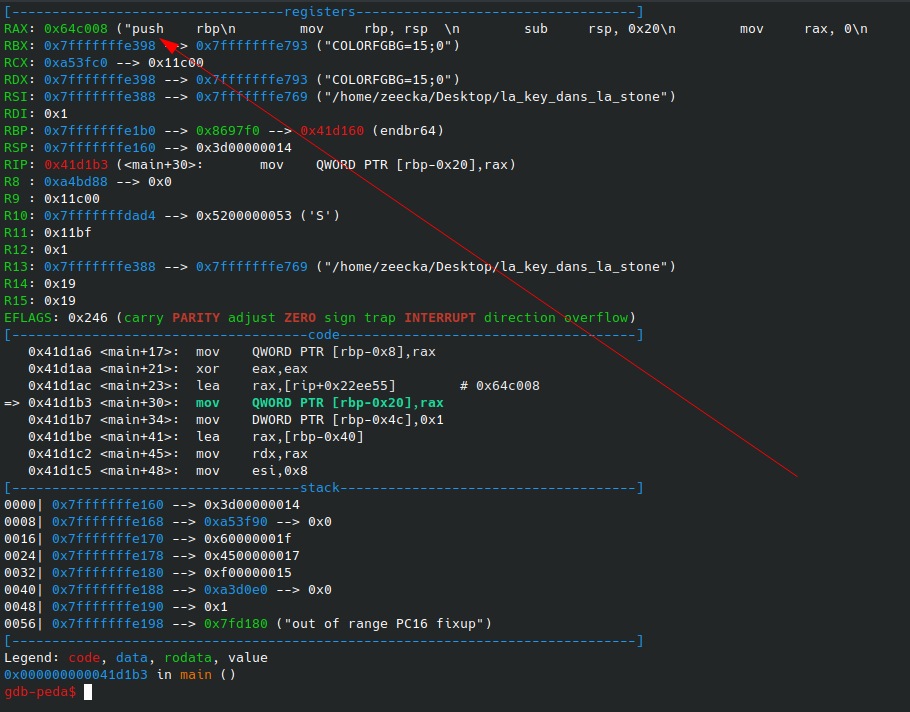
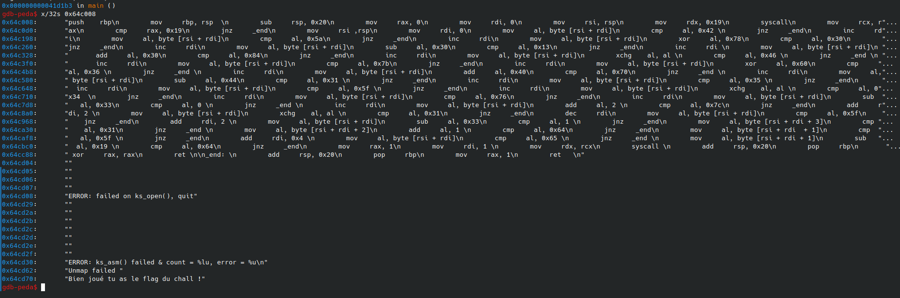

BreizhCTF 2023 - La key dans la stone
===========================

### Challenge details

| Event                    | Challenge  | Category      | Points | Solves      |
|--------------------------|------------|---------------|--------|-------------|
| BreizhCTF 2023           | La key dans la stone | Reverse | ???    | ???         |


Ce binaire semble pas faire grand chose, pourtant quand je l'exécute je vois bien qu'il se produit des choses.
Je me souviens que celui qui me l'a donné m'a dit qu'un langage ancien me donnerait la clé permettant de résoudre ce mystère.
Peut-être ce dernier est le début d'une quête extraordinaire ?

md5sum: 167d786c1a8095d7dd7feab80dcd184b 

### TL;DR

Pour résoudre le challenge, il faut extraire une chaine en assembleur embarquée et evaluée par le programme. Cette dernière effectue une vérification lettre par lettre du flag.

### Méthodologie

On ouvre le binaire avec gdb-peda, on voit une chaine en ASM passer en paramêtre :



On peut l'extraire avec la commande `x/32s <addresse>`:



Une fois mis en forme, on obtient le code suivant:

```asm
        push    rbp
        mov     rbp, rsp  
        sub     rsp, 0x20
        mov     rax, 0
        mov     rdi, 0
        mov     rsi, rsp
        mov     rdx, 0x19
        syscall
        mov     rcx, rax
        cmp     rax, 0x19
        jnz     _end
        mov     rsi ,rsp
        mov     rdi, 0
        mov     al, byte [rsi + rdi]
        cmp     al, 0x42 
        jnz     _end
        inc     rdi
        mov     al, byte [rsi + rdi]
        cmp     al, 0x5a
        jnz     _end
        inc     rdi
        mov     al, byte [rsi + rdi]
        xor     al, 0x78
        cmp     al, 0x30
        jnz     _end
        inc     rdi
        mov     al, byte [rsi + rdi]
        sub     al, 0x30
        cmp     al, 0x13
        jnz     _end
        inc     rdi 
        mov     al, byte [rsi + rdi]
        add     al, 0x30
        cmp     al, 0x84
        jnz     _end
        inc     rdi
        mov     al, byte [rsi + rdi]
        xchg    al, al 
        cmp     al, 0x46 
        jnz     _end 
        inc     rdi
        mov     al, byte [rsi + rdi]
        cmp     al, 0x7b
        jnz     _end
        inc     rdi
        mov     al, byte [rsi + rdi]
        xor     al, 0x60
        cmp     al, 0x36 
        jnz     _end 
        inc     rdi
        mov     al, byte [rsi + rdi]
        add     al, 0x40
        cmp     al, 0x70
        jnz     _end 
        inc     rdi
        mov     al, byte [rsi + rdi]
        sub     al, 0x44
        cmp     al, 0x31 
        jnz     _end
        inc     rdi
        mov     al, byte [rsi + rdi]
        cmp     al, 0x35 
        jnz     _end
        inc     rdi
        mov     al, byte [rsi + rdi]
        cmp     al, 0x5f 
        jnz     _end
        inc     rdi
        mov     al, byte [rsi + rdi]
        xchg    al, al 
        cmp     al, 0x34  
        jnz     _end
        inc     rdi
        mov     al, byte [rsi + rdi]
        cmp     al, 0x76
        jnz     _end
        inc     rdi
        mov     al, byte [rsi + rdi]
        sub     al, 0x33
        cmp     al, 0 
        jnz     _end 
        inc     rdi
        mov     al, byte [rsi + rdi]
        add     al, 2 
        cmp     al, 0x7c  # z
        jnz     _end
        add     rdi, 2 
        mov     al, byte [rsi + rdi]
        xchg    al, al 
        cmp     al, 0x31  # 1
        jnz     _end
        dec     rdi
        mov     al, byte [rsi + rdi]
        cmp     al, 0x5f  # _
        jnz     _end
        add     rdi, 2 
        mov     al, byte [rsi + rdi]
        sub     al, 0x33  # 4
        cmp     al, 1 
        jnz     _end
        mov     al, byte [rsi + rdi + 3]
        cmp     al, 0x31  # 1
        jnz     _end 
        mov     al, byte [rsi + rdi + 2]
        add     al, 1 
        cmp     al, 0x64  
        jnz     _end
        mov     al, byte [rsi + rdi  + 1]
        cmp     al, 0x5f 
        jnz     _end
        add     rdi, 0x4 
        mov     al, byte [rsi + rdi]
        cmp     al, 0x65 
        jnz     _end 
        mov     al, byte [rsi + rdi + 1]
        sub     al, 0x19 
        cmp     al, 0x64
        jnz     _end
        mov     rax, 1
        mov     rdi, 1 
        mov     rdx, rcx
        syscall 
        add     rsp, 0x20
        pop     rbp
        xor     rax, rax
        ret 

_end: 
        add     rsp, 0x20
        pop     rbp
        mov     rax, 1
        ret   
```

Ce dernier est en charge de la validation de l'entrée utilisateur. Si on verifie les valeurs des instructions `cmp` on obtient les vérifications suivantes, se rapprochant du format de flag `BZHCTF{...`:

```asm
cmp     al, 0x42  # B
cmp     al, 0x5a  # Z
xor     al, 0x78
cmp     al, 0x30  # H  (0x78 ^ 0x30)
sub     al, 0x30
cmp     al, 0x13  # C  (0x13 + 0x30)
...
```

En prenant soin d'effectuer les opérations inverses, et en vérifiant l'index des lettres récupérées (via le registre `rdi`), on récupère le flag: `BZHCTF{V0u5_4v3z_14_c1e}`.

Ce flag peut être vérifié en le prposant en entrée utilisateur:

```bash
./la_key_dans_la_stone 
BZHCTF{V0u5_4v3z_14_c1e}
BZHCTF{V0u5_4v3z_14_c1e}
Bien joué tu as le flag du chall !
```

### Flag

`BZHCTF{V0u5_4v3z_14_c1e}`