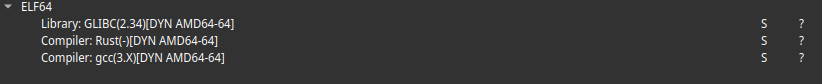
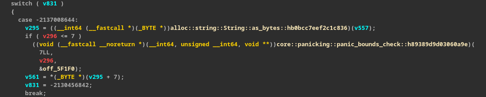
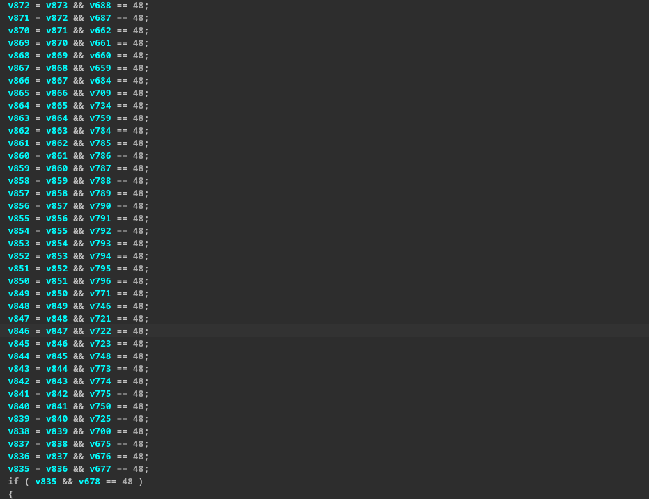

# Rouille WU 

## Récupération d'infos 

On récupère rapidement des info sur le binaire :

```bash 
$ file rouille
rouille: ELF 64-bit LSB pie executable, x86-64, version 1 (SYSV), dynamically linked, interpreter /lib64/ld-linux-x86-64.so.2, BuildID[sha1]=27d20cd004933524a61f708a7c63b65d6a675947, for GNU/Linux 3.2.0, not st
ripped
```

C'est du 64 bits ce qui est une bonne nouvelle on va pouvoir l'ouvrir avec idaFree et récupérer le décompilé (si pas trop horrible).

Le binaire se nommant rouille on suppose que c'est du rust on s'en assure avec un rapide :

```bash 
$ strings rouille | grep rust 
...
_ZN14rustc_demangle2v07Printer23print_const_str_literal17h97bae91956dde84fE
...
```

La commande nous crache plein de mangle contant rustc et d'autre string contenant "rust" ce qui nous indique que c'est bien du rust (dans notre cas).

Il a aussi été checké le binaire avec DIE cela ne nous a pas vraiment remonté plus d'information (confirmation compilo rust).  



## Analyse 

On ouvre donc le binaire dans ida afin d'avoir un aperçu de ce qu'il nous attend. 
On comprend que l'enfer ne fait que commencer avec ce message pas très rassurant.

```
[autohidden] The graph is too big (more than 1000 nodes) to be displayed on the screen.
```
On pourrait forcer ida à nous afficher le graph mais bon par sur que ce dernier soit utile dans notre cas.

Après un check rapide de l'assembleur ça à l'air d'être un crackme (part les messages / gestion de l'entrée utilisateur) avec un switch case de l'enfer. Go tester le décompilé. 
De plus on remarque que l'entrée utilisateur doit faire 25 caractères.
Après 5 - 10 minutes d'attente on récupère un décompilé plutôt potable. 
Renomer une variable ou intéragir avec le décompilé est vraiment trop long alors on va aller droit au but.



L'entrée utilisateur est contenu dans v557 on récupère un pointeur vers un tableau de byte dans v295.
Finalement il est récupérer le 8ème char de la chaîne de caractère et l'on met sa valeur dans v561.
C'est un des nombreux cas présent dans le binaire mais la logique est la même partout avec la modification de la valeur v561 avec des xor avec des valeurs différentes.

On passe par dessus le reste du switch case afin de savoir à quoi peut bien servir ces variables comme v561.



On peut admirer ce pattern sur quelques lignes. Toutes les variables entre 500 et 800 sont des variables qui ont été calculées dans le switch case précédent.
La condition en dernière ligne est celle qui permet d'afficher le message comme quoi nous avons bien le trouvé le flag.

Pour résumer ces lignes il faut que chaque variable sur ce screen soit égale à 48 après l'opération réalisée dans le cas concerné.

Il va donc nous falloir récupérer toutes les opérations sur ces variables. 
Pour cela on va faire une cross référence sur chacune d'elle et noté l'opération. 

## Résolution (au bazooka)

Une fois avoir noté toutes les opérations on les balances dans un solver pour pas s'embêter.

Cela nous donne le code suivante : 

```python
from z3 import *

solver = Solver()

flag  = [BitVec(f"flag[{i}]", 8) for i in range(25)]

solver.add((flag[0]) == ord('B'))
solver.add((flag[1]) == ord('Z'))
solver.add((flag[2]) == ord('H'))
solver.add((flag[3]) == ord('C'))
solver.add((flag[4]) == ord('T'))
solver.add((flag[5]) == ord('F'))
solver.add((flag[6]) == ord('{'))
solver.add((flag[24] == ord('}')))
solver.add((flag[7]) == 48)
solver.add((flag[8] ^ 0x45) == 48)
solver.add((flag[9] ^ 0x44) == 48)
solver.add((flag[10] ^ 0x6F) == 48)
solver.add((flag[11]) == 48)
solver.add((flag[12] ^ 0x56) == 48)
solver.add((flag[13] ^ 0x6F) == 48)
solver.add((flag[14] ^ 0x7) == 48)
solver.add((flag[15] ^ 0x58) == 48)
solver.add((flag[16] ^ 0x3) == 48)
solver.add((flag[17] ^ 0x6F) == 48)
solver.add((flag[18] ^ 0x5D) == 48)
solver.add((flag[19] ^ 0x4) == 48)
solver.add((flag[20] ^ 0x6A) == 48)
solver.add((flag[21] ^ 0x55) == 48)
solver.add((flag[22] ^ 0x6F) == 48)
solver.add((flag[23] ^ 0x11) == 48)
solver.add((flag[24] ^ 0x4D) == 48)

print(solver.check())

while solver.check() == z3.sat:
    if solver.check() == sat:
        model = solver.model()
        flag_str = ''.join([chr(model[flag[i]].as_long()) for i in range(25)])
        print(flag_str)
    else:
        print("Unable to find a solution.")

    break
```

Avec ce code on récupère le flag suivant : 
```bash
$ python resolve.py 
sat
BZHCTF{0ut_0f_7h3_m4Ze_!}
```
On le test avec le binaire :
```bash
./rouille BZHCTF{0ut_0f_7h3_m4Ze_!}
Félicitation ! Vous pouvez valider avec ce flag
```

C'est flag, let's gong.
