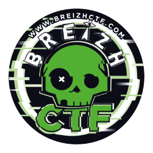
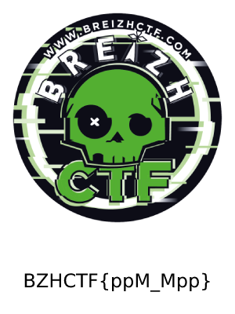

BreizhCTF 2023 - BabyStego
==========================

### Challenge details

| Event                    | Challenge  | Category       | Points | Solves      |
|--------------------------|------------|----------------|--------|-------------|
| BreizhCTF 2023           | BabyStego  | Stéganographie | ???    | ???         |


Baby breizh too doo tooo doo doo, Baby breizh too doo tooo doo doo, Baby breizh !

Auteur: [Zeecka](https://twitter.com/Zeecka_)

### TL;DR

Le fichier fournit est un fichier PPM dans sa version P3. Le fichier est modifiable avec un éditeur de texte. Ses première lignes comporte ses dimensions (300x300), suivi de 400 lignes correspondant aux 400 lignes de pixels de l'image. Il suffit alors de remplacer la deuxième valeur 300 (correspondant au nombre de lignes) par 400 pour voir apparaitre le flag. 

### Méthodologie



Pour commencer, nous récupérons le [fichier](Breizh.png) et vérifions qu'il n'a pas été altéré en calculant sa signature.

```bash
md5sum -ne Breizh.ppm
```
```plaintext
23bdea09b8958d59e716dbcc5639ed1a
```

La commande `file` permet de vérifier si le type de fichier récupéré correspond à son extension.

```bash
file Breizh.ppm
```
```plaintext
Breizh.ppm: Netpbm image data, size = 300 x 300, pixmap, ASCII text, with very long lines (3600)
```

Le fichier est donc une image au format PPM. Quelques recherche sur le [format de fichier](https://en.wikipedia.org/wiki/Netpbm#Description) permet d'en apprendre plus sur sa structure. Le format de fichier est relativement simple avec un [en-tête clair](https://en.wikipedia.org/wiki/Netpbm#PPM_example) contenant la version de fichier, les dimensions de l'image et la valeur maximale pour chaque couleur (respectivement, `P3` et `300 300` et `255` pour notre fichier).

```bash
head -n 3 Breizh.ppm
```
```plaintext
P3
300 300
255
```

Les formats proposés P1, P2 et P3 proposent respectivement des images en noires et blanc, en niveau de gris, et en couleur. Ces formats sont encodés sur la table ASCII mais peuvent être compressé avec un format RAW (respectivement P4, P5 et P6).
L'encodage du format P3 propose une série de lignes correspondant aux lignes de l'image. Chaque ligne est composées de série de nombres composant les valeurs de chaque pixels.
Le fichier dipose de 400 lignes de valeurs, ce qui est incohérent avec l'en-tête indiquant que l'iamge dispose de 300 lignes de pixels.
Nous pouvons donc ajuster la valeur de l'entête en conséquence avec un éditeur de texte: [Breizh_corrige.ppm](Breizh_corrige.ppm).

```bash
head -n 3 Breizh_corrige.ppm
```
```plaintext
P3
300 400
255
```




Nous avons maintenant l'entièreté de l'image, et récupérons le flag au passage.

#### Flag

`BZHCTF{ppM_Mpp}`

Auteur: [Zeecka](https://twitter.com/zeecka_)