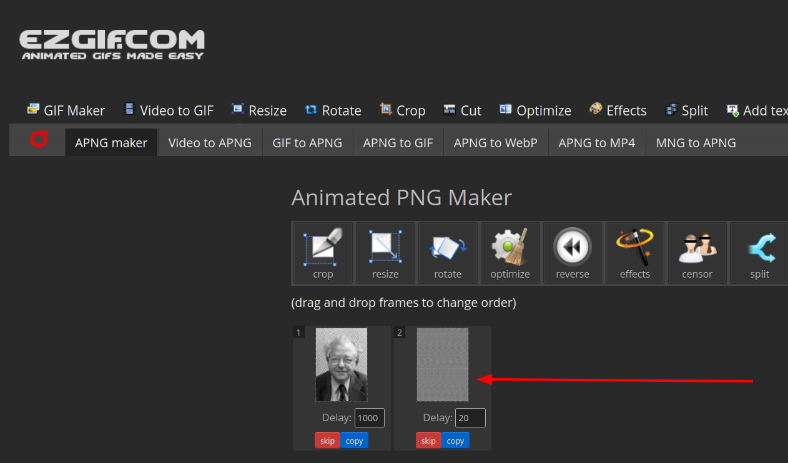
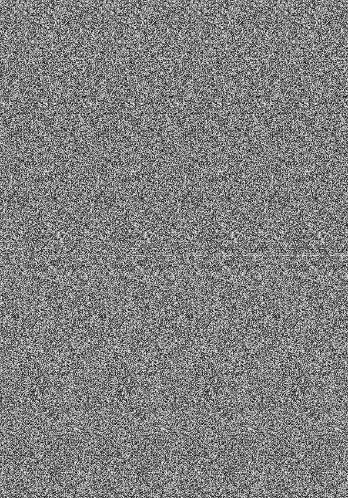
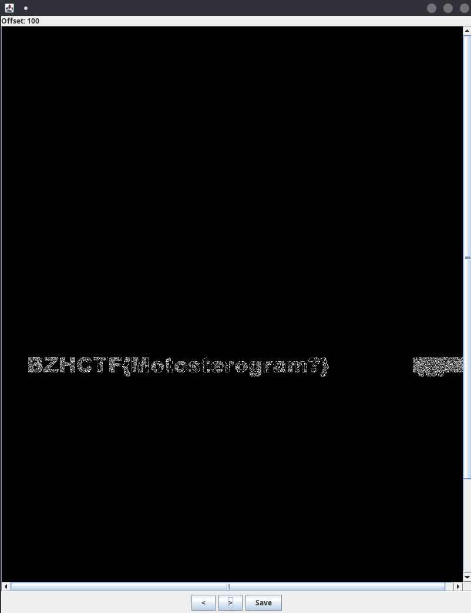

BreizhCTF 2023 - Squint
=======================

### Challenge details

| Event                    | Challenge  | Category       | Points | Solves      |
|--------------------------|------------|----------------|--------|-------------|
| BreizhCTF 2023           | Squint     | Stéganographie | ???    | ???         |


Mieux vaut loucher que d'être aveugle.

Auteur: [Zeecka](https://twitter.com/Zeecka_)

### TL;DR

Le fichier fournit est un fichier PNG, et plus particulièrement `image/apng`, disposant de 2 frames. La deuxième frame dispose d'un délai nul, elle ne peut donc être visualisée qu'au travers d'outil d'éditions de fichier APNG comme [apng-maker](https://ezgif.com/apng-maker). La deuxième frame extraite semble dénuée de sens à première vue mais une recherche inversée sur l'image originale (première frame), ainsi que l'intitulé et la description du challenge nous dirige vers les [autostéréogrammes](https://fr.wikipedia.org/wiki/Autost%C3%A9r%C3%A9ogramme). L'utilisation d'un solveur comme sur Stegsolve permet alors de faciliter la lecture du flag.

### Méthodologie

Pour commencer, nous récupérons le fichier et vérifions qu'il n'a pas été altéré en calculant sa signature.


```bash
md5sum squint.png
```
```plaintext
2c8a5ec04ddf7d0c2bd66112e7bf54f0
```

La commande `file` permet de vérifier si le type de fichier récupéré correspond à son extension.

```bash
file squint.png
```
```plaintext
squint.png: PNG image data, 800 x 1143, 8-bit grayscale, non-interlaced
```

Le fichier est donc une image au format PNG. L'outil `exiftool` peut nous permettre de récupérer les métadonnées du fichier.

```bash
exiftool squint.png
```
```plaintext
ExifTool Version Number         : 12.42
File Name                       : squint.png
Directory                       : .
File Size                       : 796 kB
File Modification Date/Time     : 2022:11:13 18:05:47+01:00
File Access Date/Time           : 2022:11:13 18:06:02+01:00
File Inode Change Date/Time     : 2022:11:13 18:05:55+01:00
File Permissions                : -rw-r--r--
File Type                       : APNG
File Type Extension             : png
MIME Type                       : image/apng
Image Width                     : 800
Image Height                    : 1143
Bit Depth                       : 8
Color Type                      : Grayscale
Compression                     : Deflate/Inflate
Filter                          : Adaptive
Interlace                       : Noninterlaced
Animation Frames                : 2
Animation Plays                 : inf
Image Size                      : 800x1143
Megapixels                      : 0.914
```

Aucun commentaire n'est présent, en revanche, on apprend ici que le type de fichier est `APNG` avec un MIME Type `image/apng`.

Une recherche sur internet sur le format de fichier [APNG](https://fr.wikipedia.org/wiki/Animated_Portable_Network_Graphics) permet d'en apprendre plus sur ce dernier. Il s'agit d'un format d'image pouvant contenir plusieurs frames d'une durée variable, au même titre que le format `GIF`.

Afin de vérifier les différentes frames, nous allons utiliser un [désassembleur APNG](https://ezgif.com/apng-maker) en ligne.



L'extraction de la frame cachée (en inversant l'ordre et la durée des frames par exemple) permet de récupérer le fichier.



Le fichier est a priori illisible en l'état. Une recherche inversée de la première image (à l'aide de Google Lens ou Yandex par exemple) nous permet de retrouver la page Wikiếdia de [Béla Julesz](https://en.wikipedia.org/wiki/B%C3%A9la_Julesz).

Ce scientifique est connu pour son travail sur les stéréogrammes et particulièrement les [autostéréogrammes](https://fr.wikipedia.org/wiki/Autost%C3%A9r%C3%A9ogramme). L'image extraite coincide avec les formes utilisées pour les autostéréogrammes disponibles sur internet.

L'utilisation d'un solveur d'autostéréogrammes comme celui de [StegSolve](http://www.caesum.com/handbook/Stegsolve.jar) nous permet alors de récupérer notre précieux Flag.



#### Flag

`BZHCTF{Motostereogram?}`

Auteur: [Zeecka](https://twitter.com/zeecka_)