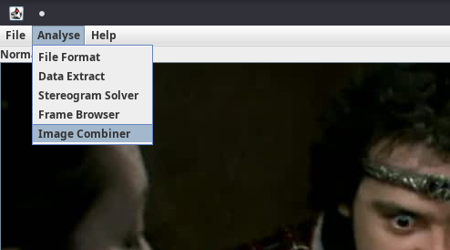
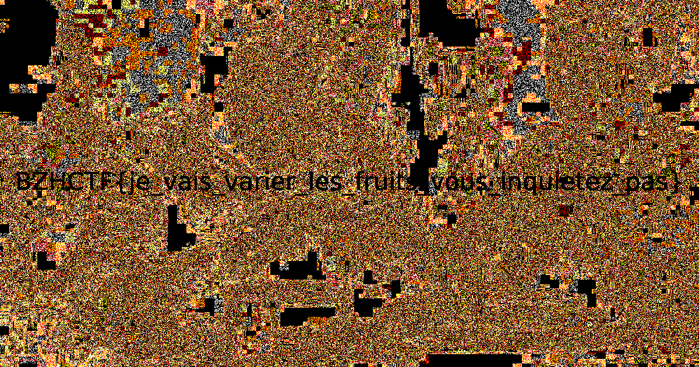

BreizhCTF 2023 - Tartes aux myrtilles
=====================================

### Challenge details

| Event                    | Challenge            | Category       | Points | Solves      |
|--------------------------|----------------------|----------------|--------|-------------|
| BreizhCTF 2023           | Tartes aux myrtilles | Stéganographie | ???    | ???         |


Auteur: [Zeecka](https://twitter.com/Zeecka_)

### TL;DR

Les fichiers [tarte1.png](Challenge/tarte1.png) et [tarte2.png](Challenge/tarte2.png) sont deux images à priori identiques. Certains pixels semblent cependant disposer d'une différence de 1 bit. En redessinant la carte des différences (en soustrayant les images), on obtient alors le flag.

### Méthodologie


Pour commencer, nous récupérons les fichiers [tarte1.png](../Challenge/tarte1.png) et [tarte2.png](../Challenge/tarte2.png).
Les deux fichiers sont identiques mais disposent d'une signature différente:

```bash
md5sum *
```
```plaintext
63b0f0e2b768845ca461961431a0a23d  tarte1.png
2ce88afda7cb0e125884694f5f5a56e5  tarte2.png
```

Afin de vérifier si la différence entre les fichier se situe au niveau des pixels qui les composent, ou de la structure, nous allons comparer les pixels des deux images. Nous utilisons pour cela le module python [PIL](https://pypi.org/project/Pillow/).

```python
#!/usr/bin/env python3
# -*- coding:utf-8 -*-
from PIL import Image

tarte_1 = Image.open("tarte1.png")
tarte_2 = Image.open("tarte2.png")

d1 = list(tarte_1.getdata())
d2 = list(tarte_2.getdata())

assert (d1 == d2)
```
```plaintext
Traceback (most recent call last):
  File "script.py", line 11, in <module>
    assert (d1 == d2)
AssertionError
```

Il s'avère que les pixels des deux images sont différents malgrès les similitudes visuelles. Les tailles des deux images étant identiques, nous allons procéder à une soustraction des deux images pour traces les différences de pixels. Pour cela, il est possible d'utiliser un script python, un logiciel comme Gimp ou Photoshop, ou encore l'outil [stegsolve](http://www.caesum.com/handbook/Stegsolve.jar).

Nous optons pour cette dernière solution en ouvrant le fichier [tarte1.png](../Challenge/tarte1.png) avec Stegsolve. La comparaison avec une autre image s'effectue à l'aide du menu `Analyse > Image Combiner` (puis selectionner le fichier [tarte2.png](../Challenge/tarte2.png)).



Les opération proposées par le combiner de Stegsolve sont multiples (Xor, Or, And, Add, Mul, Interlace, ...) la naviguation entre les différentes opérations permet alors de tomber sur la soustraction :



On peut alors distinguer le flag.

#### Flag

`BZHCTF{je_vais_varies_les_fruits_vous_inquietez_pas}`

Auteur: [Zeecka](https://twitter.com/zeecka_)