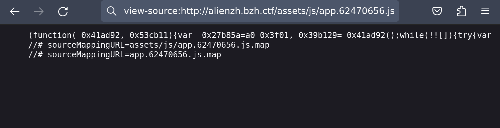
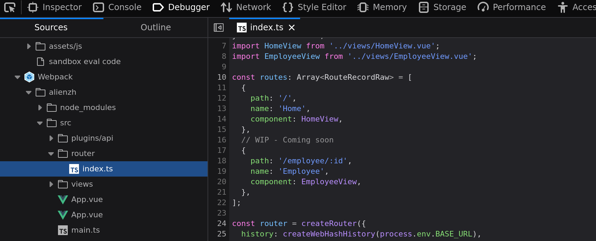
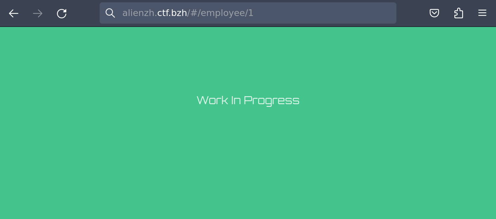
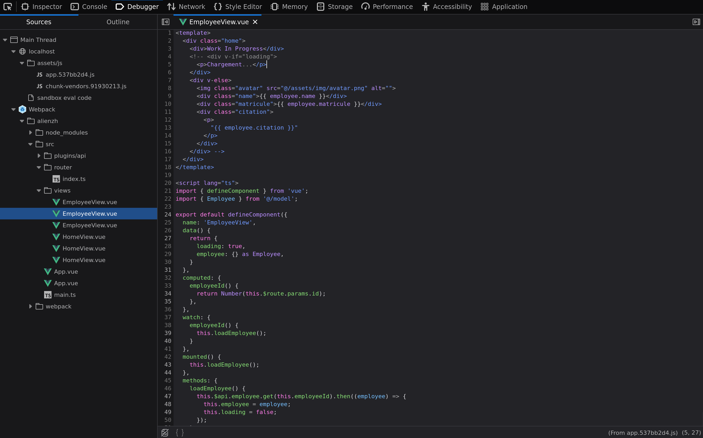
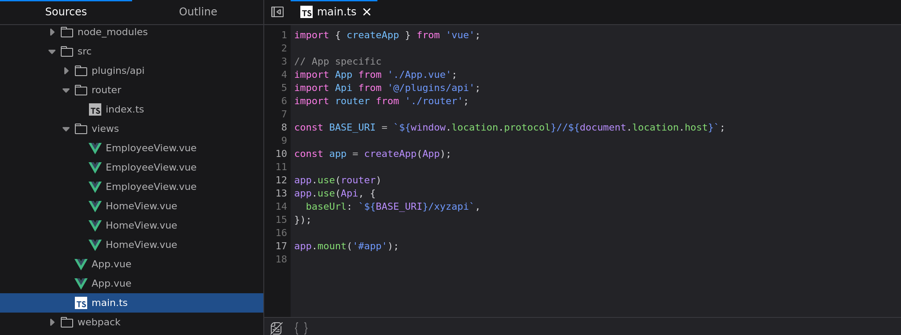
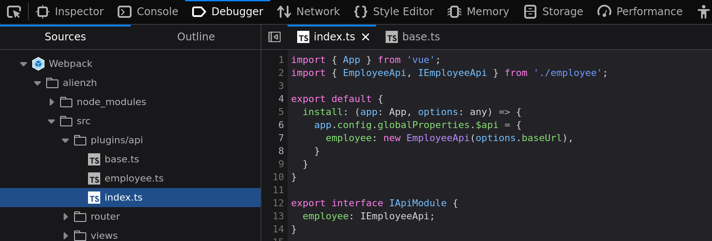
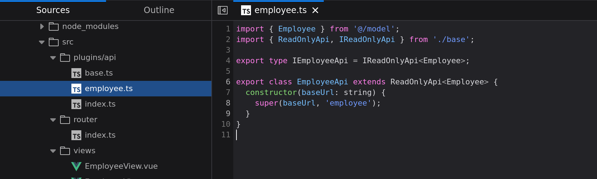
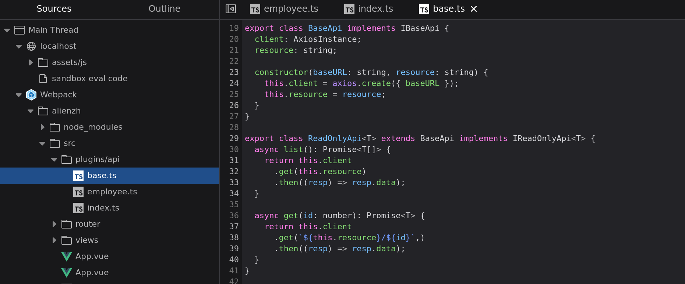

BreizhCTF 2023 - Alienzh
========================

## Détails du challenge

| Event          | Challenge       | Category | Points | Solves |
|----------------|-----------------|----------|--------|--------|
| BreizhCTF 2023 | Alienzh         | Web      | ???    | ???    |


XYZ, un cabinet de recrutement qui opère à l'échelle galactique vient d'ouvrir une antenne sur Terre. En vue de mener des travaux de recherche sur les relations interplanétaires et les possibles effets négatifs que pourrait avoir XYZ sur l'économie terrestre, nous avons mis notre meilleur agent (aka "Adrienix") sur le coup. Ce dernier a réussi à passer les différents tests de recrutement, mais nous n'avons plus de nouvelles de lui depuis. Lors de son dernier contact, il a fait mention d'une liste des employés. Retrouvez cette liste, avec un peu de chance Adrienix pourrait y avoir laissé un message.

## TL;DR

Les sources maps de l'application web sont disponibles. En lisant les sources on trouve un appel à une API dans un des composants. En faisant de l'énumération sur l'API on retrouve Adrienix qui a laissé comme message le flag.

## Méthodologie

En allant sur le site web qui nous est donné pour ce challenge, on trouve une page qui contient uniquement du texte. Pas de lien visible ou autre fonctionnalité à première vue.

Voyons voir les sources.


Un framework JavaScript semble avoir été utilisé pour la construction du site. Malheureusement, le Javascript est minifié donc compliqué à lire.




En regardant les fichiers .js on remarque la présence de deux lignes commentées indiquant la présence de sources map.

```js
//# sourceMappingURL=assets/js/app.62470656.js.map
//# sourceMappingURL=app.62470656.js.map
```

Les sources map JavaScript sont des fichiers qui permettent de mapper le code minifié et compressé à son code source d'origine, de sorte que les développeurs puissent déboguer plus facilement leur code.

C'est une aubaine pour nous, car nous allons pouvoir lire le code source beaucoup plus facilement. Les navigateurs intègrent un onglet **Sources** ou **Debugger** dans les outils développeur, permettant de visualiser le code reconstruit à partir des sources map.

Étant sous Firefox, pour moi il s'agira de l'onglet **Debugger**. En examinant les sources on confirme l'utilisation d'un framework, Vue.js.

Dans le fichier `src/router/index.ts` sont définies deux routes :
* `/` : qui est la page d'accueil
* `/employee/:id` : une page indiquée comme étant en work in progress et dont nous n'avions jusque là pas connaissance



On se rend sur `/employee/:id` en remplaçant `:id` par un paramètre, par exemple un nombre.



Avec pour seul affichage "Work In Progress", cette page ne nous donne pas beaucoup d'infomations en plus. Voyons voir les sources de la page s'il n'y aurait pas quelque chose d'intéressant.



Et en effet toute une partie du template de la page est commenté. En descendant dans la section script, on remarque l'appel à une API dans la méthode `loadEmployee`.

```js
this.$api.employee.get(this.employeeId)
```

Essayons de reconstruire l'appel à l'API. `this.$api` est un plugin importé dans `src/main.ts`, avec une option `baseUrl` qui doit être le path vers l'api. On peut donc supposer que l'API en question est dérrière `https://alienzh.bzh.ctf/xyzapi/`.



Ce plugin défini `this.$api.employee` en créant un objet `EmployeeApi`.



`EmployeeApi` est une classe qui hérite de `ReadOnlyApi`, et qui passe `employee` comme paramètre au constructeur du parent (ReadOnlyApi).



Le paramètre `employee` est assigné à `this.resource` dans BaseAPI.

La méthode `get(id: number)` de EmployeeApi, qui est donc la méthode utilisée dans le composant Employee vu précédemment, réalise un appel à `${this.resource}/${id}`.



Mis bout à bout, voici au complet l'URL de l'API get employee :

```
https://alienzh.ctf.bzh/xyzapi/employee/<number>
```

En essayant de mettre `1` comme `id` on tombe bien sur un employé.

```shell
$ curl https://alienzh.ctf.bzh/xyzapi/employee/1
{"citation":"Breizh atao !","id":1,"matricule":"d9375676-cb1a-403d-9d82-5e826ebc133f","name":"Gwenviz"}
```

Il ne reste plus qu'à faire de l'énumération pour trouver tous les employés. On trouve alors Adrienix, qui nous a effectivement laissé un message.

```shell
$  for i in `seq 1 20`; do curl -s https://alienzh.ctf.bzh/xyzapi/employee/$i; done | grep Adrienix
{"citation":"BZHCTF{S0urc3_Map_M4g1c}","id":16,"matricule":"5a1b6ff6-f36c-4c6b-948a-76de538a544c","name":"Adrienix"}
```

## Flag

`BZHCTF{S0urc3_Map_M4g1c}`
